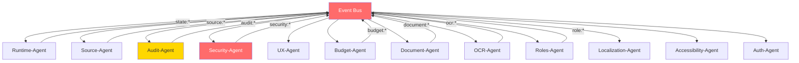

# Maloja Plana — Agent Architecture

> **Vollständiger Agenten-Audit, Sub-Agenten, Automatisierungsprozesse**  
> **Stand:** 2026-05-17 | **Status:** Audit- und Sprint-ready  
> **Constraint:** Alle Agenten sind mechanisch/deterministisch — keine AI-Logik im Core

---

## Übersicht

| Metrik | Wert |
|--------|------|
| Core-Agenten | 12 |
| Sub-Agenten | 38 |
| Automatisierungs-Agenten | 4 |
| Gesamt | 54 |

---

## Prinzipien

1. **Deterministisch:** Jeder Agent produziert bei gleichem Input den gleichen Output
2. **Sandboxed:** Kein Agent hat direkten Zugriff auf andere Agenten (Proxy-basiert)
3. **Auditierbar:** Jede Agent-Aktion wird im Audit-Log dokumentiert
4. **Human-in-the-Loop:** Kein Agent darf autonom State ändern ohne Approval Gate
5. **Offline-First:** Alle Agenten funktionieren ohne Server
6. **Zero-Trust:** Agent-API ist eingeschränkt (Blocked APIs enforced)

---

## Core-Agenten

### 1. Runtime-Agent

> **Verantwortung:** Event Bus, State Machine, Module Registry, Workflow Execution  
> **Phase:** 1 (Core) + 2 (Erweiterung)  
> **Backlog-Ref:** P1-001 bis P1-004, P2-001 bis P2-005

| Sub-Agent | Funktion | Phase | Status |
|-----------|----------|-------|--------|
| Event-Dispatcher | Event Bus Management, Wildcard, Leak Detection | P1 | Offen |
| State-Controller | State Machine Transitions, Guard Predicates | P1 | Offen |
| Registry-Manager | Module Registration, Health Checks | P1 | Offen |
| Workflow-Executor | DAG Execution, Kahn's Algorithm, Resume | P2 | Offen |
| Middleware-Chain | Event Enrichment, Throttle, Metrics | P2 | Offen |

**Schnittstellen:**
- Input: Events von allen Modulen
- Output: State Transitions, Audit Events, Workflow Status
- Blocked APIs: `fetch`, `XMLHttpRequest`, `WebSocket` (im Sandbox-Modus)

---

### 2. Source-Agent

> **Verantwortung:** File Parsing, Schema Mapping, Ingestion Pipeline  
> **Phase:** 1 (Core)  
> **Backlog-Ref:** P1-010 bis P1-012

| Sub-Agent | Funktion | Phase | Status |
|-----------|----------|-------|--------|
| File-Parser | JSON + CSV Parsing, Swiss Semicolons, BOM Handling | P1 | Offen |
| Schema-Mapper | Auto-Match, Preview, Type Coercion | P1 | Offen |
| Ingestion-Controller | 8-Stage Pipeline, SHA-256 Provenance | P1 | Offen |
| Import-Validator | Pre-flight Checks, Size Limits, Format Detection | P1 | Offen |

**Schnittstellen:**
- Input: FileReader Streams, User Uploads
- Output: Structured Data → Runtime-Agent, Evidence → Audit-Agent

---

### 3. Audit-Agent

> **Verantwortung:** Audit Logging, Evidence Chain, Compliance Reports  
> **Phase:** 1 (Core) + 2 (Erweiterung)  
> **Backlog-Ref:** P1-003, P1-008, P1-017, P2-009, P2-014, P2-018, P2-023

| Sub-Agent | Funktion | Phase | Status |
|-----------|----------|-------|--------|
| Event-Logger | Append-Only IndexedDB Writes | P1 | Offen |
| Evidence-Writer | Hash-Chain Evidence, SHA-256, Tamper Detection | P1 | Offen |
| Retention-Manager | Configurable Cleanup (30-365 Tage) | P1 | Offen |
| Compliance-Reporter | 4 Report Templates (Audit, Approval, Validation, Rollback) | P2 | Offen |
| Versioning-Logger | Schema Version Tracking, Migration Logging | P2 | Offen |

**Schnittstellen:**
- Input: Events von allen Agenten
- Output: IndexedDB (`maloja-plana-audit`), Export (JSON/PDF)
- Invariante: Append-only, niemals löschen (nur Retention-Policy)

---

### 4. Security-Agent

> **Verantwortung:** Encryption, Access Control, Vulnerability Monitoring  
> **Phase:** 3 (Features I)  
> **Backlog-Ref:** SEC-001 bis SEC-010, ADR-009, ADR-011

| Sub-Agent | Funktion | Phase | Status |
|-----------|----------|-------|--------|
| Crypto-Service | AES-256-GCM, PBKDF2, Web Crypto API | Iter 3 | Offen |
| Key-Manager | Key Derivation, Per-Document Keys, Re-Keying | Iter 3 | Offen |
| Rate-Limiter | Progressive Delay, Brute-Force Protection | Iter 3 | Offen |
| Session-Manager | JWT Handling, Token Refresh, Auto-Logout | Iter 3 | Offen |

**Schnittstellen:**
- Input: Auth Requests, Encryption/Decryption Calls
- Output: Tokens, Encrypted Blobs, Security Events → Audit-Agent

---

### 5. Auth-Agent

> **Verantwortung:** Login-Methoden, WebAuthn, 2FA, Progressive Auth  
> **Phase:** 3 (Features I)  
> **Backlog-Ref:** SEC-001 bis SEC-004, ADR-011

| Sub-Agent | Funktion | Phase | Status |
|-----------|----------|-------|--------|
| Password-Handler | bcrypt/argon2, Reset Flow | Iter 3 | Offen |
| WebAuthn-Handler | Biometric Registration + Auth, Fallback Chain | Iter 3 | Offen |
| TOTP-Handler | 2FA mit PIN-above-Keyboard | Iter 3 | Offen |
| OAuth-Handler | Google, Apple Social Login | Iter 3 | Offen |
| Level-Controller | Progressive Auth Level (0/1/2) Detection | Iter 3 | Offen |

---

### 6. UX-Agent

> **Verantwortung:** UI Components, Calm UX, Responsive Design  
> **Phase:** Durchgängig  
> **Backlog-Ref:** P1-005, P1-013, P1-014, P1-017, P1-018, P2-004, P2-008, P2-013, P2-017, P2-020, P2-025

| Sub-Agent | Funktion | Phase | Status |
|-----------|----------|-------|--------|
| Approval-Gate-UI | No-timeout Confirmation, WAI-ARIA | P1 | Offen |
| Import-Preview-UI | Diff Preview, Error Display | P1 | Offen |
| Dashboard-Controller | Health Indicator, KPIs, SVG Charts | P1+P2 | Offen |
| Responsive-Controller | 375px-1440px, Mobile-First | P1 | Offen |
| Dark-Mode-Controller | System-Aware, Palette-Only | P1 | Offen |
| Calm-UX-Enforcer | No Urgency Language, No Gamification Triggers | Alle | Offen |

---

### 7. Localization-Agent

> **Verantwortung:** i18n, Übersetzungen, Fallbacks  
> **Phase:** 3 (Features I)  
> **Backlog-Ref:** UX-001 bis UX-008, GAP-06

| Sub-Agent | Funktion | Phase | Status |
|-----------|----------|-------|--------|
| Language-Loader | Lazy-Load JSON-Dateien, Caching | Iter 3 | Offen |
| Fallback-Resolver | RM → DE → EN Chain | Iter 3 | Offen |
| Gender-Checker | Lint-Regel für genderneutrale Texte | Iter 3 | Offen |
| TTS-Bridge | Web Speech API Integration | Iter 3 | Offen |

---

### 8. Accessibility-Agent

> **Verantwortung:** WCAG, Screen Reader, Keyboard Nav, Literacy Fallbacks  
> **Phase:** 3 (Features I)  
> **Backlog-Ref:** UX-009 bis UX-013, UX-017, GAP-07

| Sub-Agent | Funktion | Phase | Status |
|-----------|----------|-------|--------|
| ARIA-Manager | Labels, Roles, Live Regions | Iter 3 | Offen |
| Focus-Controller | Tab Order, Focus Trapping, Skip Links | Iter 3 | Offen |
| Contrast-Manager | Dynamic Contrast, WCAG AAA Check | Iter 3 | Offen |
| Icon-Navigation | Pictogram-First for Literacy Fallback | Iter 3 | Offen |

---

### 9. Budget-Agent

> **Verantwortung:** Einnahmen, Ausgaben, Schulden, Alerts, Vergleiche  
> **Phase:** 4 (Features II)  
> **Backlog-Ref:** BUD-001 bis BUD-007, GAP-12

| Sub-Agent | Funktion | Phase | Status |
|-----------|----------|-------|--------|
| Income-Tracker | Einnahmen erfassen, kategorisieren | Iter 4 | Offen |
| Expense-Tracker | Ausgaben erfassen, automatisch taggen | Iter 4 | Offen |
| Debt-Linker | Schulden mit Budget verknüpfen | Iter 4 | Offen |
| Alert-Engine | Threshold-basierte Warnungen | Iter 4 | Offen |
| Benchmark-Calculator | CH-Referenzwerte (BFS), Vergleich | Iter 4 | Offen |
| Subscription-Tracker | Abo-Erkennung, Renewal-Reminder | Iter 4 | Offen |
| ÖV-Auto-Calculator | Fahrtkosten, ÖV vs. Auto | Iter 4 | Offen |

---

### 10. Document-Agent

> **Verantwortung:** Dokumenten-Tresor, Versionierung, Suche  
> **Phase:** 4 (Features II)  
> **Backlog-Ref:** DOC-001 bis DOC-007, GAP-10

| Sub-Agent | Funktion | Phase | Status |
|-----------|----------|-------|--------|
| Vault-Manager | Verschlüsselte Ablage, Zugriffskontrolle | Iter 4 | Offen |
| Version-Tracker | Dokumenten-Historie, Diff-Anzeige | Iter 4 | Offen |
| Search-Engine | Volltextsuche, Filter (Typ, Datum, Betrag) | Iter 4 | Offen |
| PDF-Renderer | In-App Preview (Canvas-basiert, zero deps) | Iter 4 | Offen |
| Upload-Controller | Multi-File, Drag & Drop, Progress | Iter 4 | Offen |

---

### 11. OCR-Agent

> **Verantwortung:** Dokumenten-Scan, Texterkennung, Swiss Formats  
> **Phase:** 4 (Features II)  
> **Backlog-Ref:** DOC-002, DOC-003, GAP-09, ADR-010

| Sub-Agent | Funktion | Phase | Status |
|-----------|----------|-------|--------|
| Scanner-Controller | Kamera/Upload, Crop, Rotate | Iter 4 | Offen |
| Preprocessor | Binarization, Deskew, Noise Reduction | Iter 4 | Offen |
| Tesseract-Bridge | Lazy-Load Worker, Language Cache | Iter 4 | Offen |
| Field-Extractor | Swiss Pattern Matching (CHF, AHV, IBAN) | Iter 4 | Offen |
| Confidence-Scorer | Per-Field Confidence, Verification Flag | Iter 4 | Offen |
| Template-Matcher | KVG, Lohn, Miete, Steuer Templates | Iter 4 | Offen |

---

### 12. Roles-Agent (Approval / Roles)

> **Verantwortung:** RBAC, Account-Übergabe, Policy Enforcement  
> **Phase:** 2 (Engine) + 4 (Features II)  
> **Backlog-Ref:** P2-006, P2-007, ROL-001 bis ROL-005, GAP-05, GAP-11

| Sub-Agent | Funktion | Phase | Status |
|-----------|----------|-------|--------|
| Role-Manager | 5 Rollen, Capability Matrix, Vererbung | P2 | Offen |
| Policy-Engine | Deny-Early, Escalation, Never Auto-Approve | P2 | Offen |
| Gate-Checker | Approval Gates mit Policy-Integration | P2 | Offen |
| Transfer-Controller | Kinder-Account Übergabe, Re-Keying | Iter 4 | Offen |
| Medical-Access | Zeitlich begrenzte View-Only Freigabe | Iter 4 | Offen |

---

## Automatisierungs-Agenten

> **Prinzip:** Mechanisch, deterministisch, ohne AI. Automatisierung = wiederholbare Prozesse.

### A1. Versioning-Agent

> **Zweck:** Automatisches Tagging, Changelog, Deployment-Vorbereitung

| Prozess | Trigger | Aktion | Output |
|---------|---------|--------|--------|
| Version Tag | Merge to `main` | Lese `package.json` version, erstelle Git Tag | `v1.2.3` Tag |
| Changelog | Neuer Tag | Parse Commit Messages (conventional commits) | `CHANGELOG.md` Update |
| Release Notes | Tag Push | Aggregiere Changes seit letztem Tag | GitHub Release Draft |
| Build Verification | Pre-Tag | Run Tests + Size Check + Lighthouse | Pass/Fail Gate |

**Implementation:**
```yaml
# GitHub Actions Workflow
on:
  push:
    branches: [main]
steps:
  - run: npm test
  - run: npm run build
  - run: npx size-limit
  - run: git tag v$(node -p "require('./package.json').version")
  - run: npx conventional-changelog -p angular -i CHANGELOG.md -s
```

---

### A2. Bugfix-Agent

> **Zweck:** Bug-Tracking, Patch-Erstellung, Regression Prevention

| Prozess | Trigger | Aktion | Output |
|---------|---------|--------|--------|
| Bug Detection | CI Failure / User Report | Erstelle Issue mit Template | GitHub Issue |
| Patch Branch | Issue Created | Erstelle `bugfix/<id>-<title>` Branch | Branch |
| Regression Test | Bugfix PR | Erstelle Test der den Bug reproduziert | Test File |
| Patch Release | Bugfix Merged | Bump Patch Version, Tag | `v1.2.4` |

**Implementation:**
```yaml
on:
  issues:
    types: [opened]
    labels: [bug]
steps:
  - run: git checkout -b bugfix/${{ github.event.issue.number }}
  - run: echo "// TODO: fix ${{ github.event.issue.title }}" > src/__tests__/regression-${{ github.event.issue.number }}.test.js
```

---

### A3. Update-Agent

> **Zweck:** Dependency Updates, Security Patches, Changelog

| Prozess | Trigger | Aktion | Output |
|---------|---------|--------|--------|
| Security Scan | Weekly Cron | `npm audit` | Report / Alert |
| Dependency Check | Weekly Cron | `npm outdated` | Update PR |
| Breaking Change Check | Update PR | Run full test suite | Pass/Fail |
| Changelog Update | Update Merged | Document changes | `CHANGELOG.md` |

**Constraint:** Zero new runtime dependencies. Updates nur für devDependencies und Security Patches.

---

### A4. Sync-Agent

> **Zweck:** Offline-Daten synchronisieren, Konflikte lösen

| Prozess | Trigger | Aktion | Output |
|---------|---------|--------|--------|
| Online Detection | `navigator.onLine` Event | Prüfe Sync Queue | Sync Status |
| Push Queue | Online + Queue nicht leer | Sende lokale Änderungen an Server | Server Confirmation |
| Pull Sync | Online + Push abgeschlossen | Hole Server-Änderungen | Merged Local State |
| Conflict Resolution | Push/Pull Conflict | Last-Write-Wins + Manual Merge UI für Docs | Resolved State |
| Evidence | Sync abgeschlossen | Schreibe Sync-Event ins Audit-Log | Audit Entry |

**Conflict Resolution Strategy:**
```
Simple Data (settings, tasks): Last-Write-Wins (timestamp)
Documents: Manual Merge via Approval Gate
Budget: Additive Merge (neue Einträge kombinieren)
Audit Logs: Append-Only (kein Conflict möglich)
```

---

## Agent-Kommunikation (Event Bus)



**Event Namespacing:**
```
runtime.*      → Runtime-Agent
source.*       → Source-Agent
audit.*        → Audit-Agent
security.*     → Security-Agent
auth.*         → Auth-Agent
ux.*           → UX-Agent
budget.*       → Budget-Agent
document.*     → Document-Agent
ocr.*          → OCR-Agent
role.*         → Roles-Agent
i18n.*         → Localization-Agent
a11y.*         → Accessibility-Agent
sync.*         → Sync-Agent
```

---

## Agent Sandbox (Zero-Trust)

```
┌─────────────────────────────────────────┐
│              Agent Sandbox               │
├─────────────────────────────────────────┤
│  Allowed APIs:                          │
│  - Event Bus (emit/subscribe)           │
│  - Suggestion API (propose changes)     │
│  - Read-only data access (filtered)     │
│  - Audit write (own events only)        │
├─────────────────────────────────────────┤
│  Blocked APIs:                          │
│  - fetch / XMLHttpRequest               │
│  - WebSocket                            │
│  - localStorage (direct)                │
│  - IndexedDB (direct)                   │
│  - DOM manipulation (direct)            │
│  - eval / Function constructor          │
├─────────────────────────────────────────┤
│  Enforcement: Proxy-based API wrapper   │
│  Violations: Logged to Audit-Agent      │
└─────────────────────────────────────────┘
```

---

## Empfehlungen für zukünftige Agenten (Phase 4+)

| Agent | Zweck | Phase | Priorität |
|-------|-------|-------|-----------|
| Analytics-Agent | Anonymisierte Usage-Metriken (opt-in) | 4+ | Niedrig |
| Backup-Agent | Automatisierte lokale + Cloud-Backups | 4+ | Mittel |
| Test-Agent | Automatisierte E2E-Test Orchestrierung | 4+ | Mittel |
| Migration-Agent | Schema-Migrationen automatisieren | 4+ | Mittel |
| Contact-Agent | Arzt/Betreuer Kontaktverknüpfung | 5 | Niedrig |
| Marketing-Agent | CSR Badge, Knowledge Panel | 6 | Niedrig |
| Community-Agent | Moderation, Peer Support | Post-MVP | Niedrig |

---

## Backlog-Tasks für Agent-Implementation

| Task ID | Titel | Agent | Priorität | Sprint |
|---------|-------|-------|-----------|--------|
| AGT-001 | Event Bus Namespace einführen | Runtime-Agent | Hoch | Iter 1 |
| AGT-002 | Agent Sandbox Proxy implementieren | Runtime-Agent | Hoch | Iter 2 |
| AGT-003 | Suggestion API designen | Runtime-Agent | Hoch | Iter 2 |
| AGT-004 | Agent Registration Protocol | Runtime-Agent | Hoch | Iter 2 |
| AGT-005 | Violation Logger | Audit-Agent | Hoch | Iter 2 |
| AGT-006 | CryptoService (Web Crypto) | Security-Agent | Hoch | Iter 3 |
| AGT-007 | WebAuthn Integration | Auth-Agent | Hoch | Iter 3 |
| AGT-008 | i18n JSON Loader + Cache | Localization-Agent | Hoch | Iter 3 |
| AGT-009 | ARIA Manager | Accessibility-Agent | Hoch | Iter 3 |
| AGT-010 | Budget Calculator Engine | Budget-Agent | Hoch | Iter 4 |
| AGT-011 | Vault Encryption Layer | Document-Agent | Hoch | Iter 4 |
| AGT-012 | Tesseract.js Lazy Loader | OCR-Agent | Hoch | Iter 4 |
| AGT-013 | RBAC Engine | Roles-Agent | Hoch | Iter 2 |
| AGT-014 | Sync Queue + Conflict Resolver | Sync-Agent | Mittel | Iter 5 |
| AGT-015 | CI/CD Versioning Workflow | Versioning-Agent | Mittel | Iter 0 |
| AGT-016 | Bugfix Template + Branch Automation | Bugfix-Agent | Mittel | Iter 0 |

---

## Cross-References

| Dokument | Relevanz |
|----------|----------|
| [SPRINT_PLAN.md](../roadmap/SPRINT_PLAN.md) | Agent-Zuweisungen pro Sprint |
| [BACKLOG_MASTER.md](../roadmap/BACKLOG_MASTER.md) | Vollständige Task-Liste |
| [OPEN_GAPS_USER_STORIES.md](../roadmap/OPEN_GAPS_USER_STORIES.md) | Offene Entscheidungen |
| [PHASE_2_BLUEPRINT.md](../roadmap/PHASE_2_BLUEPRINT.md) | Agent Runtime Sandbox Spezifikation |
| [ADR-009](../architecture/ADR-009-storage-strategy.md) | Storage-Entscheidung (Security-Agent) |
| [ADR-010](../architecture/ADR-010-ocr-engine.md) | OCR-Entscheidung (OCR-Agent) |
| [ADR-011](../architecture/ADR-011-auth-strategy.md) | Auth-Entscheidung (Auth-Agent) |
| [agent-orchestration.md](./agent-orchestration.md) | Ältere Skeleton-Datei (zu ersetzen) |
