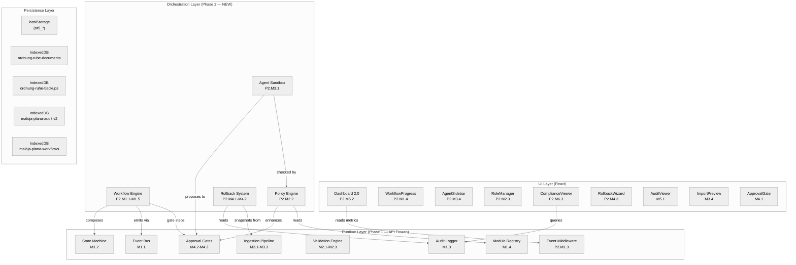
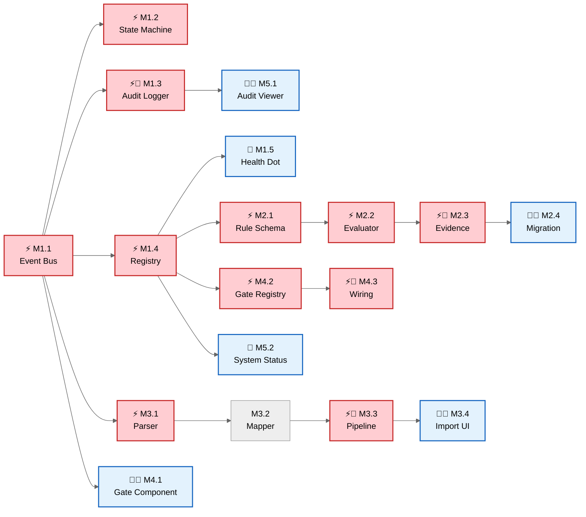
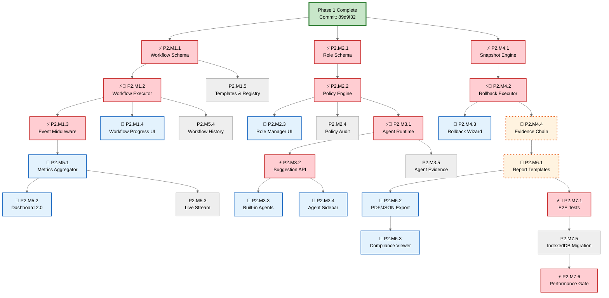
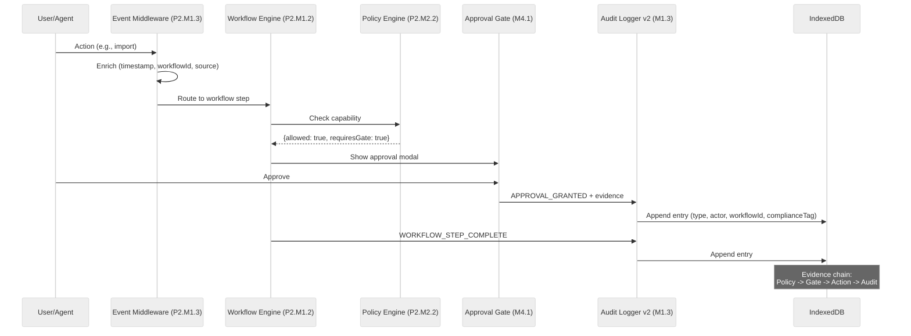
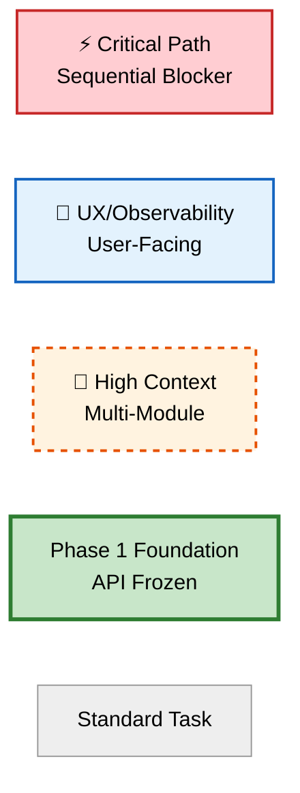

# Maloja Plana — Executive Dashboard

> **Phase 1 + Phase 2 Stakeholder Overview — ISO/Audit-Ready**

| Meta | Value |
|------|-------|
| **Version** | 1.0.0 |
| **Date** | 2026-05-17 |
| **Author** | Sophie Stebler / Stebler Studios |
| **Phase 1 Baseline** | `89d9f32` (branch: `dev`) |
| **Phase 2 Baseline** | `81b1d93` (branch: `dev`) |
| **Total Duration** | Phase 1: 6-8 weeks, Phase 2: 8-12 weeks |
| **Constraints** | Offline-first, zero runtime deps, local-only, < 250 KB gzip |

---

## 1. Executive Summary

### Vision

Transform **Maloja Plana** from a personal life organizer into a **governance-native, deterministic workflow engine** with full audit trail, sandboxed agent assistance, and team-ready governance structures.

### Phase 1 — Governance Runtime (6-8 Weeks)

Introduces: structured source ingestion, configurable validation, human approval gates, local audit trail, module registry.

### Phase 2 — Workflow Engine & Agent Layer (8-12 Weeks)

Introduces: multi-step workflow DAGs, role-based access, sandboxed AI agents, hash-chained rollback, real-time dashboard, ISO compliance export.

### Key Metrics

| Metric | Phase 1 | Phase 2 | Total |
|--------|---------|---------|-------|
| Tasks | 26 | 31 | 57 |
| Critical Path Tasks (⚡) | 12 | 11 | 23 |
| UX/Observability Tasks (🎯) | 8 | 13 | 21 |
| High-Context Tasks (🔗) | 8 | 5 | 13 |
| New Components | 5 | 7 | 12 |
| i18n Keys (per locale) | ~34 | ~60 | ~94 |
| New IndexedDB Stores | 1 | 1 | 2 |
| Runtime Dependencies Added | 0 | 0 | **0** |

---

## 2. Milestone Overview

### Phase 1 Milestones

| ID | Name | Weeks | Tasks | Focus | Lead Agent |
|----|------|-------|-------|-------|------------|
| **M1** | Runtime Foundation | 1-2 | 5 | Event bus, state machine, audit log, registry, health dot | Runtime Governance |
| **M2** | Validation Engine | 2-3 | 4 | Rule schema, evaluator, evidence, migration | Runtime Governance |
| **M3** | Source Ingestion | 3-5 | 4 | File parser, schema mapper, pipeline, import UI | Source Governance |
| **M4** | Human Approval Gates | 5-6 | 3 | Gate component, registry, wiring | UX Calmness |
| **M5** | Audit & Observability | 6-7 | 5 | Viewer, system status, export, retention, navigation | UX Calmness |
| **M6** | Integration & Polish | 7-8 | 5 | E2E tests, mobile QA, dark mode, docs, performance | Release Safety |

### Phase 2 Milestones

| ID | Name | Weeks | Tasks | Focus | Lead Agent |
|----|------|-------|-------|-------|------------|
| **P2.M1** | Workflow Engine Core | 1-3 | 5 | DAG schema, executor, middleware, progress UI, templates | Runtime Governance |
| **P2.M2** | Policy & Role Engine | 3-4 | 4 | Role schema, policy engine, role UI, audit integration | Runtime Governance |
| **P2.M3** | Agent Sandbox | 4-6 | 5 | Agent runtime, suggestion API, built-in agents, sidebar, evidence | Runtime Governance |
| **P2.M4** | Rollback System | 6-7 | 4 | Snapshot engine, rollback executor, wizard UI, evidence chain | Runtime Governance |
| **P2.M5** | Real-Time Dashboard | 7-8 | 4 | Metrics aggregator, Dashboard 2.0, live stream, workflow history | UX Calmness |
| **P2.M6** | Compliance Export | 8-9 | 3 | Report templates, PDF/JSON export, compliance viewer | Runtime Governance |
| **P2.M7** | Integration & Polish | 9-12 | 6 | E2E tests, mobile QA, dark mode, ADRs, migration, performance | Release Safety |

---

## 3. Visual Maps

### 3.1 Full System Architecture (Phase 1 + Phase 2)



### 3.2 Critical Path — Phase 1



### 3.3 Critical Path — Phase 2



### 3.4 Audit Evidence Flow (End-to-End)



### 3.5 Legend



---

## 4. Complete Task Table

### Phase 1 Tasks

| Task ID | Name | File Path | Branch | Dependencies | Agent | Type | Thinking Framework |
|---------|------|-----------|--------|--------------|-------|------|-------------------|
| M1.1 | Event Bus | `src/runtime/events.js` | `feature/m1-event-bus` | None (root) | Runtime Governance | ⚡ | Computational |
| M1.2 | State Machine | `src/runtime/stateMachine.js` | `feature/m1-state-machine` | M1.1 | Runtime Governance | ⚡ | Logical |
| M1.3 | Audit Logger | `src/runtime/auditLog.js` | `feature/m1-audit-log` | M1.1 | Runtime Governance | ⚡🔗 | Procedural |
| M1.4 | Module Registry | `src/runtime/registry.js` | `feature/m1-registry` | M1.1 | Runtime Governance | ⚡ | Logical |
| M1.5 | Dashboard Indicator | `src/Dashboard.jsx` | `feature/m1-dashboard-indicator` | M1.4 | UX Calmness | 🎯 | Analytical |
| M2.1 | Rule Schema | `src/runtime/validation/ruleSchema.js` | `feature/m2-rule-schema` | M1.1, M1.4 | Runtime Governance | ⚡ | Logical + Computational |
| M2.2 | Rule Evaluator | `src/runtime/validation/evaluator.js` | `feature/m2-evaluator` | M2.1, M1.1 | Runtime Governance | ⚡ | Computational |
| M2.3 | Evidence Register | `src/runtime/validation/evidenceRegister.js` | `feature/m2-evidence` | M2.2, M1.3 | Runtime Governance | ⚡🔗 | Analytical + Procedural |
| M2.4 | Migrate Validation | `src/ChapterView.jsx`, `src/utils/dataValidation.js` | `feature/m2-migrate-validation` | M2.1, M2.2, M2.3 | Runtime Governance + UX | 🎯🔗 | Analytical + Procedural |
| M3.1 | File Parser | `src/runtime/ingestion/parser.js` | `feature/m3-parser` | M1.1 | Source Governance | ⚡ | Computational + Procedural |
| M3.2 | Schema Mapper | `src/runtime/ingestion/mapper.js` | `feature/m3-mapper` | M3.1 | Source Governance | — | Logical + Analytical |
| M3.3 | Ingestion Pipeline | `src/runtime/ingestion/pipeline.js` | `feature/m3-pipeline` | M3.1, M3.2, M2.2, M1.1, M1.3 | Source + Runtime Gov. | ⚡🔗 | Procedural + Analytical |
| M3.4 | Import UI | `src/components/ImportPreview.jsx` | `feature/m3-import-ui` | M3.3, M4.1 | UX Calmness | 🎯🔗 | Procedural + Analytical |
| M4.1 | Gate Component | `src/components/ApprovalGate.jsx` | `feature/m4-gate-component` | M1.1 | UX Calmness | 🎯🔗 | Analytical + Procedural |
| M4.2 | Gate Registry | `src/runtime/gates/registry.js` | `feature/m4-gate-registry` | M1.4 | Runtime Governance | ⚡ | Logical + Procedural |
| M4.3 | Approval Wiring | `src/runtime/gates/evidence.js` + components | `feature/m4-wiring` | M4.1, M4.2, M1.3 | Runtime Governance | ⚡🔗 | Procedural + Analytical |
| M5.1 | Audit Viewer | `src/components/AuditViewer.jsx` | `feature/m5-audit-viewer` | M1.3, M1.1 | UX Calmness | 🎯🔗 | Analytical + Procedural |
| M5.2 | System Status Panel | `src/components/SystemStatus.jsx` | `feature/m5-system-status` | M1.4, M1.3 | UX Calmness | 🎯 | Analytical + Procedural |
| M5.3 | Audit Export | `src/components/AuditViewer.jsx` | `feature/m5-audit-export` | M5.1, M4.2 | Runtime Governance | — | Procedural + Analytical |
| M5.4 | Retention Policy | `src/runtime/auditLog.js` | `feature/m5-retention` | M1.3 | Runtime Governance | — | Computational + Procedural |
| M5.5 | System Navigation | `src/App.jsx`, `src/SystemView.jsx` | `feature/m5-system-nav` | M5.1, M5.2 | UX Calmness | 🎯 | Procedural |
| M6.1 | E2E Integration Tests | `tests/e2e/` | `feature/m6-e2e` | All M1-M5 | Release Safety | ⚡🔗 | Analytical + Procedural |
| M6.2 | Mobile QA (375px) | All new components | `feature/m6-mobile-qa` | All new UI | Accessibility | 🎯 | Analytical + Procedural |
| M6.3 | Dark Mode QA | All new components | `feature/m6-dark-mode` | All new UI | UX Calmness | 🎯 | Analytical |
| M6.4 | ADRs (001-005) | `docs/architecture/` | `feature/m6-docs` | All modules | Runtime Governance | — | Logical + Analytical |
| M6.5 | Performance Gate | Build output | `feature/m6-performance` | All modules | Release Safety | ⚡ | Computational + Analytical |

### Phase 2 Tasks

| Task ID | Name | File Path | Branch | Dependencies | Agent | Type | Thinking Framework |
|---------|------|-----------|--------|--------------|-------|------|-------------------|
| P2.M1.1 | Workflow Schema | `src/runtime/workflow/schema.js` | `feature/p2-m1-workflow-schema` | Phase 1 M1.2 | Runtime Governance | ⚡🆕 | Logical + Computational |
| P2.M1.2 | Workflow Executor | `src/runtime/workflow/executor.js` | `feature/p2-m1-workflow-executor` | P2.M1.1, M1.1, M1.2 | Runtime Governance | ⚡🔗🆕 | Procedural + Computational |
| P2.M1.3 | Event Middleware | `src/runtime/eventMiddleware.js` | `feature/p2-m1-event-middleware` | M1.1 | Runtime Governance | ⚡🆕 | Computational + Analytical |
| P2.M1.4 | Workflow Progress UI | `src/components/WorkflowProgress.jsx` | `feature/p2-m1-workflow-ui` | P2.M1.2 | UX Calmness | 🎯🆕 | Analytical + Procedural |
| P2.M1.5 | Templates & Registry | `src/runtime/workflow/templates.js` | `feature/p2-m1-workflow-registry` | P2.M1.1, P2.M1.2 | Runtime Governance | 🆕 | Logical |
| P2.M2.1 | Role Schema | `src/runtime/roles/schema.js` | `feature/p2-m2-role-schema` | M1.4 | Runtime Governance | ⚡🆕 | Logical |
| P2.M2.2 | Policy Engine | `src/runtime/roles/policyEngine.js` | `feature/p2-m2-policy-engine` | P2.M2.1, M4.2 | Runtime Governance | ⚡🆕 | Logical + Procedural |
| P2.M2.3 | Role Manager UI | `src/components/RoleManager.jsx` | `feature/p2-m2-role-ui` | P2.M2.1 | UX Calmness | 🎯🆕 | Analytical + Procedural |
| P2.M2.4 | Policy Audit Integration | `src/runtime/roles/evidence.js` | `feature/p2-m2-policy-audit` | P2.M2.2, M1.3 | Runtime Governance | 🆕 | Procedural |
| P2.M3.1 | Agent Runtime | `src/runtime/agents/runtime.js` | `feature/p2-m3-agent-runtime` | M1.1, P2.M2.2 | Runtime Governance | ⚡🔗🆕 | Computational + Logical |
| P2.M3.2 | Suggestion API | `src/runtime/agents/suggestions.js` | `feature/p2-m3-suggestions` | P2.M3.1 | Runtime Governance | ⚡🆕 | Analytical + Procedural |
| P2.M3.3 | Built-in Agents | `src/runtime/agents/builtins/` | `feature/p2-m3-builtin-agents` | P2.M3.1, P2.M3.2, M2.* | Runtime + Source Gov. | 🎯🆕 | Computational + Analytical |
| P2.M3.4 | Agent Sidebar UI | `src/components/AgentSidebar.jsx` | `feature/p2-m3-agent-sidebar` | P2.M3.2 | UX Calmness | 🎯🆕 | Analytical + Procedural |
| P2.M3.5 | Agent Audit Evidence | `src/runtime/agents/evidence.js` | `feature/p2-m3-agent-evidence` | P2.M3.1, P2.M3.2, M1.3 | Runtime Governance | 🆕 | Procedural |
| P2.M4.1 | Snapshot Engine | `src/runtime/rollback/snapshots.js` | `feature/p2-m4-snapshots` | M1.3, M3.3 | Runtime Governance | ⚡🆕 | Procedural + Computational |
| P2.M4.2 | Rollback Executor | `src/runtime/rollback/executor.js` | `feature/p2-m4-rollback-executor` | P2.M4.1, M4.* | Runtime Governance | ⚡🔗🆕 | Procedural + Logical |
| P2.M4.3 | Rollback Wizard UI | `src/components/RollbackWizard.jsx` | `feature/p2-m4-rollback-ui` | P2.M4.1, P2.M4.2 | UX Calmness | 🎯🆕 | Analytical + Procedural |
| P2.M4.4 | Evidence Chain | `src/runtime/rollback/evidence.js` | `feature/p2-m4-evidence` | P2.M4.2, M1.3 | Runtime Governance | 🔗🆕 | Analytical |
| P2.M5.1 | Metrics Aggregator | `src/runtime/metrics/aggregator.js` | `feature/p2-m5-metrics` | P2.M1.3 | Runtime Governance | 🎯🆕 | Computational |
| P2.M5.2 | Dashboard 2.0 | `src/components/DashboardMetrics.jsx` | `feature/p2-m5-dashboard` | P2.M5.1, P2.M1.4 | UX Calmness | 🎯🆕 | Analytical + Procedural |
| P2.M5.3 | Live Status Stream | `src/runtime/metrics/stream.js` | `feature/p2-m5-stream` | P2.M5.1, M1.1 | Runtime Governance | 🆕 | Computational |
| P2.M5.4 | Workflow History | `src/components/WorkflowHistory.jsx` | `feature/p2-m5-workflow-history` | P2.M1.2 | UX Calmness | 🆕 | Analytical |
| P2.M6.1 | Report Templates | `src/runtime/compliance/templates.js` | `feature/p2-m6-templates` | M1.3, P2.M4.4 | Runtime Governance | 🔗🆕 | Logical + Procedural |
| P2.M6.2 | PDF/JSON Export | `src/runtime/compliance/export.js` | `feature/p2-m6-export` | P2.M6.1, M4.2 | Runtime Governance | 🎯🆕 | Procedural + Computational |
| P2.M6.3 | Compliance Viewer | `src/components/ComplianceViewer.jsx` | `feature/p2-m6-compliance-ui` | P2.M6.1, P2.M6.2 | UX Calmness | 🎯🆕 | Analytical + Procedural |
| P2.M7.1 | E2E Workflow Tests | `tests/e2e/workflows/` | `feature/p2-m7-e2e` | All P2.M1-M6 | Release Safety | ⚡🔗 | Analytical + Procedural |
| P2.M7.2 | Mobile QA (375px) | All new components | `feature/p2-m7-mobile-qa` | All new UI | Accessibility | 🎯 | Analytical + Procedural |
| P2.M7.3 | Dark Mode QA | All new components | `feature/p2-m7-dark-mode` | All new UI | UX Calmness | 🎯 | Analytical |
| P2.M7.4 | ADRs (006-010) | `docs/architecture/adr-006..010.md` | `feature/p2-m7-docs` | All modules | Runtime Governance | — | Logical + Analytical |
| P2.M7.5 | IndexedDB Migration | `src/runtime/migrations/audit-v2.js` | `feature/p2-m7-migration` | M1.3 | Runtime Governance | — | Procedural |
| P2.M7.6 | Performance Gate | Build output | `feature/p2-m7-performance` | All modules | Release Safety | ⚡ | Computational + Analytical |

---

## 5. Agent Assignment Matrix

| Agent | Responsibility | P1 Milestones | P2 Milestones |
|-------|---------------|---------------|---------------|
| **Runtime Governance** | Core primitives, deterministic behavior, policy, audit | M1 (lead), M2 (lead), M4.2-M4.3, M5.3-M5.4 | P2.M1-M4 (lead), P2.M6 (lead) |
| **Source Governance** | Data ingestion integrity, provenance | M3.1-M3.3 (lead) | P2.M3 (support) |
| **UX Calmness** | Calm, clear UI patterns, non-intrusive | M1.5, M3.4, M4.1 (lead), M5.1-M5.2, M5.5 | P2.M1.4, P2.M2.3, P2.M3.4, P2.M4.3, P2.M5 (lead) |
| **Accessibility** | ARIA, keyboard, mobile, inclusive | M4.1 (review), M6.2 (lead) | P2.M7.2 (lead) |
| **Release Safety** | Integration, performance, documentation | M6.1 (lead), M6.4-M6.5 | P2.M7.1, P2.M7.6 (lead) |
| **Compliance** (new in P2) | ISO mapping, report accuracy | — | P2.M6.1 (review), P2.M7.4 (support) |

---

## 6. ISO/Audit Evidence Framework

### Evidence Chain per Operation

| Operation | Evidence Produced | ISO Control | Task Reference |
|-----------|-------------------|-------------|----------------|
| Field validation | Rule ID + input snapshot + pass/fail | Traceability | M2.2, M2.3 |
| File import | SHA-256 provenance + pipeline stages | Data provenance | M3.3 |
| Approval | Operation + changes + actor + timestamp | Non-repudiation | M4.3 |
| Rejection | Operation + reason + actor + timestamp | Access control | M4.3 |
| Policy evaluation | Actor + operation + capability + result | ISO 27001 A.9 | P2.M2.2, P2.M2.4 |
| Workflow execution | Step traces with timing + evidence links | ISO 27001 A.12 | P2.M1.2 |
| Agent suggestion | Agent ID + context + output + confidence | EU AI Act Art. 13 | P2.M3.5 |
| Agent violation | Blocked action + violation type | EU AI Act Art. 14 | P2.M3.1 |
| Rollback | Hash-chained evidence (from/to/actor/reason) | ISO 27001 A.16 | P2.M4.2, P2.M4.4 |
| Compliance export | Report hash + date range + meta-audit | ISO 27001 A.18 | P2.M6.2 |
| Retention prune | Deleted count + cutoff date | Lifecycle management | M5.4 |

### ISO Control Mapping (Complete)

| ISO/Legal Control | Description | Phase 1 Coverage | Phase 2 Coverage |
|-------------------|-------------|------------------|------------------|
| ISO 27001 A.9.1 | Access control policy | Human approval gates | Policy evaluation log |
| ISO 27001 A.9.2 | User access management | — | Role assignment log |
| ISO 27001 A.12.1 | Operational procedures | State machine transitions | Workflow execution traces |
| ISO 27001 A.12.4 | Logging and monitoring | Audit log (append-only) | Real-time metrics + enriched audit |
| ISO 27001 A.16.1 | Incident management | — | Hash-chained rollback evidence |
| ISO 27001 A.18.2 | Compliance review | Audit export (JSON) | Automated compliance reports |
| EU AI Act Art. 13 | Transparency | — | Agent activity audit trail |
| EU AI Act Art. 14 | Human oversight | — | Sandbox + mandatory gates |

### Audit Entry Schema v2

```json
{
  "id": "<autoIncrement>",
  "type": "VALIDATION_PASS | VALIDATION_FAIL | STATE_TRANSITION | APPROVAL_GRANTED | APPROVAL_REJECTED | INGESTION_START | INGESTION_COMPLETE | MODULE_REGISTERED | WORKFLOW_START | WORKFLOW_STEP | WORKFLOW_COMPLETE | WORKFLOW_FAILED | POLICY_EVALUATED | CAPABILITY_DENIED | ESCALATION | AGENT_INVOKED | AGENT_SUGGESTION | AGENT_VIOLATION | ROLLBACK | COMPLIANCE_EXPORTED",
  "actor": "user | system | module:<MODULE_ID> | workflow:<INSTANCE_ID> | agent:<AGENT_ID>",
  "payload": { "<operation-specific data>" },
  "timestamp": 1716000000000,
  "workflowId": "<nullable>",
  "complianceTag": "<nullable — e.g. 'A.9.1'>"
}
```

---

## 7. Persistence Map (Complete)

| Store | Type | Version | Purpose | Phase 1 | Phase 2 |
|-------|------|---------|---------|---------|---------|
| `ordnung-ruhe-documents` | IndexedDB | 1 | Document blobs + metadata | Unchanged | Unchanged |
| `ordnung-ruhe-backups` | IndexedDB | 1 | Auto-backup snapshots | Read-only (trigger in M3.3) | Unchanged |
| `maloja-plana-audit` | IndexedDB | 1 → **2** | Audit + evidence + compliance | **NEW** (v1) | Migration: +workflowId, +complianceTag, +composite index |
| `maloja-plana-workflows` | IndexedDB | **1** | Workflow defs + execution + snapshots + suggestions | — | **NEW** |
| `or5_<chapter>` | localStorage | — | Chapter field data | Write target for ingestion | Unchanged |
| `or5_settings` | localStorage | — | App settings | Extended: auditRetention | Extended: activeRole, suggestionTTL |

---

## 8. Release Gates

### Phase 1 Release Gate (M6.5)

```
IF build > 200 KB gzip           → BLOCK
IF memory leak detected           → BLOCK
IF any E2E test fails             → BLOCK
IF Lighthouse < 90                → BLOCK
IF new runtime dep found          → BLOCK
ELSE → PHASE 1 RELEASE APPROVED
```

### Phase 2 Release Gate (P2.M7.6)

```
IF build > 250 KB gzip           → BLOCK (investigate growth)
IF workflow not resumable         → BLOCK (persistence bug)
IF agent modifies state w/o gate  → BLOCK (security breach)
IF migration loses data           → BLOCK (data integrity)
IF evidence chain has gaps        → BLOCK (audit failure)
IF any E2E fails                  → BLOCK (regression)
IF Lighthouse < 85                → BLOCK (performance)
ELSE → PHASE 2 RELEASE APPROVED
```

### Phase 1 → Phase 2 Transition Checklist

| # | Gate Check | Status |
|---|-----------|--------|
| 1 | Phase 1 M6.5 release gates passed | ☐ |
| 2 | `maloja-plana-audit` IndexedDB v1 stable | ☐ |
| 3 | Event bus API frozen (`emit/on/off` signature locked) | ☐ |
| 4 | Module registry extensible (new modules register without code changes) | ☐ |
| 5 | Approval gate reusable (tested in 3+ contexts) | ☐ |
| 6 | Audit viewer filter extensible (new types via config) | ☐ |
| 7 | Build size < 180 KB gzip (70 KB budget for P2) | ☐ |
| 8 | Phase 1 ADRs complete (ADR-001 through ADR-005) | ☐ |
| 9 | Test coverage >= 80% on `src/runtime/` | ☐ |
| 10 | Zero known regressions on dev branch | ☐ |

---

## 9. Risk Mitigation

| # | Risk | Impact | Phase | Mitigation | Owner |
|---|------|--------|-------|-----------|-------|
| 1 | Audit IndexedDB unbounded growth | Performance degradation | P1 | Retention policy (M5.4), default 90 days | Runtime Governance |
| 2 | Import parser edge cases | User frustration | P1 | Preview step catches before persist | Source Governance |
| 3 | Approval fatigue | User ignores gates | P1 | Only gate destructive/bulk ops | UX Calmness |
| 4 | Build size growth | Budget violation | P1+P2 | Cap at 200/250 KB, monitor per milestone | Release Safety |
| 5 | Existing UX regression | User trust loss | P1 | Full regression QA in M2.4 + M6.2 | UX Calmness |
| 6 | Workflow state corruption | Stuck workflows | P2 | Snapshot before each step + force-complete | Runtime Governance |
| 7 | Agent sandbox escape | Unauthorized state change | P2 | Proxy-based API, violation logging | Runtime Governance |
| 8 | IndexedDB v2 migration failure | Phase 1 data inaccessible | P2 | try/catch + fallback to v1 + user warning | Release Safety |
| 9 | Role complexity for single user | UX overhead | P2 | Default owner, switcher in settings only | UX Calmness |
| 10 | Escalation misunderstanding | User expects auto-action | P2 | Clear i18n: "logged, no auto-action" | UX Calmness |

---

## 10. Gantt Overview (Combined)

### Phase 1

```
W1  ████ M1.1-M1.4 (foundation)
W2  ██── M2.1-M2.3 (validation core)       ░░ M1.5 (parallel)
W3  █─── M2.4 (migration)                  ██ M3.1-M3.2 (parser)
W4  ████ M3.3 (pipeline)                    ██ M4.1-M4.2 (gate)
W5  ██── M3.4 (import UI)                  ██ M4.3 (wiring)
W6  ████ M5.1-M5.5 (observability)
W7  ████ M6.1-M6.3 (integration + QA)
W8  ██── M6.4-M6.5 (docs + perf)           → PHASE 1 RELEASE
```

### Phase 2

```
W1-2  ████ P2.M1.1-M1.3 (workflow core)
W3    ██── P2.M1.4-M1.5 (workflow UI)      ██ P2.M2.1-M2.2 (roles)
W4    ████ P2.M2.3-M2.4 (policies)         ██ P2.M3.1 (agent core)
W5-6  ████ P2.M3.2-M3.5 (agent layer)      ██ P2.M4.1-M4.2 (rollback)
W7    ████ P2.M4.3-M4.4 (rollback UI)      ░░ P2.M5.1-M5.2 (dashboard)
W8    ████ P2.M5.3-M5.4 (dashboard)        ██ P2.M6.1 (compliance)
W9    ████ P2.M6.2-M6.3 (export)           ██ P2.M7.1 (E2E)
W10-12 ████ P2.M7.2-M7.6 (QA + docs + perf) → PHASE 2 RELEASE
```

---

## 11. Debug Commands (Quick Reference)

| Module | Console Command | Purpose |
|--------|----------------|---------|
| Event Bus | `bus._debug.listeners.size` | Verify no leaks |
| State Machine | `machine._debugHistory` | Last 50 transitions |
| Audit | `indexedDB.open('maloja-plana-audit')` | Inspect store in DevTools |
| Registry | `registry.getModules()` | All registered modules + status |
| Workflow | `workflowRegistry.getActive()` | Running workflow instances |
| Workflow | `workflowInstance.getState()` | Current step + context |
| Policy | `policyEngine.evaluate('delete', 'viewer')` | Test policy evaluation |
| Agent | `agentSandbox.getViolations()` | Sandbox integrity (should be 0) |
| Rollback | `snapshotEngine.getSnapshots({limit:5})` | Recent rollback points |
| Metrics | `metricsAggregator.getMetrics('1h')` | Last hour event counts |
| Evidence | `rollbackEvidence.verifyChain(chainId)` | Hash-chain integrity |

---

## 12. Architecture Decision Records

| ADR | Phase | Topic | Key Decision |
|-----|-------|-------|-------------|
| ADR-001 | P1 | Event bus design | Sync dispatch, in-memory, wildcard |
| ADR-002 | P1 | Validation engine | Declarative rules, evidence output |
| ADR-003 | P1 | Ingestion pipeline | Staged, SHA-256, backup-before-write |
| ADR-004 | P1 | Approval gates | Modal, no timeout, fail-safe |
| ADR-005 | P1 | Audit storage | Separate IndexedDB, append-only, retention |
| ADR-006 | P2 | Workflow engine | DAG over linear chains, Kahn's algorithm |
| ADR-007 | P2 | Agent sandbox | Zero-trust isolation, proxy-based API restriction |
| ADR-008 | P2 | Role-based access | Static roles (P2), server-synced (P3) |
| ADR-009 | P2 | Rollback evidence | Hash-chain tamper detection, delta snapshots |
| ADR-010 | P2 | Compliance export | Browser print API over PDF library, hash-verification |

---

## 13. Core Invariants (Non-Negotiable)

| # | Invariant | Applies To | Enforcement |
|---|-----------|-----------|-------------|
| 1 | No agent acts without human approval | P1 + P2 | Approval gates, mandatory | 
| 2 | All state changes produce audit entries | P1 + P2 | Wildcard event bus subscription |
| 3 | Zero new runtime dependencies | P1 + P2 | `package.json` diff check at release gate |
| 4 | All operations work fully offline | P1 + P2 | Offline E2E tests |
| 5 | Escalation never auto-approves | P2 | Timer produces log entry only |
| 6 | Unknown capability = deny (fail-safe) | P2 | Policy engine default behavior |
| 7 | Workflows are deterministic | P2 | Same definition + input = same execution path |
| 8 | Agent sandbox blocks all writes | P2 | Proxy-based API restriction + violation logging |

---

*Document: EXECUTIVE_DASHBOARD.md v1.0.0*
*Generated: 2026-05-17*
*Phase 1 Baseline: `89d9f32` | Phase 2 Baseline: `81b1d93` | Branch: `dev`*
