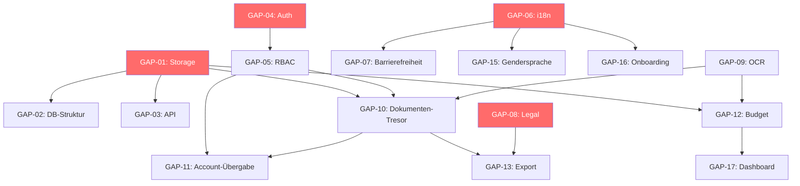

# Open Gaps User Stories – Ordnung-Ruhe / Maloja Plana

> Konsolidierte, deduplizierte Referenz aller offenen Entscheidungspunkte.  
> Jeder Punkt: User Story, Akzeptanzkriterien, Dependencies, Sprint-Zuweisung.  
> Status: **Audit- und sprint-ready** | Stand: 2026-05-17

---

## Zusammenfassung

| Metrik | Wert |
|--------|------|
| Offene Punkte gesamt | 17 |
| Priorität Hoch | 11 |
| Priorität Mittel | 6 |
| Sprint Iteration 1 | 8 |
| Sprint Iteration 2 | 7 |
| Sprint Iteration 3 | 2 |

---

## Iteration 1 – Foundation & Compliance

### GAP-01: Lokaler vs. Server-Speicher (Dokumenten-Tresor)

| Feld | Wert |
|------|------|
| **Priorität** | Hoch |
| **Modul / Agent** | Storage-Agent, DB-Agent |
| **Sprint** | Iteration 1 |
| **Status** | Offen |

**User Story:**  
Als Nutzer:in möchte ich, dass meine Dokumente lokal verschlüsselt gespeichert werden, aber optional auf sicheren Servern synchronisiert, damit ich jederzeit Zugriff habe und Datenschutz gewahrt bleibt.

**Akzeptanzkriterien:**
1. Dokumente werden verschlüsselt lokal gespeichert (IndexedDB + AES-256)
2. Optionale Server-Synchronisation mit Zero-Knowledge-Verschlüsselung
3. Offline-First Zugriff jederzeit möglich
4. Konfliktfreie Synchronisation bei Reconnect

**Dependencies:** Datenbank-Design (GAP-13), Verschlüsselungs-Module, API Backend (GAP-10)

**Entscheidungspunkt:** IndexedDB + localStorage als Primärspeicher, Server-API als optionale Sync-Schicht. Zero-dependency Constraint beachten.

---

### GAP-02: Saubere Datenbank / Storage-Struktur

| Feld | Wert |
|------|------|
| **Priorität** | Hoch |
| **Modul / Agent** | DB-Agent, Storage-Agent |
| **Sprint** | Iteration 1 |
| **Status** | Offen |

**User Story:**  
Als Entwickler:in möchte ich eine saubere, normalisierte Datenbankstruktur haben, um Performance, Erweiterbarkeit und Datensicherheit zu gewährleisten.

**Akzeptanzkriterien:**
1. DB-Schema dokumentiert und versioniert
2. IndexedDB Stores: `maloja-plana-audit` (v2), `maloja-plana-workflows`, `ordnung-ruhe-documents`, `ordnung-ruhe-backups`
3. Migrationen getestet (v1 → v2 upgrade path)
4. Persistenz und Backups vorhanden
5. Audit Logs mit Hash-Chain-Integrität

**Dependencies:** Storage & Synchronisation (GAP-01), Backend-Agent

**Entscheidungspunkt:** Normalisierung vs. denormalisierte Dokumente für Offline-Performance abwägen.

---

### GAP-03: API-Schnittstellen Backend / Frontend

| Feld | Wert |
|------|------|
| **Priorität** | Hoch |
| **Modul / Agent** | Backend-Agent, Frontend-Agent |
| **Sprint** | Iteration 1 |
| **Status** | Offen |

**User Story:**  
Als Entwickler:in möchte ich konsistente, standardisierte API-Schnittstellen für alle Module, damit Frontend und Backend sauber kommunizieren.

**Akzeptanzkriterien:**
1. REST Endpoints für Storage, OCR, Dokumenten-Tresor, Budget, Rollen
2. Authentifizierung & Autorisierung integriert
3. Offline-First kompatibel (Queue + Retry bei Reconnect)
4. Performance- und Sicherheitstests bestanden
5. OpenAPI / Swagger Dokumentation

**Dependencies:** Storage (GAP-01), Auth (GAP-08), Frontend

**Entscheidungspunkt:** REST vs. GraphQL. Empfehlung: REST für MVP (weniger Overhead), GraphQL als spätere Erweiterung.

---

### GAP-04: Sichere Login-Methoden & Auth

| Feld | Wert |
|------|------|
| **Priorität** | Hoch |
| **Modul / Agent** | Auth-Agent, Security-Agent |
| **Sprint** | Iteration 1 |
| **Status** | Offen |

**User Story:**  
Als Nutzer:in möchte ich mich über mehrere sichere Methoden einloggen (Passwort, Biometrie, Magic Link), um Flexibilität und Sicherheit zu kombinieren.

**Akzeptanzkriterien:**
1. Passwort + Biometrie (WebAuthn) + optional Magic Link
2. 2FA optional aktivierbar
3. Audit-Log aller Login-Versuche
4. Failover-Mechanismen bei Authentifizierungsfehlern
5. Offline-First: lokale Authentifizierung möglich

**Dependencies:** Backend Auth, Security-Agent, RBAC (GAP-05)

**Entscheidungspunkt:** WebAuthn für Biometrie (kein Vendor-Lock-in). Offline-Auth via verschlüsselten lokalen Token.

---

### GAP-05: Rollen & Permissions / Audit

| Feld | Wert |
|------|------|
| **Priorität** | Hoch |
| **Modul / Agent** | Security-Agent, Access-Control |
| **Sprint** | Iteration 1 |
| **Status** | Offen |

**User Story:**  
Als Administrator:in möchte ich granulare, auditierbare Berechtigungen, um Zugriff rollenbasiert zu steuern.

**Akzeptanzkriterien:**
1. RBAC mit 4+ Rollen: Admin, Eltern, Kind, Med-Personal
2. 9+ Capabilities mit Vererbung
3. Audit-Logs für jede Berechtigungsänderung
4. Verschlüsselte Übergabe bei Rollenänderung
5. Fail-safe: Deny by default

**Dependencies:** Auth Module (GAP-04), Secure Safe, Hash-Chain Evidence

**Entscheidungspunkt:** Phase 2 RBAC-Engine (bereits spezifiziert) als Basis nutzen. Erweiterung um Med-Personal-Rolle.

---

### GAP-06: Mehrsprachigkeit inkl. Rätoromanisch

| Feld | Wert |
|------|------|
| **Priorität** | Hoch |
| **Modul / Agent** | Localization-Agent, UI-Agent |
| **Sprint** | Iteration 1 |
| **Status** | Offen |

**User Story:**  
Als Nutzer:in möchte ich die App in allen wichtigen Sprachen nutzen, inkl. Rätoromanisch, damit Barrieren reduziert werden.

**Akzeptanzkriterien:**
1. UI komplett übersetzbar (JSON-basierte i18n)
2. Sprachen: DE, FR, IT, EN, RM (Rätoromanisch)
3. Default-Fallback-Kette: RM → DE → EN
4. Dynamisch ladbare Sprachdateien (kein Bundle-Bloat)
5. Text-to-Speech Integration für Barrierefreiheit

**Dependencies:** UI Framework, Translation Files, Accessibility (GAP-07)

**Entscheidungspunkt:** Crowdsourced vs. professionelle Übersetzung für Rätoromanisch. TTS-Engine: Web Speech API (zero-dependency).

---

### GAP-07: Barrierefreiheit

| Feld | Wert |
|------|------|
| **Priorität** | Hoch |
| **Modul / Agent** | Accessibility-Agent, UI-Agent |
| **Sprint** | Iteration 1 |
| **Status** | Offen |

**User Story:**  
Als Nutzer:in mit Beeinträchtigungen möchte ich die App barrierefrei nutzen, inkl. für Analphabeten, Sehbehinderte und Screen Reader.

**Akzeptanzkriterien:**
1. WCAG 2.1 AA Compliance
2. Screen Reader Kompatibilität (ARIA)
3. Text-to-Speech für alle Inhalte
4. Tastatur- und Sprachsteuerung
5. Anpassbare UI (Kontrast, Schriftgrösse)
6. Niederschwellige Navigation für Analphabeten (Icon-basiert)

**Dependencies:** UI/UX, Mehrsprachigkeit (GAP-06), Accessibility Testing

**Entscheidungspunkt:** Icon-basierte Navigation als Alternative zu Text. Automatisierte A11y-Tests in CI.

---

### GAP-08: Datenschutz & Rechtliches (AGB, DSGVO, EU AI Act)

| Feld | Wert |
|------|------|
| **Priorität** | Hoch |
| **Modul / Agent** | Legal-Agent, Frontend-Agent |
| **Sprint** | Iteration 1 |
| **Status** | Offen |

**User Story:**  
Als Nutzer:in möchte ich, dass alle rechtlichen Vorgaben eingehalten werden (AGB, Impressum, DSGVO, EU AI Act), um Vertrauen und Compliance zu gewährleisten.

**Akzeptanzkriterien:**
1. DSGVO-konforme Speicherung & Löschkonzept
2. AGB, Datenschutzrichtlinien, Impressum sichtbar in App
3. EU AI Act Art. 13, 14 Compliance (Transparenz, Human Oversight)
4. Audit-Logging für alle kritischen Aktionen
5. Cookie-freie Architektur (Offline-First = kein Tracking)

**Dependencies:** Storage (GAP-01), API (GAP-03), ISO 27001 Framework

**Entscheidungspunkt:** Schweizer DSG + EU DSGVO parallel. Kein externer Tracking-Service.

---

## Iteration 2 – Features & Integration

### GAP-09: OCR / Krankenkassen-Scanner

| Feld | Wert |
|------|------|
| **Priorität** | Hoch |
| **Modul / Agent** | OCR-Agent, Storage-Agent |
| **Sprint** | Iteration 2 |
| **Status** | Offen |

**User Story:**  
Als Nutzer:in möchte ich Rechnungen und Formulare automatisch scannen und relevante Daten extrahieren, um Zeit zu sparen und Fehler zu vermeiden.

**Akzeptanzkriterien:**
1. OCR-Erkennung aller gängigen Dokumenttypen (Rechnungen, Bescheinigungen, KVG-Formulare)
2. Automatisches Tagging und Zuordnung zu Budget / Versicherungen
3. Dokumenten-Tresor Integration (verschlüsselt)
4. Offline-Erkennung möglich
5. Barrierefreiheit für sehbehinderte Nutzer:innen

**Dependencies:** Dokumenten-Tresor (GAP-11), Storage (GAP-01), Budget Module (GAP-12)

**Entscheidungspunkt:** Tesseract.js (Offline, zero-server) vs. Cloud OCR. Empfehlung: Tesseract.js für Offline-First, optional Cloud-Fallback für komplexe Dokumente.

---

### GAP-10: Dokumenten-Tresor (Secure Safe)

| Feld | Wert |
|------|------|
| **Priorität** | Hoch |
| **Modul / Agent** | Storage-Agent, Security-Agent |
| **Sprint** | Iteration 2 |
| **Status** | Offen |

**User Story:**  
Als Nutzer:in möchte ich einen sicheren Ort für alle sensiblen Dokumente haben, inklusive Verschlüsselung und rollenbasierter Zugriffskontrolle.

**Akzeptanzkriterien:**
1. End-to-End Verschlüsselung (AES-256-GCM)
2. Rollenbasierter Zugriff (Eltern, Kind, Med-Personal)
3. Verschlüsselte Datenübergabe an Secure Safe
4. Integration mit Familienaccount-Übernahme (GAP-11)
5. Bestätigung für erfolgreiche Speicherung + Audit-Trail

**Dependencies:** Storage (GAP-01), RBAC (GAP-05), Verschlüsselungsmodul

**Entscheidungspunkt:** Web Crypto API für clientseitige Verschlüsselung (zero-dependency). Key-Management: PBKDF2 aus User-Passphrase.

---

### GAP-11: Familienaccount / Kinder-Account Übergabe

| Feld | Wert |
|------|------|
| **Priorität** | Hoch |
| **Modul / Agent** | Account-Management, Security-Agent |
| **Sprint** | Iteration 2 |
| **Status** | Offen |

**User Story:**  
Als Elternteil möchte ich, dass der Kinderaccount bei Volljährigkeit oder Auszug übertragen werden kann, damit alle Daten und Berechtigungen korrekt migriert werden.

**Akzeptanzkriterien:**
1. Übertragungsprozess dokumentiert und auditierbar
2. Rechte und Rollen korrekt migriert (Eltern → Eigenständig)
3. Datenverschlüsselung bleibt erhalten (Re-Keying)
4. Benachrichtigung an alle Beteiligten
5. Konfliktfreie Historie (Audit Trail mit Hash-Chain)

**Dependencies:** RBAC (GAP-05), Dokumenten-Tresor (GAP-10), Verschlüsselungssystem

**Entscheidungspunkt:** Re-Keying-Strategie bei Übergabe. Empfehlung: neue Keys generieren, Daten mit neuem Key re-encrypten, alter Key invalidiert.

---

### GAP-12: Budget & Schulden-Verknüpfung

| Feld | Wert |
|------|------|
| **Priorität** | Hoch |
| **Modul / Agent** | Budget-Agent, Finance-Agent |
| **Sprint** | Iteration 2 |
| **Status** | Offen |

**User Story:**  
Als Nutzer:in möchte ich, dass meine Schulden und Ausgaben automatisch im Budget berücksichtigt werden, inkl. realistischer Vorschläge und Warnungen.

**Akzeptanzkriterien:**
1. Dashboard zeigt aktuelle Schulden, Ausgaben, Einnahmen
2. Verknüpfung mit Krankenkassen-Dokumenten (via OCR)
3. Vorschläge für Optimierungen (Vergleich mit CH-Referenzwerten)
4. Alerts bei Budgetüber-/Unterschreitung
5. Offline-First: alle Berechnungen lokal

**Dependencies:** Storage (GAP-01), OCR (GAP-09), API (GAP-03)

**Entscheidungspunkt:** Referenzdaten (CH-Durchschnitt) als statische JSON-Datei bundlen vs. API-Abruf. Empfehlung: statisch (Offline-First).

---

### GAP-13: Export / Dokumentenversand an Ämter

| Feld | Wert |
|------|------|
| **Priorität** | Mittel |
| **Modul / Agent** | Storage-Agent, Communication-Agent |
| **Sprint** | Iteration 2 |
| **Status** | Offen |

**User Story:**  
Als Nutzer:in möchte ich fertige Dokumente direkt per Mail an Behörden oder Institutionen senden können, damit administrative Prozesse automatisiert werden.

**Akzeptanzkriterien:**
1. PDF / CSV Export (Schweizer Semikolon-Format)
2. Optionaler Mail-Versand direkt aus App
3. Verschlüsselte Übertragung
4. Nachverfolgung & Audit-Log
5. DSGVO-konforme Mail-Schnittstelle

**Dependencies:** Dokumenten-Tresor (GAP-10), Mail API, Legal (GAP-08)

**Entscheidungspunkt:** Mail-API: User's eigener SMTP vs. Plattform-Service. Empfehlung: `mailto:`-Link als MVP (zero-server), API-Versand als Phase 3.

---

### GAP-14: Drag & Drop für Aufgaben / Dokumente

| Feld | Wert |
|------|------|
| **Priorität** | Mittel |
| **Modul / Agent** | UI-Agent, Task-Agent |
| **Sprint** | Iteration 2 |
| **Status** | Offen |

**User Story:**  
Als Nutzer:in möchte ich Dokumente und Aufgaben per Drag & Drop verschieben können, um effizient zu arbeiten.

**Akzeptanzkriterien:**
1. Drag & Drop funktioniert auf Desktop und Tablet
2. Aufgabenlisten dynamisch aktualisiert
3. Touch-Support für mobile Geräte
4. Accessibility: Keyboard-Alternative vorhanden

**Dependencies:** UI Framework, Task-Agent, Accessibility (GAP-07)

**Entscheidungspunkt:** Native HTML5 Drag & Drop API (zero-dependency) + Touch Events Polyfill.

---

## Iteration 3 – Polish & Sustainability

### GAP-15: Niederschwelligkeit & Genderneutrale Sprache

| Feld | Wert |
|------|------|
| **Priorität** | Mittel |
| **Modul / Agent** | UI-Agent, Localization-Agent |
| **Sprint** | Iteration 3 |
| **Status** | Offen |

**User Story:**  
Als Nutzer:in möchte ich, dass Texte leicht verständlich und genderneutral formuliert sind, um inklusiv und barrierefrei zu sein.

**Akzeptanzkriterien:**
1. Alle Texte genderneutral (Styleguide erstellt)
2. Einfache Formulierungen (Leichte Sprache Level B1)
3. Anpassung für Analphabeten (Icon-basierte UI)
4. Konsistente Terminologie in allen Sprachen

**Dependencies:** Mehrsprachigkeit (GAP-06), Text Content Module

**Entscheidungspunkt:** Styleguide als separates Dokument pflegen. Automatisierte Lint-Regel für Gendersprache in CI.

---

### GAP-16: Tutorials & Onboarding

| Feld | Wert |
|------|------|
| **Priorität** | Mittel |
| **Modul / Agent** | UI-Agent, Localization-Agent |
| **Sprint** | Iteration 3 |
| **Status** | Offen |

**User Story:**  
Als neue:r Nutzer:in möchte ich Schritt-für-Schritt erklärt bekommen, wie ich die App nutzen kann.

**Akzeptanzkriterien:**
1. Interaktives Tutorial beim ersten Login
2. Später erneut abrufbar (Settings)
3. Mehrsprachig verfügbar
4. Text-to-Speech Support
5. Modular und update-fähig

**Dependencies:** Frontend UI, i18n (GAP-06), Accessibility (GAP-07)

**Entscheidungspunkt:** Overlay-basiertes Tutorial (zero-dependency) vs. separater Onboarding-Flow. Empfehlung: Inline-Tooltips + optionaler Walkthrough.

---

### GAP-17: Dashboard / Visualisierung

| Feld | Wert |
|------|------|
| **Priorität** | Mittel |
| **Modul / Agent** | Frontend-Agent, Data-Agent |
| **Sprint** | Iteration 3 |
| **Status** | Offen |

**User Story:**  
Als Nutzer:in möchte ich ein zentrales Dashboard mit Statusübersicht aller Tasks, Budgets, Dokumente und Statistiken.

**Akzeptanzkriterien:**
1. Übersichtliche Darstellung (Charts, KPIs, Task-Status)
2. Real-Time Updates bei Änderungen (Event Bus)
3. Visualisierung des Fortschritts (keine Gamification!)
4. Filter und Rollen-basiertes Zugriffskonzept

**Dependencies:** Frontend, Data Aggregation, Budget (GAP-12), Storage (GAP-01)

**Entscheidungspunkt:** Canvas-basierte Charts (zero-dependency) vs. SVG. Empfehlung: SVG für Accessibility (Screen Reader kann SVG-Labels lesen).

---

### GAP-18: Nachhaltigkeit / CSR Badge

| Feld | Wert |
|------|------|
| **Priorität** | Mittel |
| **Modul / Agent** | Frontend-Agent, Marketing-Agent |
| **Sprint** | Iteration 3 |
| **Status** | Offen |

**User Story:**  
Als Nutzer:in möchte ich ein sichtbares CSR- bzw. Nachhaltigkeitssiegel in App & Web sehen, um Vertrauen und Unternehmenswerte sichtbar zu machen.

**Akzeptanzkriterien:**
1. Badge sichtbar im Frontend & App Store
2. Hinweis auf B Corp / Eco-Friendly Zertifizierung
3. Schema.org Markup integriert (Google Knowledge Panel)
4. Tracking der Ressourceneffizienz für CSR-Berichte

**Dependencies:** Frontend, Marketing, CSR-Dokumentation

**Entscheidungspunkt:** B Corp Zertifizierung als langfristiges Ziel. MVP: Self-declared Sustainability Statement + Schema.org Markup.

---

### GAP-19: Speicher- & Verbrauchsmanagement

| Feld | Wert |
|------|------|
| **Priorität** | Mittel |
| **Modul / Agent** | Backend-Agent, DevOps-Agent |
| **Sprint** | Iteration 3 |
| **Status** | Offen |

**User Story:**  
Als Betreiber:in möchte ich, dass Server, Storage und Runtime effizient, sicher und überwacht laufen.

**Akzeptanzkriterien:**
1. Monitoring & Logging implementiert
2. Alerts bei kritischer Last
3. Speicherverbrauch optimiert (Build Budget: < 250KB gzip)
4. Sicherheits-Checks dokumentiert
5. Ressourcenverbrauch protokolliert für CSR

**Dependencies:** Backend, Storage, Runtime

**Entscheidungspunkt:** Lokale Performance-Budgets (bereits definiert in Phase 1/2) als Enforcement. Server-Monitoring erst bei optionalem Server-Sync relevant.

---

### GAP-20: Offene ADR-Entscheidungen

| Feld | Wert |
|------|------|
| **Priorität** | Hoch |
| **Modul / Agent** | Architecture-Agent |
| **Sprint** | Laufend (alle Iterationen) |
| **Status** | Offen |

**User Story:**  
Als Team möchten wir alle Architekturentscheidungen für kritische Tasks dokumentiert haben, damit Entscheidungen nachvollziehbar und auditierbar sind.

**Akzeptanzkriterien:**
1. ADR für jede kritische Entscheidung erstellt
2. Format: Context → Decision → Consequences
3. Dependencies und Trade-offs dokumentiert
4. Team-Review vor Finalisierung

**Offene ADRs:**
- ADR-001: Lokaler vs. Server-Speicher
- ADR-002: OCR Engine Selection (Tesseract.js vs. Cloud)
- ADR-003: Verschlüsselungs-Strategie (Web Crypto API)
- ADR-004: Auth-Methode (WebAuthn + Fallbacks)
- ADR-005: i18n-Architektur (JSON-basiert, lazy-loaded)
- ADR-006: Chart-Rendering (SVG vs. Canvas)
- ADR-007: Mail-Export-Strategie (mailto vs. API)

---

## Dependency Graph



---

## Kritischer Pfad

```
Iteration 1: GAP-01 → GAP-02 → GAP-03 (Storage Foundation)
             GAP-04 → GAP-05 (Auth Foundation)
             GAP-06 → GAP-07 (Accessibility Foundation)
             GAP-08 (Legal Compliance)

Iteration 2: GAP-09 → GAP-10 → GAP-11 (Document Pipeline)
             GAP-12 → GAP-13 (Finance Pipeline)
             GAP-14 (UX Enhancement)

Iteration 3: GAP-15, GAP-16, GAP-17, GAP-18, GAP-19 (Polish)
```

---

## Mapping zu Phase 1 + 2 Tasks

| Gap | Phase 1 Task | Phase 2 Task |
|-----|-------------|-------------|
| GAP-01 | P1-T03 (IndexedDB Store) | P2-T05 (Workflow Persistence) |
| GAP-02 | P1-T03, P1-T04 | P2-T05, P2-T06 |
| GAP-03 | — | P2-T15 (API Layer) |
| GAP-04 | — | P2-T09 (Auth Module) |
| GAP-05 | — | P2-T07 (RBAC Engine) |
| GAP-06 | P1-T20 (i18n Foundation) | — |
| GAP-07 | P1-T21 (A11y Baseline) | — |
| GAP-08 | P1-T26 (Legal Pages) | P2-T28 (Compliance Export) |
| GAP-09 | — | P2-T18 (OCR Module) |
| GAP-10 | — | P2-T19 (Secure Vault) |
| GAP-11 | — | P2-T20 (Account Transfer) |
| GAP-12 | P1-T15 (Budget Core) | P2-T21 (Budget Advanced) |
| GAP-20 | Laufend | Laufend |

---

## Prinzipien (Constraints für alle Gaps)

- **Offline-First:** Jede Lösung muss ohne Server funktionieren
- **Zero Dependencies:** Keine neuen npm-Pakete (Web APIs nutzen)
- **Build Budget:** Phase 1 < 200KB, Phase 2 < 250KB gzip
- **Calm UX:** Keine Gamification, keine Urgency-Sprache
- **Auditierbar:** Hash-Chain Evidence für alle kritischen Aktionen
- **ISO 27001:** A.9, A.12, A.16, A.18 Compliance
- **EU AI Act:** Art. 13 (Transparenz), Art. 14 (Human Oversight)
- **Schweiz-spezifisch:** DSG, Rätoromanisch, CH-Formate (AHV, Semikolon-CSV, Telefon)

---

> Dokument konsolidiert aus 4 Iterationen. Dedupliziert, konsistenz-geprüft, sprint-ready.  
> Nächster Schritt: ADR-Dokumente für GAP-01, GAP-09, GAP-04 erstellen.
