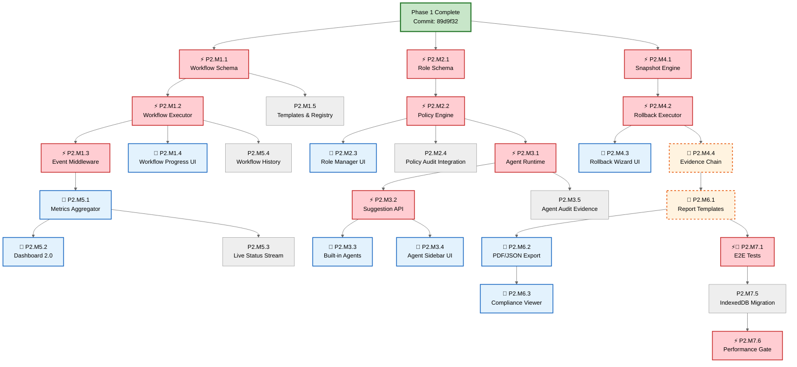
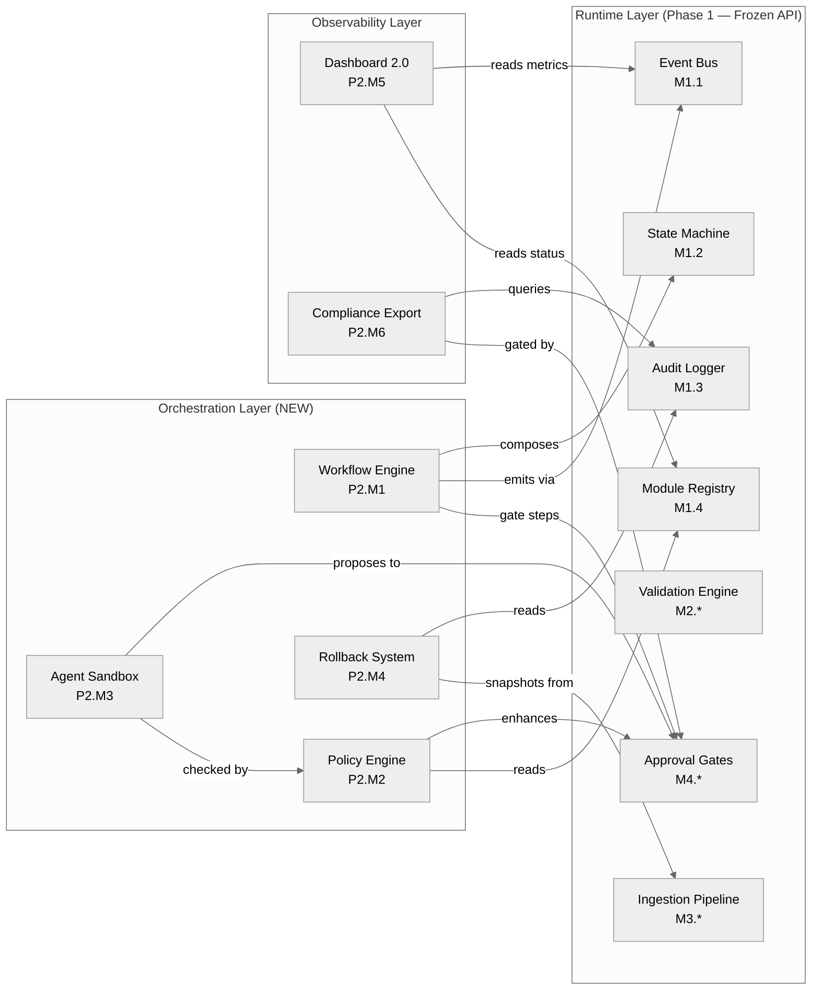
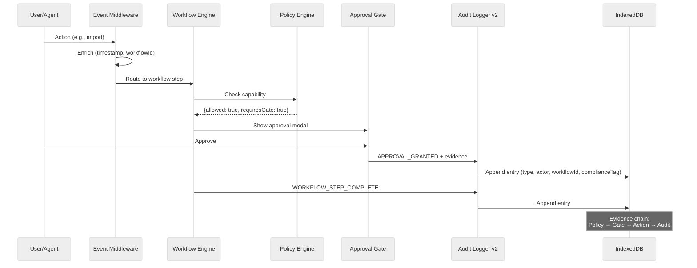
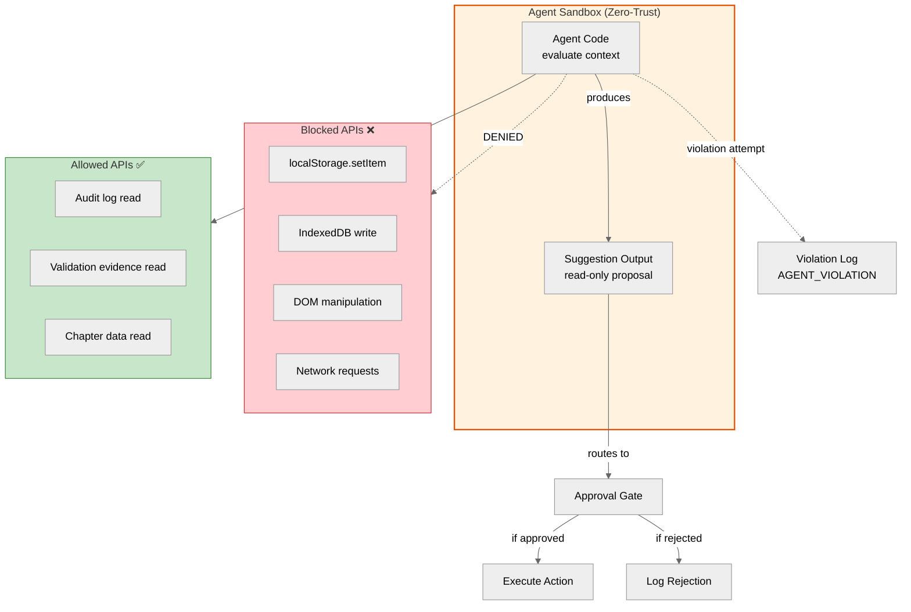
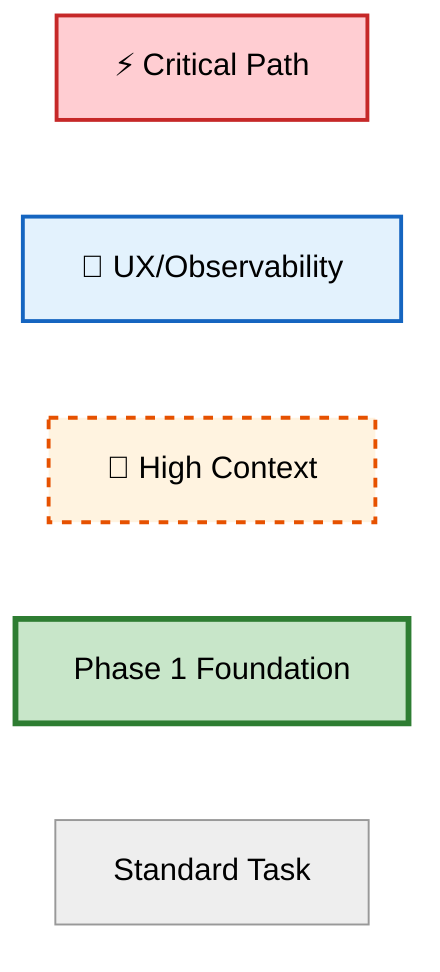

# Maloja Plana — Phase 2 Blueprint

> **Workflow Engine, Agent Layer & Team Governance — Audit-Ready Specification**

| Meta | Value |
|------|-------|
| **Version** | 1.0.0 |
| **Date** | 2026-05-17 |
| **Author** | Sophie Stebler / Stebler Studios |
| **Baseline Commit** | `81b1d93` (branch: `dev`) |
| **Prerequisite** | Phase 1 complete — all M6.5 release gates passed |
| **Duration** | 8–12 weeks estimated |
| **Branch Strategy** | `feature/p2-<milestone>-<module>` → `dev` → `main` |
| **Constraints** | Offline-first, < 250 KB gzip, zero mandatory server, Phase 1 API frozen |

> **Legend**  
> ⚡ = Critical Path Blocker | 🎯 = UX/Observability/Governance | 🔗 = High Context Dependency | 🆕 = Net-New Capability

---

## Table of Contents

1. [Phase 1 Analysis & Transition Notes](#1-phase-1-analysis--transition-notes)
2. [Phase 2 Vision](#2-phase-2-vision)
3. [Architecture Evolution](#3-architecture-evolution)
4. [Milestone Map (P2.M1–P2.M7)](#4-milestone-map)
5. [Critical Path & Parallel Tracks](#5-critical-path--parallel-tracks)
6. [Visual Maps (Mermaid)](#6-visual-maps-mermaid)
7. [Complete Task Specification](#7-complete-task-specification)
8. [ISO/Audit Evidence Framework](#8-isoaudit-evidence-framework)
9. [Agent Orchestration Evolution](#9-agent-orchestration-evolution)
10. [Success Criteria & Release Gate](#10-success-criteria--release-gate)
11. [Appendices](#11-appendices)

---

## 1. Phase 1 Analysis & Transition Notes

### 1.1 Identified Redundancies

| # | Area | Observation | Phase 2 Resolution |
|---|------|-------------|-------------------|
| R1 | Event emission | M1.1, M1.2, M1.3 each emit independently | `EventMiddleware` (P2.M1.3) — centralized enrichment, metrics, throttle |
| R2 | Evidence storage | M2.3 + M4.3 both write to `maloja-plana-audit` with type filter | Unified `EvidenceService` with composite indexes (audit v2) |
| R3 | Gate invocation | M4.3 wires gates into 3+ components manually | Declarative `useApprovalGate()` hook pattern (Phase 1 backport candidate) |
| R4 | Status computation | M1.5 + M5.2 both compute health from registry | Reactive status store via event middleware (P2.M5.3) |
| R5 | i18n structure | 34 keys added without namespacing | Namespaced: `runtime.audit.*`, `runtime.gate.*`, `workflow.*`, `agent.*` |

### 1.2 Inconsistencies Resolved

| # | Issue | Phase 1 State | Phase 2 Standard |
|---|-------|---------------|-----------------|
| I1 | Actor naming | `'agent:<name>'` inconsistent with module IDs | `'user'` / `'module:<MODULE_ID>'` / `'workflow:<id>'` / `'agent:<id>'` |
| I2 | Evidence query API | Payload filter (M2.3) vs. index query (M1.3) | Unified query interface: composite indexes in audit v2 |
| I3 | Lifecycle unification | Field + document lifecycles never composed | Workflow Engine composes state machines into DAGs |

### 1.3 Phase 1 → Phase 2 Extension Points

| Phase 1 Primitive | Task Ref | Phase 2 Extension | New Task |
|-------------------|----------|-------------------|----------|
| Event Bus (M1.1) | `src/runtime/events.js` | Event middleware, replay, metrics | P2.M1.3 |
| State Machine (M1.2) | `src/runtime/stateMachine.js` | Workflow DAG composition | P2.M1.1 |
| Audit Log (M1.3) | `src/runtime/auditLog.js` | Schema v2, compliance tags, rollback markers | P2.M7.5 |
| Module Registry (M1.4) | `src/runtime/registry.js` | Capability-based permissions | P2.M2.1 |
| Validation Engine (M2.*) | `src/runtime/validation/` | AI-assisted rule suggestions | P2.M3.3 |
| Ingestion Pipeline (M3.*) | `src/runtime/ingestion/` | Workflow-governed import | P2.M1.5 |
| Approval Gates (M4.*) | `src/runtime/gates/` | Policy-enhanced gates, escalation | P2.M2.2 |
| Audit Viewer (M5.*) | `src/components/AuditViewer.jsx` | Real-time dashboard, compliance export | P2.M5.2, P2.M6.3 |

---

## 2. Phase 2 Vision

Transform the governance runtime into a **deterministic workflow engine** with optional, sandboxed agent assistance and team-ready governance structures.

### Core Principles

| Principle | Phase 1 | Phase 2 Extension |
|-----------|---------|-------------------|
| Offline-first | All operations local | Workflows execute offline; sync is opt-in |
| Human-governed | Approval gates | Multi-level policies + delegation + escalation |
| Deterministic | State machines | Workflow DAG with guaranteed replay |
| Auditable | Append-only log | Compliance reports + hash-chained rollback proofs |
| No autonomous AI | N/A | Agents propose only; never execute without gate |

### New Capabilities

| # | Capability | Description | Key Constraint |
|---|-----------|-------------|----------------|
| 1 | Workflow Engine | Multi-step governed flows with branching + parallelism | Deterministic replay guaranteed |
| 2 | Agent Layer | Sandboxed AI suggestions (heuristic, no LLM) | Always behind approval gate |
| 3 | Role-Based Access | Capability-mapped roles, policy enforcement | Fail-safe: unknown = deny |
| 4 | Team Governance | Multi-user policies, delegation, escalation timers | Escalation never auto-approves |
| 5 | Rollback System | Evidence-chain state restoration | Hash-chained integrity proof |
| 6 | Real-Time Dashboard | Live metrics, workflow progress, sparklines | No chart library (SVG only) |
| 7 | Compliance Export | ISO-ready PDF/JSON from audit data | Browser print API (no deps) |

---

## 3. Architecture Evolution

### Phase 2 Runtime Stack

```
┌─────────────────────────────────────────────────────────────────┐
│                       UI Layer (React)                            │
│  Dashboard 2.0 │ WorkflowProgress │ AgentSidebar │ RoleManager  │
│  ComplianceViewer │ RollbackWizard │ WorkflowHistory             │
├─────────────────────────────────────────────────────────────────┤
│                   Orchestration Layer (NEW)                       │
│  Workflow Engine │ Agent Sandbox │ Policy Engine │ Role Registry │
├─────────────────────────────────────────────────────────────────┤
│                    Runtime Layer (Phase 1 — API frozen)           │
│  Event Bus │ State Machine │ Module Registry                     │
│  Validation Engine │ Ingestion Pipeline │ Approval Gates         │
│  Audit Logger │ ← Event Middleware (new wrapper)                 │
├─────────────────────────────────────────────────────────────────┤
│                   Persistence Layer (extended)                    │
│  localStorage (or5_*) │ IndexedDB (documents, backups)           │
│  IndexedDB (maloja-plana-audit v2) │ IndexedDB (workflows) ← NEW│
└─────────────────────────────────────────────────────────────────┘
```

### Persistence Map (Phase 2)

| Store | Type | Version | Purpose | Phase 2 Change |
|-------|------|---------|---------|---------------|
| `ordnung-ruhe-documents` | IndexedDB | 1 | Document blobs | ❌ Unchanged |
| `ordnung-ruhe-backups` | IndexedDB | 1 | Auto-backup snapshots | ❌ Unchanged |
| `maloja-plana-audit` | IndexedDB | **2** | Audit + evidence + compliance | ✅ Migration: +`workflowId`, +`complianceTag`, +composite index |
| `maloja-plana-workflows` | IndexedDB | **1** | Workflow defs + execution + snapshots | ✅ **NEW** |
| `or5_<chapter>` | localStorage | — | Chapter field data | ❌ Schema unchanged |
| `or5_settings` | localStorage | — | App settings | Extended: `activeRole` |

---

## 4. Milestone Map

| Milestone | Name | Weeks | Tasks | Critical | UX/Obs | High-Ctx | Phase 1 Foundation |
|-----------|------|-------|-------|----------|--------|----------|-------------------|
| **P2.M1** | Workflow Engine Core | 1–3 | 5 | 3 | 1 | 1 | M1.1, M1.2 |
| **P2.M2** | Policy & Role Engine | 3–4 | 4 | 2 | 1 | 0 | M1.4, M4.2 |
| **P2.M3** | Agent Sandbox | 4–6 | 5 | 2 | 2 | 1 | M1.1, M4.1 |
| **P2.M4** | Rollback System | 6–7 | 4 | 2 | 1 | 1 | M1.3, M3.3 |
| **P2.M5** | Real-Time Dashboard | 7–8 | 4 | 0 | 4 | 0 | M1.5, M5.1–M5.2 |
| **P2.M6** | Compliance Export | 8–9 | 3 | 0 | 2 | 1 | M5.3, M1.3 |
| **P2.M7** | Integration & Polish | 9–12 | 6 | 2 | 2 | 1 | M6.* |

**Totals**: 31 tasks | 11 ⚡ critical | 13 🎯 UX/obs | 5 🔗 high-context | ~7 new components | ~60 i18n keys

---

## 5. Critical Path & Parallel Tracks

### Critical Path (⚡ Sequential Blockers)

```
W1–2:  P2.M1.1 → P2.M1.2 → P2.M1.3
W3:    P2.M1.4 + P2.M2.1 → P2.M2.2
W4:    P2.M2.3 + P2.M3.1 → P2.M3.2
W5���6:  P2.M3.3 + P2.M4.1 → P2.M4.2
W7:    P2.M4.3 + P2.M5.1
W8:    P2.M5.2 + P2.M6.1
W9:    P2.M6.2 + P2.M7.1
W10–12: P2.M7.5 → P2.M7.6 → Release
```

### Parallel Tracks

| Track | Tasks | Starts After | Runs Parallel To |
|-------|-------|--------------|-----------------|
| **A** — Dashboard | P2.M5.1–M5.4 | P2.M1.3 | P2.M3, P2.M4 |
| **B** — Agent UI | P2.M3.4–M3.5 | P2.M3.2 | P2.M4 |
| **C** — Compliance | P2.M6.1–M6.3 | P2.M4.3 | P2.M5, P2.M7 |
| **D** — Rollback UI | P2.M4.3–M4.4 | P2.M4.2 | P2.M5 |
| **E** — Polish | P2.M7.2–M7.4 | All core done | P2.M7.1, P2.M7.6 |

### Gantt

```
W1–2  ████ P2.M1.1–M1.3 (workflow core)
W3    ██── P2.M1.4–M1.5 (workflow UI)         ██ P2.M2.1–M2.2 (roles)
W4    ████ P2.M2.3–M2.4 (policies)            ██ P2.M3.1 (agent core)
W5–6  ████ P2.M3.2–M3.5 (agent layer)         ██ P2.M4.1–M4.2 (rollback)
W7    ████ P2.M4.3–M4.4 (rollback UI)         ░░ P2.M5.1–M5.2 (dashboard)
W8    ████ P2.M5.3–M5.4 (dashboard)           ██ P2.M6.1 (compliance)
W9    ████ P2.M6.2–M6.3 (export)              ██ P2.M7.1 (E2E)
W10–12 ████ P2.M7.2–M7.6 (QA + docs + perf)  → RELEASE
```

---

## 6. Visual Maps (Mermaid)

### 6.1 Dependency Graph — Full Critical Path



### 6.2 Module Interaction Map



### 6.3 Audit Evidence Flow



### 6.4 Agent Sandbox Security Model



### 6.5 Legend



---

## 7. Complete Task Specification

### P2.M1 — Workflow Engine Core (Week 1–3)

---

#### ⚡🆕 P2.M1.1 — Workflow Definition Schema

| Field | Detail |
|-------|--------|
| **File Path** | `src/runtime/workflow/schema.js` |
| **Branch** | `feature/p2-m1-workflow-schema` |
| **Dependencies** | Phase 1 M1.2 (`src/runtime/stateMachine.js`) |
| **Agent** | Runtime Governance (lead) |
| **Thinking Framework** | **Logical + Computational** — DAG theory, schema self-validation |
| **High-Context** | No |

**Subtasks:**

| # | Task | Detail | Checkpoint |
|---|------|--------|-----------|
| 1 | Create `src/runtime/workflow/` | Module boundary | — |
| 2 | Define workflow schema | `{ id, name, version, steps: Step[], triggers: Trigger[], policies: PolicyRef[] }` | — |
| 3 | Define Step shape | `{ id, type: 'action'\|'gate'\|'branch'\|'parallel'\|'agent', config, next: string[], guard? }` | — |
| 4 | Implement `validateWorkflow(def)` | No cycles (Kahn's algorithm), all `next` resolve, terminal exists | CP-1 |
| 5 | Define built-in templates | `import-and-validate`, `bulk-update`, `compliance-check` | CP-2 |
| 6 | Unit tests | Cycle detection, orphan detection, valid DAG acceptance | CP-3 |

**Acceptance Criteria:**
- Workflows are JSON-serializable DAGs
- Cycle detection prevents infinite loops (Kahn's algorithm, O(V+E))
- Templates map 1:1 to Phase 1 flows (import, delete, validate)
- `validateWorkflow` catches: cycles, dangling refs, missing terminal, duplicate IDs

**Versioning / Persistence:**
- Definitions stored in `maloja-plana-workflows` IndexedDB, object store `definitions`
- Versioned: each save creates new version (immutable history, never overwrite)
- Templates are static code exports (not persisted)

**Checkpoints & Evidence:**

| CP | Trigger | Verification | Debug Command |
|----|---------|-------------|---------------|
| CP-1 | After subtask 4 | Import template DAG → 8 steps → validates clean | `validateWorkflow(importTemplate)` |
| CP-2 | After subtask 4 | Inject cycle (step A→B→A) → validator returns `{ valid:false, error:'cycle_detected' }` | Console: cycle error with involved step IDs |
| CP-3 | After subtask 4 | Orphan step (no incoming edge, not root) → warning | `validateWorkflow(orphanDef).warnings` |

**Agent Memory State:** `"Workflow schema: 5 step types, DAG-validated, 3 templates, stored in maloja-plana-workflows."`

**ISO Evidence:** Schema validation unit tests prove structural integrity of all workflow definitions.

---

#### ⚡🆕 P2.M1.2 — Workflow Executor

| Field | Detail |
|-------|--------|
| **File Path** | `src/runtime/workflow/executor.js` |
| **Branch** | `feature/p2-m1-workflow-executor` |
| **Dependencies** | P2.M1.1, Phase 1 M1.1 (event bus), M1.2 (state machine) |
| **Agent** | Runtime Governance (lead) |
| **Thinking Framework** | **Procedural + Computational** — step sequencing, Promise coordination |
| **High-Context** | 🔗 Yes — coordinates event bus, state machine, gates, persistence |

**Subtasks:**

| # | Task | Detail | Checkpoint |
|---|------|--------|-----------|
| 1 | Implement `createWorkflowInstance(def, ctx)` | Returns `{ run(), pause(), getState(), resume() }` | — |
| 2 | Sequential step engine | Follows `next` pointers, one at a time | CP-1 |
| 3 | Parallel step support | `type:'parallel'` → `Promise.all(childSteps)` | CP-2 |
| 4 | Branch step support | `type:'branch'` → evaluate condition → follow one path | — |
| 5 | Gate step integration | `type:'gate'` → invoke Phase 1 `requestApproval()`, await | CP-3 |
| 6 | Agent step integration | `type:'agent'` → invoke sandbox (P2.M3), await proposal + gate | — |
| 7 | Emit workflow events | `WORKFLOW_START`, `WORKFLOW_STEP`, `WORKFLOW_COMPLETE`, `WORKFLOW_FAILED` | — |
| 8 | Persist execution state | Save to IndexedDB after each step completion | CP-4 |
| 9 | Implement `resume()` | On app reload, restore from last persisted state | CP-4 |
| 10 | Unit tests | Linear, parallel, branch, gate, resume, failure handling | — |

**Acceptance Criteria:**
- Deterministic: same definition + same input → same execution path
- Parallel branches resolve via `Promise.all` (all must succeed)
- Gate steps block indefinitely until human action (no timeout, no auto-approve)
- Execution state persisted after each step (survives page refresh)
- Events emitted per step for observability

**Versioning / Persistence:**
- Execution state in `maloja-plana-workflows` IndexedDB, object store `instances`
- Schema: `{ instanceId, definitionId, definitionVersion, currentSteps[], completedSteps[], context, startedAt, updatedAt }`
- Resumable: `resume()` reads last state, continues from next uncompleted step

**Checkpoints & Evidence:**

| CP | Trigger | Verification | Debug Command |
|----|---------|-------------|---------------|
| CP-1 | After subtask 2 | 3-step linear → steps execute in order → `WORKFLOW_COMPLETE` emitted | `workflowInstance.getState()` |
| CP-2 | After subtask 3 | Parallel (2 branches) → both complete → next step fires | Verify event bus received 2× `WORKFLOW_STEP` then continuation |
| CP-3 | After subtask 5 | Gate step → blocks → approve → continues → audit entry | Check `maloja-plana-audit` for `APPROVAL_GRANTED` |
| CP-4 | After subtask 9 | ⚠️ **CRITICAL**: Refresh mid-workflow → `resume()` → correct step continues | DevTools: close tab → reopen → verify `getState()` |

**Agent Memory State:** `"Executor: 5 step types, parallel+branch, gate-integrated, resumable from IndexedDB, events per step."`

**ISO Evidence:** Execution state history in IndexedDB proves deterministic replay capability.

---

#### ⚡🆕 P2.M1.3 — Event Middleware

| Field | Detail |
|-------|--------|
| **File Path** | `src/runtime/eventMiddleware.js` |
| **Branch** | `feature/p2-m1-event-middleware` |
| **Dependencies** | Phase 1 M1.1 (`src/runtime/events.js` — wraps transparently) |
| **Agent** | Runtime Governance (lead) |
| **Thinking Framework** | **Computational + Analytical** — middleware chain, enrichment |
| **High-Context** | No |

**Subtasks:**

| # | Task | Detail | Checkpoint |
|---|------|--------|-----------|
| 1 | Implement middleware chain | `use(fn)` — each receives `(event, next)`, can transform or halt | CP-1 |
| 2 | Timestamp enrichment middleware | Adds `enrichedAt`, `source` metadata to every event | — |
| 3 | Workflow context middleware | If workflow active, injects `workflowId`, `stepId` | CP-2 |
| 4 | Metrics collection middleware | Counts by type per minute (60-slot ring buffer) | — |
| 5 | Throttle middleware | Rate-limits `VALIDATION_*` during rapid typing (100ms debounce) | — |
| 6 | `createEnrichedBus(baseBus, middlewares)` | Same `emit/on/off` API — Phase 1 consumers unchanged | CP-3 |
| 7 | Unit tests | Chain order, halt, enrichment, throttle, API compatibility | — |

**Acceptance Criteria:**
- Phase 1 consumers require zero changes (same `emit/on/off` interface)
- Middleware executes in registration order
- Workflow context attached automatically when workflow instance is active
- Metrics ring buffer queryable via `getMetrics()` for dashboard

**Versioning / Persistence:**
- In-memory only (ring buffer, no IndexedDB)
- Metrics buffer: 60 slots × event-type counters (last 60 minutes, 1-minute granularity)

**Checkpoints & Evidence:**

| CP | Trigger | Verification |
|----|---------|-------------|
| CP-1 | After subtask 1 | 3 middlewares → events pass through all 3 in order |
| CP-2 | After subtask 3 | Start workflow → emit event → verify `workflowId` present in payload |
| CP-3 | After subtask 6 | ⚠️ Run Phase 1 test suite with enriched bus → all tests still pass |

**Agent Memory State:** `"Middleware wraps Phase 1 bus. 4 built-in middlewares. Zero breaking changes. Metrics in ring buffer."`

---

#### 🎯🆕 P2.M1.4 — Workflow Progress UI

| Field | Detail |
|-------|--------|
| **File Path** | `src/components/WorkflowProgress.jsx` (new) |
| **Branch** | `feature/p2-m1-workflow-ui` |
| **Dependencies** | P2.M1.2 (executor state) |
| **Agent** | UX Calmness (lead), Accessibility (review) |
| **Thinking Framework** | **Analytical + Procedural** — step visualization, responsive |
| **High-Context** | No |

**Subtasks:**

| # | Task | Detail | Checkpoint |
|---|------|--------|-----------|
| 1 | Horizontal step indicator | Dots connected by lines, active step highlighted | — |
| 2 | Step labels | From workflow definition `step.config.label` | — |
| 3 | Status colors | pending=`palette.mid`, active=`palette.gold`, complete=`palette.sage`, failed=`palette.rose` | — |
| 4 | Compact mode | Single progress bar for mobile/embedded | — |
| 5 | Import flow integration | WorkflowProgress embedded in ImportPreview during import | CP-1 |
| 6 | i18n (4 locales) | `workflow.step`, `workflow.progress`, `workflow.complete`, `workflow.failed` | — |
| 7 | Accessibility | `role="progressbar"`, `aria-valuenow`, step change announcements | — |
| 8 | 375px + dark mode | Responsive + palette-only colors | CP-2 |

**Acceptance Criteria:**
- User sees current position in multi-step flow
- Calm, non-intrusive (subtle gold pulse on active, no jarring animations)
- Accessible: screen reader announces step transitions
- Works at 375px in compact mode

**Checkpoints & Evidence:**

| CP | Trigger | Verification |
|----|---------|-------------|
| CP-1 | After subtask 5 | Start import → progress shows 8 steps → advances as pipeline proceeds |
| CP-2 | Visual QA | Screenshot at 375px dark mode — no overflow, all dots visible |

---

#### 🆕 P2.M1.5 — Workflow Templates & Registry

| Field | Detail |
|-------|--------|
| **File Path** | `src/runtime/workflow/templates.js`, `src/runtime/workflow/registry.js` |
| **Branch** | `feature/p2-m1-workflow-registry` |
| **Dependencies** | P2.M1.1, P2.M1.2 |
| **Agent** | Runtime Governance (lead) |
| **Thinking Framework** | **Logical** — template composition, registry pattern |
| **High-Context** | No |

**Subtasks:**

| # | Task | Detail | Checkpoint |
|---|------|--------|-----------|
| 1 | `import-and-validate` template | 8 steps matching Phase 1 pipeline (read→parse→map→validate→preview→approve→persist→audit) | CP-1 |
| 2 | `bulk-update` template | Multi-field update: validate-all → single gate → persist-batch → audit | — |
| 3 | `compliance-check` template | For each chapter: run validation → aggregate → generate summary | — |
| 4 | Implement `workflowRegistry` | `register(def)`, `get(id)`, `instantiate(id, context)` | — |
| 5 | Register 'workflow' module | `registry.registerModule({ id: 'workflow', ... })` | CP-2 |
| 6 | Unit tests | Template validation passes, registry CRUD, module registration | — |

**Checkpoints & Evidence:**

| CP | Trigger | Verification |
|----|---------|-------------|
| CP-1 | After subtask 1 | `validateWorkflow(importTemplate)` → `{ valid: true }` |
| CP-2 | After subtask 5 | `registry.getModule('workflow')` returns registered module |

---

### P2.M2 — Policy & Role Engine (Week 3–4)

---

#### ⚡🆕 P2.M2.1 — Role Definition Schema

| Field | Detail |
|-------|--------|
| **File Path** | `src/runtime/roles/schema.js` |
| **Branch** | `feature/p2-m2-role-schema` |
| **Dependencies** | Phase 1 M1.4 (`src/runtime/registry.js`) |
| **Agent** | Runtime Governance (lead) |
| **Thinking Framework** | **Logical** — RBAC theory, capability taxonomy |
| **High-Context** | No |

**Subtasks:**

| # | Task | Detail | Checkpoint |
|---|------|--------|-----------|
| 1 | Create `src/runtime/roles/` | Module boundary | — |
| 2 | Define role shape | `{ id, name, capabilities: string[], inherits?: string[] }` | — |
| 3 | Define built-in roles | `owner`(all), `editor`(data ops), `viewer`(read-only), `auditor`(audit+export) | CP-1 |
| 4 | Define capabilities | `data.read`, `data.write`, `data.delete`, `data.import`, `audit.read`, `audit.export`, `workflow.execute`, `settings.modify`, `agent.invoke` | — |
| 5 | Implement `hasCapability(role, cap)` | Resolves inheritance: `editor` inherits `viewer` capabilities | CP-2 |
| 6 | Unit tests | Direct, inherited, missing, hierarchy chain, unknown → deny | CP-3 |

**Acceptance Criteria:**
- Roles are JSON-serializable plain objects
- Inheritance resolves recursively (no cycles in role hierarchy)
- `owner` has all capabilities implicitly (wildcard)
- Unknown capability → deny (**fail-safe**)
- Backward-compatible: single-user defaults to `owner` role

**Versioning / Persistence:**
- Static code exports (no persistence in Phase 2 single-user mode)
- Active role stored in `or5_settings.activeRole` (default: `'owner'`)
- Future (Phase 3): server-synced roles for multi-user

**Checkpoints & Evidence:**

| CP | Trigger | Verification |
|----|---------|-------------|
| CP-1 | After subtask 3 | `hasCapability('owner', 'data.delete')` → true |
| CP-2 | After subtask 5 | `hasCapability('editor', 'data.read')` → true (inherited from viewer) |
| CP-3 | After subtask 6 | `hasCapability('viewer', 'data.write')` → false; `hasCapability('viewer', 'unknown.thing')` → false |

**Agent Memory State:** `"4 roles, 9 capabilities, inheritance chain, fail-safe deny. Active role in or5_settings."`

---

#### ⚡🆕 P2.M2.2 — Policy Engine

| Field | Detail |
|-------|--------|
| **File Path** | `src/runtime/roles/policyEngine.js` |
| **Branch** | `feature/p2-m2-policy-engine` |
| **Dependencies** | P2.M2.1, Phase 1 M4.2 (`src/runtime/gates/registry.js`) |
| **Agent** | Runtime Governance (lead) |
| **Thinking Framework** | **Logical + Procedural** — policy evaluation, gate enhancement |
| **High-Context** | No |

**Subtasks:**

| # | Task | Detail | Checkpoint |
|---|------|--------|-----------|
| 1 | Define policy shape | `{ id, operation, requiredCapability, escalation?: { afterMs, toRole } }` | — |
| 2 | Implement `evaluatePolicy(op, actor, ctx)` | Returns `{ allowed, denied, requiresGate, reason }` | CP-1 |
| 3 | Enhance Phase 1 gate registry | Check policy before showing gate UI (deny early) | CP-2 |
| 4 | Implement escalation timer | Unresolved gate after N ms → log escalation (never auto-approve) | CP-3 |
| 5 | Emit `POLICY_EVALUATED` event | For audit trail + metrics | — |
| 6 | Register 'policy' module | Via Phase 1 registry | — |
| 7 | Unit tests | Allow, deny, gate-required, escalation, backward compat | — |

**Acceptance Criteria:**
- Deny immediately if role lacks capability (no gate shown)
- Gate shown only if capable but operation needs confirmation
- Escalation logs but **NEVER auto-approves** (security invariant)
- Backward-compatible: Phase 1 behavior unchanged when role = `owner`

**Gate Condition:** Escalation produces audit entry `{ type: 'ESCALATION' }` only. No state change. No auto-resolution.

**Checkpoints & Evidence:**

| CP | Trigger | Verification |
|----|---------|-------------|
| CP-1 | After subtask 2 | Viewer + `data.delete` → `{ allowed: false, reason: 'capability_missing' }` |
| CP-2 | After subtask 3 | Viewer clicks delete → no gate modal → immediate denial message |
| CP-3 | After subtask 4 | Gate open 5 min → escalation logged → gate still pending (not resolved) |

**ISO Evidence:** Policy evaluation log proves access control enforcement per operation.

---

#### 🎯🆕 P2.M2.3 — Role Manager UI

| Field | Detail |
|-------|--------|
| **File Path** | `src/components/RoleManager.jsx` (new) |
| **Branch** | `feature/p2-m2-role-ui` |
| **Dependencies** | P2.M2.1 |
| **Agent** | UX Calmness (lead), Accessibility (review) |
| **Thinking Framework** | **Analytical + Procedural** — capability visualization |
| **High-Context** | No |

**Subtasks:**

| # | Task | Detail | Checkpoint |
|---|------|--------|-----------|
| 1 | Role list | Cards: role name + capability count + inherited badge | — |
| 2 | Capability matrix | Grid: roles × capabilities with checkmarks/inheritance indicators | — |
| 3 | Active role selector | Dropdown in settings, persists to `or5_settings.activeRole` | CP-1 |
| 4 | i18n (4 locales) | `roles.title`, `roles.capabilities`, `roles.active`, role display names | — |
| 5 | Accessible table | `<table>` with `<th>` headers, `aria-label` on checkmarks | — |
| 6 | 375px + dark mode | Horizontal scroll on mobile, palette-only | CP-2 |

**Checkpoints & Evidence:**

| CP | Trigger | Verification |
|----|---------|-------------|
| CP-1 | After subtask 3 | Switch to 'viewer' → attempt delete → denied (policy enforced) |
| CP-2 | Visual QA | Screenshot at 375px dark mode — table scrollable, no clip |

---

#### 🆕 P2.M2.4 — Policy Audit Integration

| Field | Detail |
|-------|--------|
| **File Path** | `src/runtime/roles/evidence.js` |
| **Branch** | `feature/p2-m2-policy-audit` |
| **Dependencies** | P2.M2.2, Phase 1 M1.3 (`src/runtime/auditLog.js`) |
| **Agent** | Runtime Governance (lead) |
| **Thinking Framework** | **Procedural** — evidence chain, compliance |
| **High-Context** | No |

**Subtasks:**

| # | Task | Detail | Checkpoint |
|---|------|--------|-----------|
| 1 | Log `POLICY_EVALUATED` | `{ actor, operation, result, role, capabilities }` | CP-1 |
| 2 | Log `CAPABILITY_DENIED` | Separate type for immediate denials | — |
| 3 | Log `ESCALATION` | `{ operation, afterMs, toRole, gateId }` | — |
| 4 | Extend AuditViewer filter | Add "Policy" option to type dropdown | — |
| 5 | Unit tests | Evidence retrievable, filterable by new types | — |

**Checkpoints & Evidence:**

| CP | Trigger | Verification |
|----|---------|-------------|
| CP-1 | After subtask 1 | Evaluate policy → entry in `maloja-plana-audit` with type `POLICY_EVALUATED` |

**ISO Evidence:** Complete policy evaluation log satisfies ISO 27001 A.9 access control audit requirements.

---

### P2.M3 — Agent Sandbox (Week 4–6)

---

#### ⚡🆕 P2.M3.1 — Agent Runtime

| Field | Detail |
|-------|--------|
| **File Path** | `src/runtime/agents/runtime.js` |
| **Branch** | `feature/p2-m3-agent-runtime` |
| **Dependencies** | Phase 1 M1.1 (events), P2.M2.2 (policy check) |
| **Agent** | Runtime Governance (lead) |
| **Thinking Framework** | **Computational + Logical** — sandbox isolation, zero-trust |
| **High-Context** | 🔗 Yes — integrates policy, events, gates |

**Subtasks:**

| # | Task | Detail | Checkpoint |
|---|------|--------|-----------|
| 1 | Create `src/runtime/agents/` | Module boundary | — |
| 2 | Define agent shape | `{ id, name, capabilities: string[], evaluate: (ctx) => Suggestion }` | — |
| 3 | Implement `createAgentSandbox(agent, perms)` | Returns restricted API: read-only data access | CP-1 |
| 4 | Sandbox restrictions | **BLOCKED**: localStorage write, IndexedDB write, DOM, fetch, eval | CP-2 |
| 5 | Agent output: `Suggestion` | `{ type, description, changes: [], confidence: 0-1, evidence }` | — |
| 6 | Route all suggestions through gate | `requestApproval('agent_suggestion', suggestion.changes)` | CP-3 |
| 7 | Emit `AGENT_SUGGESTION` event | For audit + sidebar display | — |
| 8 | Log sandbox violations | `{ type: 'AGENT_VIOLATION', agentId, attemptedAction, timestamp }` | CP-2 |
| 9 | Register 'agent' module | Via Phase 1 registry | — |
| 10 | Unit tests | Sandbox blocks writes, suggestion→gate, violation logged | — |

**Acceptance Criteria:**
- Agent **cannot** modify state directly — sandbox strictly enforced
- Every suggestion requires human approval via gate
- Sandbox violation attempts logged as `AGENT_VIOLATION` (security audit)
- Agent capabilities checked against P2.M2.2 policy engine before invocation

**Gate Condition:** Agent output ALWAYS routes through approval gate. No shortcut. No `confidence > 0.9 → auto-approve`. Never.

**Checkpoints & Evidence:**

| CP | Trigger | Verification |
|----|---------|-------------|
| CP-1 | After subtask 3 | Agent sandbox API exposes only: `readChapterData()`, `readAuditEntries()`, `readValidationEvidence()` |
| CP-2 | After subtask 4 | ⚠️ **SECURITY**: Agent calls `localStorage.setItem()` → blocked + `AGENT_VIOLATION` logged |
| CP-3 | After subtask 6 | Agent produces suggestion → gate modal appears → must approve/reject |

**ISO Evidence:** Sandbox violation log (expected: always empty in production) proves agent cannot bypass governance. Maps to AI Act Art. 14.

---

#### ⚡🆕 P2.M3.2 — Suggestion API

| Field | Detail |
|-------|--------|
| **File Path** | `src/runtime/agents/suggestions.js` |
| **Branch** | `feature/p2-m3-suggestions` |
| **Dependencies** | P2.M3.1 |
| **Agent** | Runtime Governance (lead) |
| **Thinking Framework** | **Analytical + Procedural** — lifecycle management |
| **High-Context** | No |

**Subtasks:**

| # | Task | Detail | Checkpoint |
|---|------|--------|-----------|
| 1 | Implement `createSuggestion(agent, ctx)` | Invokes agent.evaluate(ctx), wraps in lifecycle | — |
| 2 | Define suggestion lifecycle | `proposed → reviewing → approved \| rejected \| expired` | CP-1 |
| 3 | Evidence linking | Each suggestion stores: agent input context + output changes | — |
| 4 | Expiration policy | TTL default 24h, configurable in `or5_settings.suggestionTTL` | CP-2 |
| 5 | Implement `getSuggestions({ status?, agentId? })` | Query from IndexedDB | — |
| 6 | Store suggestions | In `maloja-plana-workflows` IndexedDB, store `suggestions` | — |
| 7 | Unit tests | Lifecycle, expiration, evidence, query | — |

**Acceptance Criteria:**
- Suggestions have full lifecycle tracked in IndexedDB
- Expired suggestions auto-reject with `{ reason: 'expired' }` (logged, not silent)
- Evidence captures what agent received (input snapshot) and what it proposed (output)

**Checkpoints & Evidence:**

| CP | Trigger | Verification |
|----|---------|-------------|
| CP-1 | After subtask 2 | Create suggestion → status = `proposed` → accept → status = `approved` |
| CP-2 | After subtask 4 | Create suggestion → wait 24h (mock time) → status = `expired` + rejection logged |

---

#### 🎯🆕 P2.M3.3 — Built-in Agents

| Field | Detail |
|-------|--------|
| **File Path** | `src/runtime/agents/builtins/` |
| **Branch** | `feature/p2-m3-builtin-agents` |
| **Dependencies** | P2.M3.1, P2.M3.2, Phase 1 M2.* (validation) |
| **Agent** | Runtime Governance + Source Governance |
| **Thinking Framework** | **Computational + Analytical** — heuristic pattern detection |
| **High-Context** | No |

**Subtasks:**

| # | Task | Detail | Checkpoint |
|---|------|--------|-----------|
| 1 | `ValidationAdvisor` | Reads validation evidence → suggests rule threshold adjustments | CP-1 |
| 2 | `ImportMapper` | Reads file structure → suggests field mappings (improves auto-match) | — |
| 3 | `AnomalyDetector` | Compares new data vs. historical chapter values → flags statistical outliers | — |
| 4 | `ComplianceChecker` | Scans audit log for gaps (long periods without validation) → suggests remediation | CP-2 |
| 5 | All agents read-only | Verify sandbox constraints apply to each | — |
| 6 | Unit tests | Each produces valid `Suggestion`, sandbox intact for all | — |

**Acceptance Criteria:**
- Each agent solves one specific problem
- All outputs are `Suggestion` objects (never direct state modification)
- All agents work offline (heuristic-based, no LLM, no network)
- `confidence` field: 0.0–1.0 based on evidence strength

**Checkpoints & Evidence:**

| CP | Trigger | Verification |
|----|---------|-------------|
| CP-1 | After subtask 1 | Feed 100 validation failures for same field → agent suggests raising threshold |
| CP-2 | After subtask 4 | 30-day gap in audit → agent suggests compliance check workflow |

---

#### 🎯🆕 P2.M3.4 — Agent Sidebar UI

| Field | Detail |
|-------|--------|
| **File Path** | `src/components/AgentSidebar.jsx` (new) |
| **Branch** | `feature/p2-m3-agent-sidebar` |
| **Dependencies** | P2.M3.2 (suggestion query) |
| **Agent** | UX Calmness (lead), Accessibility (review) |
| **Thinking Framework** | **Analytical + Procedural** — non-intrusive notification |
| **High-Context** | No |

**Subtasks:**

| # | Task | Detail | Checkpoint |
|---|------|--------|-----------|
| 1 | Collapsible sidebar | Right-side, starts collapsed, 280px wide expanded | — |
| 2 | Suggestion cards | Agent name + description + confidence badge + accept/reject buttons | — |
| 3 | Confidence colors | Low (<0.4)=`palette.mid`, Medium (0.4–0.7)=`palette.gold`, High (>0.7)=`palette.sage` | — |
| 4 | Accept → approval gate | Routes through standard gate (never bypasses) | CP-1 |
| 5 | Reject → log + dismiss | `AGENT_SUGGESTION` status → `rejected`, optional reason | — |
| 6 | Nav badge | Notification dot with pending count | — |
| 7 | i18n (4 locales) | `agent.suggestion`, `agent.accept`, `agent.reject`, `agent.confidence`, `agent.sidebar` | — |
| 8 | 375px | Becomes bottom sheet on mobile (max-height 50vh) | CP-2 |
| 9 | Dark mode | Palette-only, confidence dots visible | — |

**Checkpoints & Evidence:**

| CP | Trigger | Verification |
|----|---------|-------------|
| CP-1 | After subtask 4 | Click accept → gate modal appears → must explicitly approve |
| CP-2 | Visual QA at 375px | Bottom sheet renders, scrollable, buttons tappable (44px) |

---

#### 🆕 P2.M3.5 — Agent Audit Evidence

| Field | Detail |
|-------|--------|
| **File Path** | `src/runtime/agents/evidence.js` |
| **Branch** | `feature/p2-m3-agent-evidence` |
| **Dependencies** | P2.M3.1, P2.M3.2, Phase 1 M1.3 |
| **Agent** | Runtime Governance (lead) |
| **Thinking Framework** | **Procedural** — traceability, provenance |
| **High-Context** | No |

**Subtasks:**

| # | Task | Detail | Checkpoint |
|---|------|--------|-----------|
| 1 | Log `AGENT_INVOKED` | `{ agentId, inputContext, timestamp }` | — |
| 2 | Log `AGENT_SUGGESTION` | `{ agentId, suggestion, confidence, timestamp }` | — |
| 3 | Log `AGENT_VIOLATION` | `{ agentId, attemptedAction, blocked: true, timestamp }` | CP-1 |
| 4 | Cross-reference | Suggestion entry links to eventual approval/rejection entry | — |
| 5 | Extend AuditViewer | Add "Agent" filter, agent badge color (`palette.gold`) | — |

**Checkpoints & Evidence:**

| CP | Trigger | Verification |
|----|---------|-------------|
| CP-1 | After subtask 3 | Force sandbox violation → verify `AGENT_VIOLATION` in audit with full details |

**ISO Evidence:** Agent activity audit trail satisfies AI Act Art. 13 (Transparency) and Art. 14 (Human Oversight).

---

### P2.M4 — Rollback System (Week 6–7)

---

#### ⚡🆕 P2.M4.1 — State Snapshot Engine

| Field | Detail |
|-------|--------|
| **File Path** | `src/runtime/rollback/snapshots.js` |
| **Branch** | `feature/p2-m4-snapshots` |
| **Dependencies** | Phase 1 M1.3 (audit), M3.3 (backup integration) |
| **Agent** | Runtime Governance (lead) |
| **Thinking Framework** | **Procedural + Computational** — delta computation, efficient storage |
| **High-Context** | No |

**Subtasks:**

| # | Task | Detail | Checkpoint |
|---|------|--------|-----------|
| 1 | Create `src/runtime/rollback/` | Module boundary | — |
| 2 | Implement `captureSnapshot(scope)` | Reads localStorage + IndexedDB state for specified chapter/scope | CP-1 |
| 3 | Delta computation | JSON-diff from previous snapshot (only store changes) | CP-2 |
| 4 | Link to audit entry | `{ snapshotId, auditEntryId, scope, timestamp }` | — |
| 5 | Implement `getSnapshots({ since, scope })` | Query available rollback points | — |
| 6 | Store in `maloja-plana-workflows` | Object store `snapshots` | — |
| 7 | Auto-capture trigger | Snapshot after every `APPROVAL_GRANTED` event | CP-3 |
| 8 | Unit tests | Capture, delta, retrieval, auto-trigger, linkage | — |

**Acceptance Criteria:**
- Snapshot captured at every gate-approved state change (automatic)
- Delta-based: typical snapshot < 1 KB (stores only diff)
- Each snapshot links to triggering audit entry (bidirectional)
- Queryable by time range and scope (chapter-level granularity)

**Checkpoints & Evidence:**

| CP | Trigger | Verification |
|----|---------|-------------|
| CP-1 | After subtask 2 | Capture snapshot of `or5_persoenlich` → verify complete state captured |
| CP-2 | After subtask 3 | Change one field → capture again → verify delta contains only changed field |
| CP-3 | After subtask 7 | Approve import → verify snapshot auto-created → linked to approval entry |

---

#### ⚡🆕 P2.M4.2 — Rollback Executor

| Field | Detail |
|-------|--------|
| **File Path** | `src/runtime/rollback/executor.js` |
| **Branch** | `feature/p2-m4-rollback-executor` |
| **Dependencies** | P2.M4.1, Phase 1 M4.* (approval gate) |
| **Agent** | Runtime Governance (lead) |
| **Thinking Framework** | **Procedural + Logical** — state restoration, integrity proof |
| **High-Context** | 🔗 Yes — modifies localStorage via delta chain, requires gate |

**Subtasks:**

| # | Task | Detail | Checkpoint |
|---|------|--------|-----------|
| 1 | Implement `rollbackTo(snapshotId)` | Reconstruct target state from delta chain | CP-1 |
| 2 | Require approval gate | `requestApproval('rollback', [{label: 'Restore to <date>'}])` | — |
| 3 | Reverse delta application | Walk delta chain backwards from current to target | — |
| 4 | Log `ROLLBACK` event | `{ type:'ROLLBACK', fromSnapshotId, toSnapshotId, actor, reason }` | CP-2 |
| 5 | Post-rollback verification | Compare restored state vs. target snapshot → match? | CP-3 |
| 6 | Unit tests | Single rollback, multi-step chain, verification pass/fail | — |

**Acceptance Criteria:**
- Rollback is gated (human must approve with preview of what changes)
- State verified after restoration — mismatch = error (no silent corruption)
- Audit trail: `ROLLBACK` entry with from/to/actor/reason
- Evidence chain: `[snapshot_before → action → snapshot_after → rollback → verification]`

**Checkpoints & Evidence:**

| CP | Trigger | Verification |
|----|---------|-------------|
| CP-1 | After subtask 1 | Import 5 fields → rollback to pre-import → verify all 5 fields restored |
| CP-2 | After subtask 4 | Rollback → verify `ROLLBACK` entry in audit with both snapshot IDs |
| CP-3 | After subtask 5 | ⚠️ Tamper localStorage after rollback → verification fails → error reported |

**ISO Evidence:** Rollback evidence chain with hash verification proves state integrity (ISO 27001 A.16).

---

#### 🎯🆕 P2.M4.3 — Rollback Wizard UI

| Field | Detail |
|-------|--------|
| **File Path** | `src/components/RollbackWizard.jsx` (new) |
| **Branch** | `feature/p2-m4-rollback-ui` |
| **Dependencies** | P2.M4.1, P2.M4.2 |
| **Agent** | UX Calmness (lead), Accessibility (review) |
| **Thinking Framework** | **Analytical + Procedural** — timeline selection, diff UX |
| **High-Context** | No |

**Subtasks:**

| # | Task | Detail | Checkpoint |
|---|------|--------|-----------|
| 1 | Timeline of snapshots | Vertical timeline, newest first (reuses AuditViewer pattern) | — |
| 2 | Snapshot selection | Click to select target point | — |
| 3 | Diff preview | Show field-level changes (current → target) | CP-1 |
| 4 | Confirm via gate | Standard approval gate before execution | — |
| 5 | Success/failure state | Clear message with audit reference | — |
| 6 | i18n (4 locales) | `rollback.title`, `rollback.select`, `rollback.preview`, `rollback.success`, `rollback.failed` | — |
| 7 | 375px + dark mode | Timeline stacks, palette-only | — |

**Checkpoints & Evidence:**

| CP | Trigger | Verification |
|----|---------|-------------|
| CP-1 | After subtask 3 | Select point 3 changes ago → diff shows exactly those 3 changes |

---

#### 🔗🆕 P2.M4.4 — Rollback Evidence Chain

| Field | Detail |
|-------|--------|
| **File Path** | `src/runtime/rollback/evidence.js` |
| **Branch** | `feature/p2-m4-evidence` |
| **Dependencies** | P2.M4.2, Phase 1 M1.3 |
| **Agent** | Runtime Governance (lead) |
| **Thinking Framework** | **Analytical** — hash-chain integrity, tamper detection |
| **High-Context** | 🔗 Yes — cross-references audit, snapshots, approval entries |

**Subtasks:**

| # | Task | Detail | Checkpoint |
|---|------|--------|-----------|
| 1 | Construct evidence chain | `[snapshot_before, action_entry, snapshot_after, rollback_entry, verification_result]` | CP-1 |
| 2 | Hash chain | Each entry's hash includes previous entry's hash (SHA-256) | CP-2 |
| 3 | Integrity verification | `verifyChain(chain)` → `{ intact: boolean, brokenAt?: index }` | — |
| 4 | Export chain as JSON | For external auditor review | — |
| 5 | Unit tests | Chain construction, integrity pass, tamper detection | — |

**Acceptance Criteria:**
- Evidence chain forms unbroken hash sequence
- Tamper in any entry → `verifyChain` detects broken link
- Exportable as self-contained JSON (includes all referenced entries)

**Checkpoints & Evidence:**

| CP | Trigger | Verification |
|----|---------|-------------|
| CP-1 | After subtask 1 | Complete rollback → chain has 5 entries in correct order |
| CP-2 | After subtask 2 | Modify one entry's payload → `verifyChain` returns `{ intact: false, brokenAt: 2 }` |

**ISO Evidence:** Hash-chained evidence provides tamper-proof proof of state transitions (ISO 27001 A.16 Incident Management).

---

### P2.M5 — Real-Time Dashboard (Week 7–8)

---

#### 🎯🆕 P2.M5.1 — Metrics Aggregator

| Field | Detail |
|-------|--------|
| **File Path** | `src/runtime/metrics/aggregator.js` |
| **Branch** | `feature/p2-m5-metrics` |
| **Dependencies** | P2.M1.3 (event middleware metrics) |
| **Agent** | Runtime Governance (lead) |
| **Thinking Framework** | **Computational** — time-series, ring buffer |
| **High-Context** | No |

**Subtasks:**

| # | Task | Detail | Checkpoint |
|---|------|--------|-----------|
| 1 | Create `src/runtime/metrics/` | Module boundary | — |
| 2 | Ring buffer (60 slots) | Fixed-size, 1-minute granularity, overwrites oldest | — |
| 3 | Events per type | Count per bucket per event type | CP-1 |
| 4 | Workflow metrics | Active, completed today, avg duration | — |
| 5 | Validation metrics | Pass rate %, most-failed fields (top 5), evidence count | — |
| 6 | `getMetrics(timeRange)` | Returns aggregated object for dashboard consumption | — |
| 7 | Cold-start reconstruction | On app load, rebuild last 60min from audit entries (if available) | CP-2 |

**Acceptance Criteria:**
- Metrics available within 1 minute of events
- Ring buffer bounded (constant memory: 60 slots × ~20 event types)
- Cold-start: recovers recent metrics from audit log

**Checkpoints & Evidence:**

| CP | Trigger | Verification |
|----|---------|-------------|
| CP-1 | After subtask 3 | Emit 10 validations in 1 minute → `getMetrics('1m')` shows count=10 for validation type |
| CP-2 | After subtask 7 | App reload → metrics show data from last 60 min (reconstructed from audit) |

---

#### 🎯🆕 P2.M5.2 — Dashboard 2.0

| Field | Detail |
|-------|--------|
| **File Path** | `src/components/DashboardMetrics.jsx` (new), `src/Dashboard.jsx` (modify) |
| **Branch** | `feature/p2-m5-dashboard` |
| **Dependencies** | P2.M5.1, P2.M1.4 (workflow progress) |
| **Agent** | UX Calmness (lead) |
| **Thinking Framework** | **Analytical + Procedural** — data visualization, calm metrics |
| **High-Context** | No |

**Subtasks:**

| # | Task | Detail | Checkpoint |
|---|------|--------|-----------|
| 1 | Metrics cards | Validation pass rate (%), active workflows (#), recent approvals (#) | — |
| 2 | SVG sparkline | Last 24h trend, events per hour — hand-crafted SVG (no library) | CP-1 |
| 3 | Active workflows | List with WorkflowProgress mini-indicators | — |
| 4 | Agent suggestion badge | Pending count linking to sidebar | — |
| 5 | Calm design | Numbers only, `palette.rose` only on actual errors | — |
| 6 | i18n (4 locales) | `metrics.passRate`, `metrics.activeWorkflows`, `metrics.approvals`, `metrics.trend` | — |
| 7 | 375px + dark mode | Cards stack, sparkline responsive | CP-2 |

**Checkpoints & Evidence:**

| CP | Trigger | Verification |
|----|---------|-------------|
| CP-1 | After subtask 2 | Sparkline renders 24 data points as SVG path — no external lib loaded |
| CP-2 | Visual QA | 375px dark mode screenshot — cards readable, sparkline visible |

---

#### 🆕 P2.M5.3 — Live Status Streaming

| Field | Detail |
|-------|--------|
| **File Path** | `src/runtime/metrics/stream.js` |
| **Branch** | `feature/p2-m5-stream` |
| **Dependencies** | P2.M5.1, Phase 1 M1.1 |
| **Agent** | Runtime Governance (lead) |
| **Thinking Framework** | **Computational** — reactive pub/sub, debounce |
| **High-Context** | No |

**Subtasks:**

| # | Task | Detail | Checkpoint |
|---|------|--------|-----------|
| 1 | `createMetricsStream()` | Subscribes to event bus, pushes aggregated updates | — |
| 2 | Debounced updates | Max 1 push per second to subscribers | CP-1 |
| 3 | `useMetrics(type)` hook | React hook: subscribes on mount, unsubscribes on unmount | — |
| 4 | Cleanup guarantee | `off()` called on component unmount — no leaks | — |
| 5 | Unit tests | Push frequency, debounce, cleanup | — |

**Checkpoints & Evidence:**

| CP | Trigger | Verification |
|----|---------|-------------|
| CP-1 | After subtask 2 | Emit 50 events in 1 second → subscriber receives max 1 update |

---

#### 🆕 P2.M5.4 — Workflow History View

| Field | Detail |
|-------|--------|
| **File Path** | `src/components/WorkflowHistory.jsx` (new) |
| **Branch** | `feature/p2-m5-workflow-history` |
| **Dependencies** | P2.M1.2 (executor state in IndexedDB) |
| **Agent** | UX Calmness (lead) |
| **Thinking Framework** | **Analytical** — timeline, detail drill-down |
| **High-Context** | No |

**Subtasks:**

| # | Task | Detail | Checkpoint |
|---|------|--------|-----------|
| 1 | List completed workflows | Name, duration, result badge, timestamp | — |
| 2 | Detail view | Expandable: step-by-step with timing + evidence links | CP-1 |
| 3 | Filter | All / Completed / Failed dropdown | — |
| 4 | Audit links | Each step links to relevant audit record | — |
| 5 | i18n + responsive + dark mode | Standard pattern | — |

**Checkpoints & Evidence:**

| CP | Trigger | Verification |
|----|---------|-------------|
| CP-1 | After subtask 2 | Expand workflow → verify each step shows duration + links to audit entry |

---

### P2.M6 — Compliance Export (Week 8–9)

---

#### 🔗🆕 P2.M6.1 — Report Template Engine

| Field | Detail |
|-------|--------|
| **File Path** | `src/runtime/compliance/templates.js` |
| **Branch** | `feature/p2-m6-templates` |
| **Dependencies** | Phase 1 M1.3 (audit), P2.M4.4 (rollback evidence) |
| **Agent** | Runtime Governance (lead), Compliance (review) |
| **Thinking Framework** | **Logical + Procedural** — template composition |
| **High-Context** | 🔗 Yes — queries across audit, validation, agent, rollback data |

**Subtasks:**

| # | Task | Detail | Checkpoint |
|---|------|--------|-----------|
| 1 | Create `src/runtime/compliance/` | Module boundary | — |
| 2 | Define template shape | `{ id, title, sections: [{ title, query, format: 'table'\|'list'\|'summary' }] }` | — |
| 3 | "Audit Summary" template | Period, event counts by type, actor distribution, peak hours | CP-1 |
| 4 | "Approval Register" | All approval/rejection with operation, actor, reason, timestamp | — |
| 5 | "Validation Evidence" | Per-chapter pass rates, most-failed fields, evidence count | — |
| 6 | "Rollback History" | All rollback events with evidence chain summaries | — |
| 7 | `generateReport(template, params)` | Queries audit → formats per section → returns structured data | CP-2 |
| 8 | Register 'compliance' module | Via registry | — |

**Acceptance Criteria:**
- Reports are deterministic: same audit data → same report content
- Templates are declarative (query-based, no hardcoded logic)
- Report data verifiable against raw audit entries

**Checkpoints & Evidence:**

| CP | Trigger | Verification |
|----|---------|-------------|
| CP-1 | After subtask 3 | Generate audit summary → event counts match `getEntryCount()` per type |
| CP-2 | After subtask 7 | Generate report → manually count audit entries → numbers match exactly |

**ISO Evidence:** Report data hash-verifiable against source audit store.

---

#### 🎯🆕 P2.M6.2 — PDF/JSON Export

| Field | Detail |
|-------|--------|
| **File Path** | `src/runtime/compliance/export.js` |
| **Branch** | `feature/p2-m6-export` |
| **Dependencies** | P2.M6.1, Phase 1 M4.2 (export is gated) |
| **Agent** | Runtime Governance (lead) |
| **Thinking Framework** | **Procedural + Computational** — document generation |
| **High-Context** | No |

**Subtasks:**

| # | Task | Detail | Checkpoint |
|---|------|--------|-----------|
| 1 | JSON export | `Blob([JSON.stringify(report)])` → download trigger | CP-1 |
| 2 | PDF via browser print | Render report in hidden `<div>`, call `window.print()` | — |
| 3 | Report header | Title, date range, generated timestamp, system version, report hash | — |
| 4 | Approval gate | `requestApproval('export', [{label: reportType}])` | — |
| 5 | Meta-audit | Log `{ type: 'COMPLIANCE_EXPORTED', reportType, dateRange }` | — |
| 6 | Filename | `maloja-plana-<type>-YYYY-MM-DD.{json\|pdf}` | — |

**Acceptance Criteria:**
- Zero new dependencies (browser print API for PDF)
- Export is gated + logged (meta-audit)
- JSON includes content hash for verification

**Checkpoints & Evidence:**

| CP | Trigger | Verification |
|----|---------|-------------|
| CP-1 | After subtask 1 | Export → download .json → parse → verify valid structure + hash |

---

#### 🎯🆕 P2.M6.3 — Compliance Viewer UI

| Field | Detail |
|-------|--------|
| **File Path** | `src/components/ComplianceViewer.jsx` (new) |
| **Branch** | `feature/p2-m6-compliance-ui` |
| **Dependencies** | P2.M6.1, P2.M6.2 |
| **Agent** | UX Calmness (lead), Accessibility (review) |
| **Thinking Framework** | **Analytical + Procedural** — report preview, export UX |
| **High-Context** | No |

**Subtasks:**

| # | Task | Detail | Checkpoint |
|---|------|--------|-----------|
| 1 | Report type selector | Dropdown: Audit Summary, Approval Register, Validation Evidence, Rollback History | — |
| 2 | Date range inputs | Start/end date (type="date") | — |
| 3 | Preview pane | Rendered report in-page (same layout as PDF) | CP-1 |
| 4 | Export buttons | "Download JSON" / "Print PDF" — both gated | — |
| 5 | Route `#/compliance` | New nav item after System | — |
| 6 | i18n + responsive + dark mode | Standard pattern | — |

**Checkpoints & Evidence:**

| CP | Trigger | Verification |
|----|---------|-------------|
| CP-1 | After subtask 3 | Generate preview → content matches eventual export (WYSIWYG) |

---

### P2.M7 — Integration & Polish (Week 9–12)

---

#### ⚡🔗 P2.M7.1 — E2E Workflow Tests

| Field | Detail |
|-------|--------|
| **File Path** | `tests/e2e/workflows/` (new dir) |
| **Branch** | `feature/p2-m7-e2e` |
| **Dependencies** | All P2.M1–M6 |
| **Agent** | Release Safety (lead) |
| **Thinking Framework** | **Analytical + Procedural** — integration verification |
| **High-Context** | 🔗 Yes — exercises all modules end-to-end |

**Subtasks:**

| # | Task | Detail | Checkpoint |
|---|------|--------|-----------|
| 1 | Workflow E2E: import | Full template workflow → approval → persist → audit complete | CP-1 |
| 2 | Workflow E2E: rollback | Execute → rollback → verify state restored + evidence chain intact | CP-2 |
| 3 | Agent E2E: suggestion | Agent produces → sidebar shows → accept → gate → execute | — |
| 4 | Policy E2E: denial | Set role=viewer → attempt write → denied → `CAPABILITY_DENIED` logged | CP-3 |
| 5 | Compliance E2E: report | Generate audit summary → export JSON → verify content matches | — |
| 6 | Offline E2E | All above flows with `navigator.onLine = false` | — |

**Acceptance Criteria:**
- All 5 critical flows pass deterministically
- Audit log has zero gaps (every transition produces entry)
- Offline behavior identical to online
- Tests run in `npm test` (< 10s total, `fake-indexeddb`)

**Checkpoints & Evidence:**

| CP | Trigger | Verification |
|----|---------|-------------|
| CP-1 | After subtask 1 | Import workflow → 8 audit entries (one per step) in correct order |
| CP-2 | After subtask 2 | Rollback → evidence chain verifies → `{ intact: true }` |
| CP-3 | After subtask 4 | Viewer role + delete → `CAPABILITY_DENIED` in audit (not `APPROVAL_REJECTED`) |

---

#### 🎯 P2.M7.2 — Mobile QA (375px)

| Field | Detail |
|-------|--------|
| **File Path** | All new components |
| **Branch** | `feature/p2-m7-mobile-qa` |
| **Dependencies** | All new UI components |
| **Agent** | Accessibility (lead) + UX Calmness |
| **Thinking Framework** | **Analytical + Procedural** — responsive sweep |

**Subtasks:**

| # | Task | Detail |
|---|------|--------|
| 1 | WorkflowProgress 375px | Compact mode active, no overflow |
| 2 | RoleManager 375px | Table horizontal-scrollable, no clip |
| 3 | AgentSidebar 375px | Bottom sheet mode, 50vh max, scrollable |
| 4 | RollbackWizard 375px | Timeline stacks, diff preview scrollable |
| 5 | DashboardMetrics 375px | Cards stack, sparkline scales |
| 6 | ComplianceViewer 375px | Date inputs stack, preview scrollable |
| 7 | Touch targets | All buttons ≥ 44px tap area |
| 8 | No horizontal scroll | `scrollWidth > innerWidth` = failure |

---

#### 🎯 P2.M7.3 — Dark Mode QA

| Field | Detail |
|-------|--------|
| **File Path** | All new components |
| **Branch** | `feature/p2-m7-dark-mode` |
| **Dependencies** | All new UI components |
| **Agent** | UX Calmness (lead) |
| **Thinking Framework** | **Analytical** — color audit, contrast |

**Subtasks:**

| # | Task | Detail |
|---|------|--------|
| 1 | Grep for hardcoded colors | `grep -rn '#[0-9a-fA-F]' src/components/Workflow* src/components/Agent* src/components/Role* src/components/Rollback* src/components/Dashboard* src/components/Compliance*` → **zero results** |
| 2 | Confidence dots visible | Gold/sage/mid dots contrast against dark backgrounds |
| 3 | Sparkline SVG | Stroke color from palette, visible in dark |
| 4 | WCAG AA | All text ≥ 4.5:1 contrast ratio |

---

#### P2.M7.4 — Architecture Decision Records

| Field | Detail |
|-------|--------|
| **File Path** | `docs/architecture/adr-006..010.md` |
| **Branch** | `feature/p2-m7-docs` |
| **Dependencies** | All modules implemented |
| **Agent** | Runtime Governance + Release Safety |
| **Thinking Framework** | **Logical + Analytical** — architectural reasoning |

| ADR | Topic | Key Decision |
|-----|-------|-------------|
| ADR-006 | Workflow engine | DAG over linear chains; Kahn's algorithm for validation |
| ADR-007 | Agent sandbox | Zero-trust isolation; proxy-based API restriction |
| ADR-008 | Role-based access | Static roles (Phase 2); server-synced (Phase 3) |
| ADR-009 | Rollback evidence | Hash-chain for tamper detection; delta snapshots for space |
| ADR-010 | Compliance export | Browser print API over PDF library; hash-verification |

---

#### P2.M7.5 — IndexedDB Migration (v1 → v2)

| Field | Detail |
|-------|--------|
| **File Path** | `src/runtime/migrations/audit-v2.js` |
| **Branch** | `feature/p2-m7-migration` |
| **Dependencies** | Phase 1 M1.3 (audit store v1) |
| **Agent** | Runtime Governance (lead), Release Safety (review) |
| **Thinking Framework** | **Procedural** — data migration safety |
| **High-Context** | No |

**Subtasks:**

| # | Task | Detail | Checkpoint |
|---|------|--------|-----------|
| 1 | Define v2 schema | +composite index `by-workflow` (workflowId+timestamp), +field `complianceTag` | — |
| 2 | Migration handler | `onupgradeneeded(event)`: if oldVersion < 2 → create new index, add field defaults | CP-1 |
| 3 | Backward-compatible | Existing entries: `workflowId=null`, `complianceTag=null` (valid) | — |
| 4 | Test with populated store | 500+ entries → migrate → all accessible via both old and new queries | CP-2 |
| 5 | Rollback plan | If migration fails → catch error → keep v1 → log + surface warning | — |

**Acceptance Criteria:**
- Existing Phase 1 data fully preserved (zero data loss)
- Migration runs once on first app load with Phase 2 code
- All Phase 1 queries still work (backward-compatible)
- New queries (by workflowId, by complianceTag) available after migration

**Checkpoints & Evidence:**

| CP | Trigger | Verification |
|----|---------|-------------|
| CP-1 | After subtask 2 | Open v1 store with v2 code → migration runs → new index exists |
| CP-2 | After subtask 4 | ⚠️ 500 entries → migrate → count unchanged → random sample accessible |

---

#### ⚡ P2.M7.6 — Performance Verification

| Field | Detail |
|-------|--------|
| **File Path** | Build output, browser profiling |
| **Branch** | `feature/p2-m7-performance` |
| **Dependencies** | All modules |
| **Agent** | Release Safety (lead) |
| **Thinking Framework** | **Computational + Analytical** — budgeting, profiling |
| **High-Context** | No |

| Check | Budget | Measurement Method |
|-------|--------|-------------------|
| Build size | **< 250 KB gzip** (baseline: ~180 KB post-P1) | `npm run build` → check output |
| Lighthouse | **≥ 85** Performance score | Chrome DevTools audit |
| IndexedDB growth | **< 2 MB** typical session (1h, 50 actions) | DevTools → Application → Storage |
| Memory leaks | **Zero** (workflow + agent cleanup) | 100× mount/unmount cycle |
| Runtime deps | **Zero new** | `diff package.json` vs Phase 1 |
| Workflow step | **< 100ms** per step (excl. human gate) | Performance.now() instrumentation |

**Release Gate:**
```
IF build > 250 KB gzip           → BLOCK (investigate growth)
IF workflow not resumable         → BLOCK (persistence bug)
IF agent modifies state w/o gate  → BLOCK (security breach)
IF migration loses data           → BLOCK (data integrity)
IF evidence chain has gaps        → BLOCK (audit failure)
IF any E2E fails                  → BLOCK (regression)
IF Lighthouse < 85                → BLOCK (performance)
ELSE → PHASE 2 RELEASE APPROVED
```

---

## 8. ISO/Audit Evidence Framework

### Evidence Types per Milestone

| Milestone | Evidence Type | Storage | Retention | ISO Control |
|-----------|--------------|---------|-----------|-------------|
| P2.M1 | Workflow execution traces | `maloja-plana-workflows` | Permanent | ISO 27001 A.12 |
| P2.M2 | Policy evaluation records | `maloja-plana-audit` v2 | 90 days (configurable) | ISO 27001 A.9 |
| P2.M3 | Agent activity log + violation log | `maloja-plana-audit` v2 | 90 days (configurable) | AI Act Art. 13, 14 |
| P2.M4 | Hash-chained rollback evidence | `maloja-plana-workflows` | Permanent | ISO 27001 A.16 |
| P2.M5 | Metrics snapshots (in-memory) | Not persisted | Session only | N/A (observability) |
| P2.M6 | Compliance reports (exported) | User download | User-managed | ISO 27001 A.18 |
| P2.M7 | E2E test results, perf baselines | Git (CI artifacts) | Permanent | Process quality |

### Audit Entry Schema v2

```json
{
  "id": "<autoIncrement>",
  "type": "<Phase 1 types> | WORKFLOW_START | WORKFLOW_STEP | WORKFLOW_COMPLETE | WORKFLOW_FAILED | POLICY_EVALUATED | CAPABILITY_DENIED | ESCALATION | AGENT_INVOKED | AGENT_SUGGESTION | AGENT_VIOLATION | ROLLBACK | COMPLIANCE_EXPORTED",
  "actor": "user | system | module:<MODULE_ID> | workflow:<INSTANCE_ID> | agent:<AGENT_ID>",
  "payload": { "<operation-specific data>" },
  "timestamp": 1716000000000,
  "workflowId": "<nullable — set by middleware if within workflow>",
  "complianceTag": "<nullable — ISO control reference, e.g. 'A.9.1'>"
}
```

### ISO Control Mapping

| ISO/Legal Control | Phase 2 Coverage | Evidence Source | Task |
|-------------------|-----------------|----------------|------|
| ISO 27001 A.9.1 | Access control policy | Policy evaluation log | P2.M2.2, P2.M2.4 |
| ISO 27001 A.9.2 | User access management | Role assignment log | P2.M2.1, P2.M2.3 |
| ISO 27001 A.12.1 | Operational procedures | Workflow execution traces | P2.M1.2 |
| ISO 27001 A.12.4 | Logging and monitoring | Real-time metrics + audit | P2.M5.1, P2.M1.3 |
| ISO 27001 A.16.1 | Incident management | Rollback evidence chains | P2.M4.2, P2.M4.4 |
| ISO 27001 A.18.2 | Compliance review | Automated compliance reports | P2.M6.1, P2.M6.2 |
| EU AI Act Art. 13 | Transparency | Agent activity audit trail | P2.M3.5 |
| EU AI Act Art. 14 | Human oversight | Sandbox + mandatory gates | P2.M3.1, P2.M3.2 |

### Compliance Report Structure

```
┌──────────────────────────────────────────┐
│  MALOJA PLANA — COMPLIANCE REPORT        │
│  Generated: YYYY-MM-DD HH:MM            │
│  Period: <start> to <end>                │
│  Hash: SHA-256 of report content         │
├──────────────────────────────────────────┤
│  1. Executive Summary                    │
│     • Total events, actor breakdown      │
│     • Workflow completions/failures      │
│  2. Access Control (ISO A.9)             │
│     • Policy evaluations (allow/deny)    │
│     • Capability denial log              │
│     • Escalation events                  │
│  3. Change Management (ISO A.12)         │
│     • Approval register                  │
│     • Rejection log with reasons         │
│  4. Data Integrity (ISO A.16)            │
│     • Validation evidence summary        │
│     • Rollback events + chain status     │
│  5. AI Governance (AI Act Art. 13/14)    │
│     • Agent invocations                  │
│     • Sandbox violations (expected: 0)   │
│     • Suggestion outcomes (accept/reject)│
│  6. System Health                        │
│     • Module status history              │
│     • Workflow completion rates           │
│     • Performance metrics                │
└──────────────────────────────────────────┘
```

---

## 9. Agent Orchestration Evolution

### Agent Assignment Matrix

| Agent | P2.M1 | P2.M2 | P2.M3 | P2.M4 | P2.M5 | P2.M6 | P2.M7 |
|-------|--------|--------|--------|--------|--------|--------|--------|
| Runtime Governance | Lead | Lead | Lead | Lead | Support | Lead | Review |
| Source Governance | — | — | Support | — | — | — | Review |
| UX Calmness | Support | Support | Support | Support | Lead | Support | QA |
| Accessibility | — | Review | Review | Review | — | Review | QA |
| Release Safety | — | — | — | — | — | — | Lead |
| Compliance (new) | — | — | — | — | — | Review | Support |

### Sprint Plan

| Sprint | Weeks | Milestone | Focus | Lead Agent | Deliverable |
|--------|-------|-----------|-------|-----------|-------------|
| 1 | W1–3 | P2.M1 | Workflow engine + middleware | Runtime Governance | Deterministic DAG execution |
| 2 | W3–4 | P2.M2 | Roles + policy enforcement | Runtime Governance | RBAC with fail-safe deny |
| 3 | W4–6 | P2.M3 | Agent sandbox + suggestions | Runtime Governance | Zero-trust agent isolation |
| 4 | W6–7 | P2.M4 | Rollback with hash chains | Runtime Governance | Tamper-proof state restoration |
| 5 | W7–8 | P2.M5 | Dashboard + live metrics | UX Calmness | Real-time observability |
| 6 | W8–9 | P2.M6 | Compliance reports | Runtime Governance | ISO-ready export |
| 7 | W9–12 | P2.M7 | Integration + QA + docs | Release Safety | Release gate passed |

### Orchestration Rules

| # | Rule | Rationale |
|---|------|-----------|
| 1 | No agent acts without human review | Inherited from Phase 1 — governance invariant |
| 2 | Workflows are deterministic | Same definition + input → same execution path |
| 3 | Agent suggestions expire (default 24h) | Stale proposals auto-reject (logged) |
| 4 | Rollbacks require evidence | Cannot restore without snapshot proof |
| 5 | Policies fail-safe | Unknown capability → deny |
| 6 | Compliance export is gated | Audit data export requires human approval |
| 7 | IndexedDB migration is reversible | v2 maintains v1 read compatibility |
| 8 | Escalation never auto-approves | Timer produces log entry only |

---

## 10. Success Criteria & Release Gate

### Phase 2 Complete When:

| # | Criterion | Method | Task | ISO |
|---|-----------|--------|------|-----|
| 1 | Workflow engine deterministic | E2E: same input → same trace | P2.M7.1 | A.12 |
| 2 | Workflows resumable after refresh | Resume test | P2.M1.2 | — |
| 3 | Role policies deny unauthorized ops | Policy E2E | P2.M7.1 | A.9 |
| 4 | Agent suggestions route through gates | Agent E2E | P2.M7.1 | Art.14 |
| 5 | Agent sandbox blocks writes | Violation test | P2.M3.1 | Art.14 |
| 6 | Rollback with intact evidence chain | Rollback E2E | P2.M7.1 | A.16 |
| 7 | Dashboard shows live metrics | Visual QA | P2.M5.2 | A.12.4 |
| 8 | Compliance reports exportable | Export E2E | P2.M6.2 | A.18 |
| 9 | IndexedDB v1→v2 migration safe | Migration test | P2.M7.5 | — |
| 10 | Build < 250 KB gzip | Build check | P2.M7.6 | — |
| 11 | Zero new runtime dependencies | Dep diff | P2.M7.6 | — |
| 12 | All operations offline | Offline E2E | P2.M7.1 | — |
| 13 | Mobile 375px all new UI | QA pass | P2.M7.2 | — |
| 14 | Dark mode correct | QA pass | P2.M7.3 | — |
| 15 | ADRs 006–010 written | Doc review | P2.M7.4 | — |

---

## 11. Appendices

### Appendix A: Phase 1 → Phase 2 Transition Checklist

| # | Gate Check | Verification | Status |
|---|-----------|-------------|--------|
| 1 | Phase 1 M6.5 release gates passed | All criteria met | ☐ |
| 2 | `maloja-plana-audit` IndexedDB v1 stable | No schema changes pending | ☐ |
| 3 | Event bus API frozen | `emit/on/off` signature locked | ☐ |
| 4 | Module registry extensible | New modules register without code changes | ☐ |
| 5 | Approval gate reusable | Tested in 3+ contexts (Tresor, Import, Export) | ☐ |
| 6 | Audit viewer filter extensible | New types addable via config | ☐ |
| 7 | Build size headroom | Current < 180 KB gzip (70 KB budget for P2) | ☐ |
| 8 | Phase 1 ADRs complete | ADR-001 through ADR-005 reviewed | ☐ |
| 9 | Test coverage ≥ 80% | On `src/runtime/` modules | ☐ |
| 10 | Zero known regressions | Dev branch clean | ☐ |

### Appendix B: Debug Commands

| Module | Console Command | Purpose |
|--------|----------------|---------|
| Workflow | `workflowRegistry.getActive()` | List running workflow instances |
| Workflow | `workflowInstance.getState()` | Current step + completed steps + context |
| Policy | `policyEngine.evaluate('delete', 'viewer')` | Test policy evaluation result |
| Agent | `agentSandbox.getViolations()` | Check sandbox integrity (should be 0) |
| Rollback | `snapshotEngine.getSnapshots({limit:5})` | Recent rollback points |
| Metrics | `metricsAggregator.getMetrics('1h')` | Last hour event counts |
| Migration | `indexedDB.open('maloja-plana-audit')` | Inspect v2 schema in DevTools |
| Evidence | `rollbackEvidence.verifyChain(chainId)` | Hash-chain integrity check |

### Appendix C: Persistence Lifecycle

```
App Start
  ├── Open maloja-plana-audit (v2, run migration if oldVersion < 2)
  ├── Open maloja-plana-workflows (v1)
  ├── Resume pending workflows (read instances with status='active')
  ├── Rebuild metrics ring buffer (last 60 min from audit entries)
  ├── Register modules: validation, ingestion, approval, audit, workflow, agent, policy
  ├── Run retention prune (audit entries older than setting)
  └── Expire stale suggestions (older than TTL → mark 'expired' + log)
       │
       ▼
  App Running (event bus loop)
  ├── Middleware enriches all events
  ├── Workflows advance on events
  ├── Metrics ring buffer updates
  └── Snapshots captured on APPROVAL_GRANTED
       │
       ▼
  App Shutdown / Refresh
  ├── Persist all active workflow states to IndexedDB
  └── (Metrics ring buffer lost — rebuilt on next start from audit)
```

### Appendix D: Risk Mitigation

| # | Risk | Impact | Probability | Mitigation | Owner |
|---|------|--------|-------------|-----------|-------|
| 1 | Workflow state corruption | Stuck workflows, data loss | Low | Snapshot before each step + force-complete admin action | Runtime Governance |
| 2 | Agent sandbox escape | Unauthorized state change | Very Low | Proxy-based API, no direct references, violation logging | Runtime Governance |
| 3 | IndexedDB v2 migration failure | Phase 1 data inaccessible | Low | try/catch + fallback to v1 + user warning | Release Safety |
| 4 | Role complexity (single user) | UX overhead | Medium | Default owner, role switcher in settings only | UX Calmness |
| 5 | Build size growth | Budget exceeded | Medium | SVG sparklines (no chart lib), browser print (no PDF lib) | Release Safety |
| 6 | Workflow DAG user confusion | Feature underuse | Medium | Pre-built templates, no custom workflow designer in P2 | UX Calmness |
| 7 | Report accuracy mismatch | Audit failure | Low | Report hash verifiable against raw data | Compliance |
| 8 | Escalation misunderstanding | User expects auto-action | Low | Clear i18n: "Escalation logged, no auto-action taken" | UX Calmness |

---

*Document: PHASE_2_BLUEPRINT.md v1.0.0*  
*Generated: 2026-05-17 | Baseline: `81b1d93` | Branch: `dev`*  
*Prerequisite: Phase 1 Master (`ee093dc`) — all release gates passed*  
*Next review: After Phase 1 M6.5 completion*
