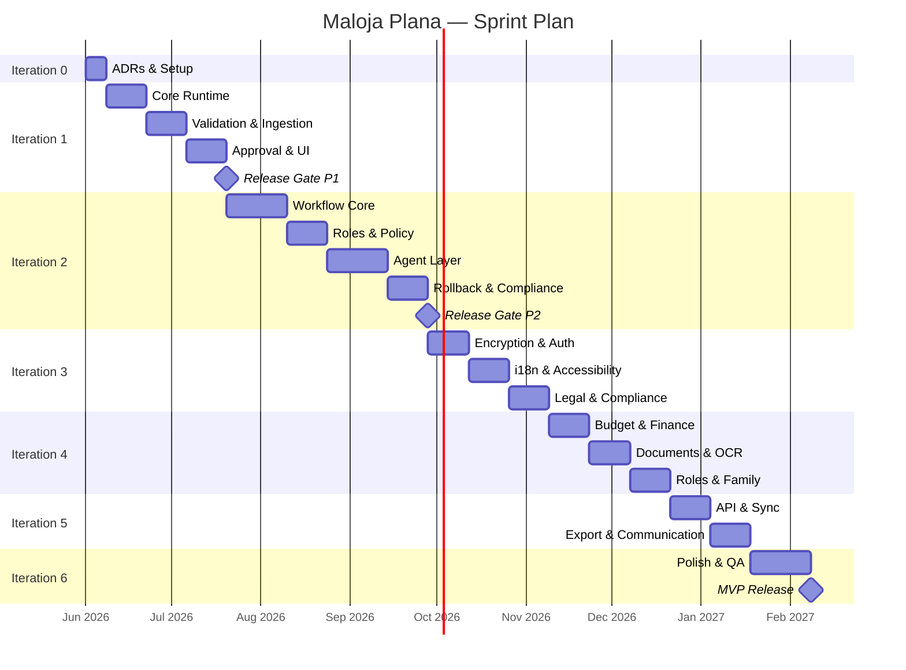
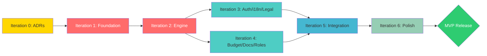

# Maloja Plana — Sprint Plan

> **Abgeleitet aus:** BACKLOG_MASTER.md, OPEN_GAPS_USER_STORIES.md, EXECUTIVE_DASHBOARD.md  
> **Stand:** 2026-05-17 | **Methode:** Iterationsbasiert (Foundation → Features → Polish)

---

## Übersicht

| Iteration | Name | Dauer | Focus | Tasks |
|-----------|------|-------|-------|-------|
| **0** | Pre-Sprint | 1 Woche | ADRs finalisieren, Setup, Tooling | 5 |
| **1** | Foundation | 6-8 Wochen | Phase 1 Core (Governance Runtime) | 26 |
| **2** | Engine | 8-12 Wochen | Phase 2 Core (Workflow + Agents) | 31 |
| **3** | Features I | 4-6 Wochen | Auth, Storage Encryption, i18n, Legal | 28 |
| **4** | Features II | 4-6 Wochen | Budget, Documents, OCR, Roles | 24 |
| **5** | Integration | 3-4 Wochen | Sync, Export, API, Calendar | 16 |
| **6** | Polish | 2-3 Wochen | Onboarding, CSR, Dashboard, QA | 14 |

**Gesamt:** ~144 Tasks | **Geschätzte Gesamtdauer:** 28-41 Wochen

---

## Iteration 0 — Pre-Sprint (Setup & Entscheidungen)

> **Ziel:** Alle kritischen Entscheidungen treffen, bevor Code geschrieben wird.  
> **Dauer:** 1 Woche | **Blocker für:** Alles

| # | Task | Deliverable | Owner | Status |
|---|------|-------------|-------|--------|
| 0.1 | ADR-009 finalisieren (Storage) | Entscheidung dokumentiert | Architektur | ✅ Accepted |
| 0.2 | ADR-010 finalisieren (OCR) | Entscheidung dokumentiert | Architektur | ✅ Accepted |
| 0.3 | ADR-011 finalisieren (Auth) | Entscheidung dokumentiert | Architektur | ✅ Accepted |
| 0.4 | CI/CD Pipeline aufsetzen | GitHub Actions, Lint, Tests | DevOps | ✅ Done (`08f8814`) |
| 0.5 | Build Budget Enforcement | Size-limit config, Lighthouse CI | DevOps | ✅ Done (`86a1630`) |

**Exit Criteria:** ✅ Alle erfüllt — ADRs Accepted, CI grün, Build Budget < 200KB enforced.

---

## Iteration 1 — Foundation (Phase 1: Governance Runtime)

> **Ziel:** Governance-nativer Runtime, deterministic, auditierbar.  
> **Dauer:** 6-8 Wochen | **Baseline:** `89d9f32` | **Budget:** < 200KB gzip  
> **Ref:** [PHASE_1_MASTER.md](./PHASE_1_MASTER.md)

### Sprint 1.1 — Core Runtime (Woche 1-2)

| Task ID | Titel | Critical Path | Agent | Status |
|---------|-------|:---:|-------|--------|
| P1-001 | Event Bus | Yes | Runtime-Agent | ✅ Done (A-004a) |
| P1-002 | State Machine | Yes | Runtime-Agent | ✅ Done (A-002, A-003) |
| P1-003 | Audit Logger (IndexedDB) | Yes | Audit-Agent | Offen |
| P1-004 | Module Registry | Yes | Runtime-Agent | Offen |

**Milestone:** Event Bus emittiert ✅, State Machine transitiert ✅, Audit schreibt (offen).

**Runtime ↔ UI POC (A-004a–A-004f):**
Lokale Runtime ↔ UI Verbindung validiert. EventBus publish/subscribe funktioniert.
Kein React Context, kein Hook-System — bewusst vertagt.
Details: [runtime-ui-poc.md](../runtime/runtime-ui-poc.md)

### Sprint 1.2 — Validation & Ingestion (Woche 3-4)

| Task ID | Titel | Critical Path | Agent |
|---------|-------|:---:|-------|
| P1-006 | Rule Schema | Yes | Runtime-Agent |
| P1-007 | Rule Evaluator | Yes | Runtime-Agent |
| P1-008 | Evidence Register | Yes | Audit-Agent |
| P1-010 | File Parser | Yes | Source-Agent |
| P1-011 | Schema Mapper | — | Source-Agent |
| P1-012 | Ingestion Pipeline | Yes | Source-Agent |

**Milestone:** File → Parse → Validate → Evidence geschrieben.

### Sprint 1.3 — Approval & UI (Woche 5-6)

| Task ID | Titel | Critical Path | Agent |
|---------|-------|:---:|-------|
| P1-005 | Dashboard Health Indicator | — | UX-Agent |
| P1-009 | Migrate Existing Validation | Yes | Runtime-Agent |
| P1-013 | Import UI (Preview) | Yes | UX-Agent |
| P1-014 | Approval Gate Component | Yes | UX-Agent |
| P1-015 | Gate Registry | Yes | Runtime-Agent |
| P1-016 | Approval Wiring + Evidence | Yes | Runtime-Agent |

**Milestone:** User kann importieren, previewing, approven. Zero UX regression.

### Sprint 1.4 — Observability & Release (Woche 7-8)

| Task ID | Titel | Critical Path | Agent |
|---------|-------|:---:|-------|
| P1-017 | Audit Viewer | — | UX-Agent |
| P1-018 | System Status Panel | — | UX-Agent |
| P1-019 | Audit Export | — | Compliance-Agent |
| P1-020 | Retention Policy | — | Runtime-Agent |
| P1-021 | System Navigation Tab | — | UX-Agent |
| P1-022 | E2E Integration Tests | Yes | Test-Agent |
| P1-023 | Mobile QA (375px) | Yes | QA-Agent |
| P1-024 | Dark Mode QA | Yes | QA-Agent |
| P1-025 | ADRs 001-005 | — | Architektur |
| P1-026 | Performance Gate | Yes | Release-Agent |

**Release Gate:** < 200KB, Lighthouse >= 90, 14/14 tests, zero regressions.

---

## Iteration 2 — Engine (Phase 2: Workflow + Agents)

> **Ziel:** DAG-basierte Workflows, Agent Sandbox, Rollback, Compliance Export.  
> **Dauer:** 8-12 Wochen | **Budget:** < 250KB gzip  
> **Ref:** [PHASE_2_BLUEPRINT.md](./PHASE_2_BLUEPRINT.md)

### Sprint 2.1 — Workflow Core (Woche 1-3)

| Task ID | Titel | Agent |
|---------|-------|-------|
| P2-001 | Workflow Definition Schema | Runtime-Agent |
| P2-002 | Workflow Executor | Runtime-Agent |
| P2-003 | Event Middleware | Runtime-Agent |
| P2-004 | Workflow Progress UI | UX-Agent |
| P2-005 | Workflow Templates | Runtime-Agent |

### Sprint 2.2 — Roles & Policy (Woche 4-5)

| Task ID | Titel | Agent |
|---------|-------|-------|
| P2-006 | Role Definition Schema | Security-Agent |
| P2-007 | Policy Engine | Security-Agent |
| P2-008 | Role Manager UI | UX-Agent |
| P2-009 | Policy Audit Integration | Audit-Agent |

### Sprint 2.3 — Agent Layer (Woche 6-8)

| Task ID | Titel | Agent |
|---------|-------|-------|
| P2-010 | Agent Runtime (Sandbox) | Runtime-Agent |
| P2-011 | Suggestion API | Runtime-Agent |
| P2-012 | Built-in Agents (4) | Agent-Framework |
| P2-013 | Agent Sidebar UI | UX-Agent |
| P2-014 | Agent Audit Evidence | Audit-Agent |

### Sprint 2.4 — Rollback & Compliance (Woche 9-10)

| Task ID | Titel | Agent |
|---------|-------|-------|
| P2-015 | State Snapshot Engine | Runtime-Agent |
| P2-016 | Rollback Executor | Runtime-Agent |
| P2-017 | Rollback Wizard UI | UX-Agent |
| P2-018 | Rollback Evidence Chain | Audit-Agent |
| P2-023 | Report Template Engine | Compliance-Agent |
| P2-024 | PDF/JSON Export | Compliance-Agent |
| P2-025 | Compliance Viewer UI | UX-Agent |

### Sprint 2.5 — Metrics & Release (Woche 11-12)

| Task ID | Titel | Agent |
|---------|-------|-------|
| P2-019 | Metrics Aggregator | Runtime-Agent |
| P2-020 | Dashboard 2.0 | UX-Agent |
| P2-021 | Live Status Stream | Runtime-Agent |
| P2-022 | Workflow History View | UX-Agent |
| P2-026 | E2E Workflow Tests | Test-Agent |
| P2-027 | Mobile QA Phase 2 | QA-Agent |
| P2-028 | Dark Mode QA Phase 2 | QA-Agent |
| P2-029 | ADRs 006-010 | Architektur |
| P2-030 | IndexedDB Migration v1→v2 | Runtime-Agent |
| P2-031 | Performance Gate Phase 2 | Release-Agent |

**Release Gate:** < 250KB, Lighthouse >= 85, 5 critical flows pass, zero regressions.

---

## Iteration 3 — Features I (Auth, Encryption, i18n, Legal)

> **Ziel:** Sicherheit, Mehrsprachigkeit, Rechtskonformität.  
> **Dauer:** 4-6 Wochen | **Ref:** GAP-01 bis GAP-08

### Sprint 3.1 — Encryption & Local Auth (Woche 1-2)

| Task ID | Titel | Ref | Agent |
|---------|-------|-----|-------|
| SEC-006 | Verschlüsselung (at rest) | ADR-009 | Security-Agent |
| SEC-001 | Login (Email + Passwort) | ADR-011 | Auth-Agent |
| SEC-004 | Biometrische Auth (WebAuthn) | ADR-011 | Auth-Agent |
| SEC-005 | Session Management | ADR-011 | Auth-Agent |
| SEC-003 | Zwei-Faktor (TOTP + PIN) | ADR-011 | Auth-Agent |
| SEC-008 | Password Reset Flow | — | Auth-Agent |
| SEC-009 | Rate Limiting | — | Security-Agent |
| SEC-010 | Audit Logging (Security) | — | Audit-Agent |

### Sprint 3.2 — i18n & Accessibility (Woche 3-4)

| Task ID | Titel | Ref | Agent |
|---------|-------|-----|-------|
| UX-001 | Multi-Language Framework | GAP-06 | Localization-Agent |
| UX-002 | Deutsch (Standard) | — | Localization-Agent |
| UX-003 | Englisch | — | Localization-Agent |
| UX-004 | Rätoromanisch | GAP-06 | Localization-Agent |
| UX-007 | Fallback Language Handling | GAP-06 | Localization-Agent |
| UX-008 | Gender-neutrale Sprache | GAP-15 | Localization-Agent |
| UX-010 | Accessibility (Screenreader) | GAP-07 | Accessibility-Agent |
| UX-011 | Schriftgrössen & Kontrast | GAP-07 | Accessibility-Agent |
| UX-012 | Literacy Fallbacks | GAP-07 | Accessibility-Agent |
| UX-017 | Tastatur-Navigation | GAP-07 | Accessibility-Agent |

### Sprint 3.3 — Legal & Compliance (Woche 5-6)

| Task ID | Titel | Ref | Agent |
|---------|-------|-----|-------|
| LEG-001 | Impressum | GAP-08 | Legal-Agent |
| LEG-002 | Datenschutzerklärung | GAP-08 | Legal-Agent |
| LEG-003 | Nutzungsbedingungen | GAP-08 | Legal-Agent |
| LEG-005 | Consent Management | GAP-08 | Legal-Agent |
| LEG-006 | Datenschutzrechte Interface | GAP-08 | Legal-Agent |
| LEG-007 | DSGVO/DSG Compliance Checks | GAP-08 | Compliance-Agent |
| LEG-008 | Datenlöschung | GAP-08 | Security-Agent |
| SEC-002 | Social Login (OAuth) | — | Auth-Agent |
| SEC-007 | Verschlüsselung (in transit) | — | Security-Agent |

---

## Iteration 4 — Features II (Budget, Documents, OCR, Roles)

> **Ziel:** Kernfeatures für Endnutzer.  
> **Dauer:** 4-6 Wochen | **Ref:** GAP-09 bis GAP-14

### Sprint 4.1 — Budget & Finance (Woche 1-2)

| Task ID | Titel | Ref | Agent |
|---------|-------|-----|-------|
| BUD-001 | Budget Tracking Modul | GAP-12 | Budget-Agent |
| BUD-002 | Schulden-Integration | GAP-12 | Budget-Agent |
| BUD-003 | Einnahmen/Ausgaben Vergleich | GAP-12 | Budget-Agent |
| BUD-004 | Budget Alerts | GAP-12 | Notification-Agent |
| BUD-005 | Subscription Management | — | Budget-Agent |
| BUD-006 | ÖV/Auto Kostentracking | — | Budget-Agent |
| BUD-007 | Realistische Budgetvorschläge | GAP-12 | Budget-Agent |

### Sprint 4.2 — Documents & OCR (Woche 3-4)

| Task ID | Titel | Ref | Agent |
|---------|-------|-----|-------|
| DOC-001 | Dokumententresor (Vault) | GAP-10 | Document-Agent |
| DOC-002 | OCR / Scanner | GAP-09, ADR-010 | OCR-Agent |
| DOC-003 | Krankenkassen-Scanner | GAP-09 | OCR-Agent |
| DOC-004 | Multi-File Upload | — | Document-Agent |
| DOC-005 | Dokumenten-Versionierung | — | Document-Agent |
| DOC-006 | Dokumenten-Suche & Filter | — | Document-Agent |

### Sprint 4.3 — Roles & Family (Woche 5-6)

| Task ID | Titel | Ref | Agent |
|---------|-------|-----|-------|
| ROL-001 | Familien-/Account-Übergabe | GAP-11 | Roles-Agent |
| ROL-002 | Eltern-Kind Verknüpfung | GAP-11 | Roles-Agent |
| ROL-003 | Medizinisches Personal | GAP-11 | Roles-Agent |
| ROL-004 | Multi-Device Sync | GAP-01 | Sync-Agent |
| ROL-005 | Delegierte Aufgaben | — | Task-Agent |
| UX-014 | Drag & Drop Tasks | GAP-14 | UX-Agent |
| UX-009 | Niedrigschwelligkeit | GAP-07 | UX-Agent |

---

## Iteration 5 — Integration (Sync, Export, API, Calendar)

> **Ziel:** Externe Anbindungen, Kommunikation.  
> **Dauer:** 3-4 Wochen | **Ref:** GAP-13, GAP-03

### Sprint 5.1 — API & Sync (Woche 1-2)

| Task ID | Titel | Ref | Agent |
|---------|-------|-----|-------|
| INF-001 | Datenbank-Architektur | GAP-02 | DB-Agent |
| INF-002 | API-Schnittstellen | GAP-03 | Backend-Agent |
| INF-005 | CI/CD Pipeline | — | DevOps-Agent |
| INF-007 | API Rate Limiting | — | Security-Agent |
| INF-008 | Local-First Sync Engine | GAP-01 | Sync-Agent |

### Sprint 5.2 — Export & Communication (Woche 3-4)

| Task ID | Titel | Ref | Agent |
|---------|-------|-----|-------|
| COM-001 | Export an Behörden | GAP-13 | Communication-Agent |
| COM-002 | E-Mail-Vorlagen | GAP-13 | Communication-Agent |
| COM-003 | PDF-Export (allgemein) | — | Document-Agent |
| COM-004 | Benachrichtigungen (In-App) | — | Notification-Agent |
| INF-003 | Server Hosting & Skalierung | — | DevOps-Agent |
| INF-004 | Logging / Monitoring | GAP-19 | DevOps-Agent |
| INF-006 | Backup-Strategie | — | DevOps-Agent |

### Convenience Features (parallel)

| Task ID | Titel | Agent |
|---------|-------|-------|
| CONV-001 | iOS Calendar Sync | Sync-Agent |
| CONV-002 | Android Calendar Sync | Sync-Agent |
| CONV-003 | Kontaktverknüpfung (Ärzte, Betreuer) | Contact-Agent |
| CONV-004 | Auto-Save | Runtime-Agent |

---

## Iteration 6 — Polish (Onboarding, CSR, Dashboard, QA)

> **Ziel:** Feinschliff, UX-Verbesserungen, Release-Readiness.  
> **Dauer:** 2-3 Wochen

| Task ID | Titel | Ref | Agent |
|---------|-------|-----|-------|
| UX-016 | Tutorial / Onboarding | GAP-16 | UX-Agent |
| UX-013 | Audio / Vorlesefunktion | GAP-07 | Accessibility-Agent |
| UX-015 | User Customization | — | Settings-Agent |
| UX-005 | Französisch | — | Localization-Agent |
| UX-006 | Italienisch | — | Localization-Agent |
| VIS-001 | Fortschritts-Visualisierung | GAP-17 | UX-Agent |
| VIS-002 | CSR Badge | GAP-18 | Marketing-Agent |
| VIS-003 | Energieverbrauch-Tracking | GAP-19 | DevOps-Agent |
| VIS-004 | Dashboard KPIs | GAP-17 | UX-Agent |
| COM-F02 | User Feedback Interface | — | UX-Agent |
| COM-005 | Push Notifications | — | Notification-Agent |
| UX-018 | Responsive QA Final | — | QA-Agent |
| UX-019 | Dark Mode Final | — | QA-Agent |
| UX-020 | Calm UX Audit | — | UX-Agent |

**Release Gate:** Full QA pass, alle Sprachen komplett, Legal approved, < 250KB, A11y audit bestanden.

---

## Kritischer Pfad (Mermaid)

---

## Dependency Chain (Mermaid)

---

## Risiken & Mitigationen

| Risiko | Wahrscheinlichkeit | Impact | Mitigation |
|--------|-------------------|--------|-----------|
| Build Budget überschritten | Mittel | Hoch | Continuous size monitoring, tree-shaking, lazy-loading |
| OCR Accuracy zu niedrig | Mittel | Mittel | Template-Matching, User-Verification, Confidence-Scoring |
| Rätoromanisch-Übersetzung fehlt | Hoch | Mittel | Frühzeitig Übersetzer:in engagieren, Fallback-Chain |
| IndexedDB Storage Eviction | Niedrig | Hoch | `navigator.storage.persist()`, User-Warning |
| Scope Creep in Features | Hoch | Mittel | Strikte Sprint-Boundaries, Deferred-Liste |

---

## Cross-References

| Dokument | Inhalt |
|----------|--------|
| [PHASE_1_MASTER.md](./PHASE_1_MASTER.md) | Detaillierte Spezifikation Iteration 1 |
| [PHASE_2_BLUEPRINT.md](./PHASE_2_BLUEPRINT.md) | Detaillierte Spezifikation Iteration 2 |
| [BACKLOG_MASTER.md](./BACKLOG_MASTER.md) | Vollständiger Backlog mit allen Feature-Tasks |
| [OPEN_GAPS_USER_STORIES.md](./OPEN_GAPS_USER_STORIES.md) | Offene Entscheidungspunkte + User Stories |
| [EXECUTIVE_DASHBOARD.md](./EXECUTIVE_DASHBOARD.md) | Stakeholder-Übersicht |
| [ADR-009](../architecture/ADR-009-storage-strategy.md) | Storage-Entscheidung |
| [ADR-010](../architecture/ADR-010-ocr-engine.md) | OCR-Entscheidung |
| [ADR-011](../architecture/ADR-011-auth-strategy.md) | Auth-Entscheidung |
| [decision-records.md](../architecture/decision-records.md) | Philosophische ADRs 001-008 |
