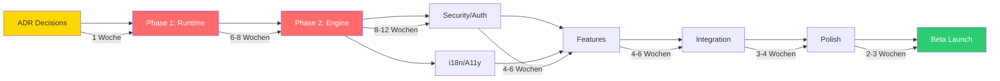
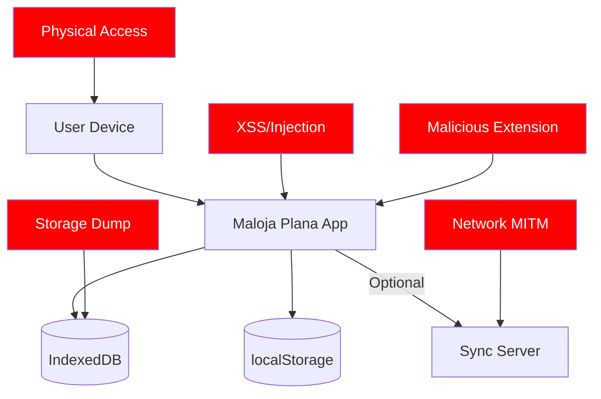

# Maloja Plana / Ordnung-Ruhe — Full Project Audit

> **IP Strategy, Security Review, Compliance Audit, Governance Assessment**  
> **Stand:** 2026-05-17 | **Version:** 1.0.0  
> **Autor:** Stebler Studios | **Status:** Audit-Ready Draft

---

## Inhaltsverzeichnis

1. [Executive Summary](#1-executive-summary)
2. [Consolidated Backlog Validation](#2-consolidated-backlog-validation)
3. [IP & Brand Strategy](#3-ip--brand-strategy)
4. [Security & Privacy Review](#4-security--privacy-review)
5. [Governance & Compliance](#5-governance--compliance)
6. [Infrastructure & Architecture Review](#6-infrastructure--architecture-review)
7. [Accessibility & Ethical UX Audit](#7-accessibility--ethical-ux-audit)
8. [Risk Matrix](#8-risk-matrix)
9. [Recommendations & Next Steps](#9-recommendations--next-steps)
10. [Cross-References](#10-cross-references)

---

## 1. Executive Summary

| Dimension | Status | Bewertung |
|-----------|--------|-----------|
| Backlog Completeness | 148 Tasks, 20 Open Gaps, 10 Decisions | Vollständig |
| Security Architecture | ADR-009, ADR-011, Encryption-at-Rest | Konzept solid, Implementation offen |
| Legal Readiness | Impressum, AGB, DSGVO konzipiert | Nicht implementiert |
| IP Protection | Marken/Namen nicht geschützt | Handlungsbedarf |
| Governance | 8 ADRs + 3 technische ADRs, Audit-Trail | Gut fundiert |
| Accessibility | WCAG 2.1 AA geplant, Icon-Navigation | Konzept vorhanden |
| Infrastructure | Offline-First, Zero-Dep, < 250KB | Architektur solid |

**Gesamtbewertung:** Konzeptionell ausgereift, Implementierung steht bevor. Kritische Lücken: IP-Schutz, Legal-Dokumente, Security-Testing.

---

## 2. Consolidated Backlog Validation

### 2.1 Vollständigkeitsprüfung

| Kategorie | Items in Backlog | Gaps identifiziert | Status |
|-----------|-----------------|-------------------|--------|
| Core Runtime (P1) | 26 | 0 | Vollständig |
| Workflow Engine (P2) | 31 | 0 | Vollständig |
| Budget & Finance | 7 | 1 (CH-Referenzdaten) | Fast vollständig |
| Documents & OCR | 7 | 1 (Offline OCR Performance) | Fast vollständig |
| UX & Accessibility | 20 | 2 (Dyslexie-Font, Cognitive Load) | Ergänzung nötig |
| Security | 10 | 3 (Pen-Testing, CSP, SRI) | Ergänzung nötig |
| Legal | 8 | 1 (CH-spezifische Jugendschutz) | Ergänzung nötig |
| Roles | 5 | 1 (Notfall-Zugriff) | Ergänzung nötig |
| Communication | 5 | 0 | Vollständig |
| Convenience | 9 | 2 (Offline-Indicator, Error-Recovery) | Ergänzung nötig |
| Infrastructure | 8 | 2 (CDN, Edge-Cache) | Ergänzung nötig |

### 2.2 Neu identifizierte fehlende Tasks

| ID | Titel | Kategorie | Priorität | Begründung |
|----|-------|-----------|-----------|------------|
| SEC-011 | Content Security Policy (CSP) | Security | Hoch | XSS-Schutz, ISO 27001 |
| SEC-012 | Subresource Integrity (SRI) | Security | Mittel | Supply-Chain-Schutz |
| SEC-013 | Penetration Test Planung | Security | Hoch | Vor Go-Live zwingend |
| UX-021 | Dyslexie-freundliche Schrift | Accessibility | Mittel | OpenDyslexic oder ähnlich |
| UX-022 | Cognitive Load Reduktion | Accessibility | Hoch | Max 3 Actions pro Screen |
| UX-023 | Offline-Indikator (UI) | UX | Hoch | User muss Sync-Status sehen |
| UX-024 | Error Recovery Flow | UX | Hoch | Graceful Degradation bei Fehlern |
| ROL-006 | Notfall-Zugriff (Emergency Access) | Roles | Hoch | Med. Notfall ohne Login |
| LEG-009 | CH Jugendschutz-Konformität | Legal | Hoch | Unter-16 Account-Regeln |
| INF-009 | Service Worker (Offline Shell) | Infrastructure | Hoch | PWA-Grundlage |
| INF-010 | Web App Manifest | Infrastructure | Mittel | Installierbarkeit |
| CONV-010 | Offline-Status Toast | Convenience | Hoch | Non-intrusive Status-Anzeige |

**Neue Gesamtzahl:** 160 Tasks (148 + 12 neue)

### 2.3 Kritischer Pfad (validiert)



**Gesamtdauer kritischer Pfad:** 28-41 Wochen (bestätigt)

---

## 3. IP & Brand Strategy

### 3.1 Marken-Analyse

| Name | Typ | CH-Register | EU-Register | Risiko | Empfehlung |
|------|-----|-------------|-------------|--------|------------|
| **Maloja Plana** | Wortmarke | Nicht eingetragen | Nicht eingetragen | Mittel (Maloja = existierender Ort) | Prüfung + Eintragung |
| **Ordnung & Ruhe** | Wortmarke | Nicht eingetragen | Nicht eingetragen | Niedrig (beschreibend) | Eintragung empfohlen |
| **Stebler Studios** | Firmenname | Nicht geprüft | — | Niedrig | HR-Eintrag prüfen |

### 3.2 Naming-Konflikte

| Potentieller Konflikt | Bereich | Risiko | Aktion |
|-----------------------|---------|--------|--------|
| Maloja (Engadin, Ort) | Geographie | Niedrig | Kein Markenschutz für Ortsnamen in CH |
| Maloja Clothing (existierende Marke) | Mode | Mittel | Andere Branche, aber Verwechslungsgefahr prüfen |
| Ordnung (generisch) | Beschreibend | Niedrig | Kombination "Ordnung & Ruhe" schützbar |

### 3.3 IP-Empfehlungen

| Priorität | Aktion | Kosten (geschätzt) | Timeline |
|-----------|--------|---------------------|----------|
| Hoch | CH-Markenanmeldung "Maloja Plana" (Klasse 9, 42) | CHF 550 | 6-8 Monate |
| Hoch | CH-Markenanmeldung "Ordnung & Ruhe" (Klasse 9, 42) | CHF 550 | 6-8 Monate |
| Mittel | Domain-Sicherung (malojaplana.ch, ordnung-ruhe.ch) | CHF 20/Jahr | Sofort |
| Mittel | EU-Markenanmeldung (EUIPO) bei Internationalisierung | EUR 850+ | Bei Expansion |
| Niedrig | Design-Patent für UI-Konzept (Calm UX) | Nicht empfohlen | — |

### 3.4 Potentiell schützbare Innovationen

| Innovation | Typ | Schützbar? | Empfehlung |
|-----------|-----|-----------|------------|
| Progressive Auth (Level 0/1/2) | Verfahren | Nein (Stand der Technik) | — |
| Calm UX Framework | Designprinzip | Nein (zu abstrakt) | Styleguide veröffentlichen |
| Swiss-Format OCR Templates | Datenbank | Ja (Datenbankschutz) | sui generis Datenbankschutz |
| Hash-Chain Audit Trail | Verfahren | Nein (Blockchain-ähnlich, prior art) | — |
| Life-Event Workflow Engine | Software | Fraglich | Trade Secret bevorzugen |
| Offline-First Governance Runtime | Software | Nein (Kombination bekannter Techniken) | Open Source als Differenzierung |

**Empfehlung:** Trade Secrets + Markenrecht statt Patente. Open-Source-Teile (Runtime) zur Community-Bildung, proprietäre Teile (Templates, Workflows) als Differenzierung.

---

## 4. Security & Privacy Review

### 4.1 Threat Model



### 4.2 Attack Surface Analysis

| Vektor | Beschreibung | Schwere | Wahrscheinlichkeit | Mitigation | Status |
|--------|-------------|---------|--------------------|-----------|---------| 
| **Physical Device Access** | Unverschlüsselte Daten auf Gerät | Hoch | Mittel | Encryption at rest (ADR-009) | Geplant |
| **XSS (Cross-Site Scripting)** | Injizierter Code in User-Inputs | Hoch | Mittel | CSP, Input Sanitization, DOMPurify-Pattern | SEC-011 offen |
| **IndexedDB Direct Access** | DevTools/Extension liest Daten | Mittel | Niedrig | Encryption at rest | Geplant |
| **Network Interception** | Daten bei Sync abfangen | Hoch | Niedrig (Offline-First) | TLS 1.3, Zero-Knowledge Sync | Geplant |
| **Shoulder Surfing** | PIN/Passwort ablesen | Mittel | Mittel | Randomizable PIN, Biometric | ADR-011 |
| **Brute Force (Local)** | Passwort-Raten | Mittel | Mittel | PBKDF2 (100k iter), Progressive Delay | ADR-011 |
| **OCR Data Leakage** | Gescannte Dokumente im Memory | Mittel | Niedrig | Secure memory handling, clear after use | Geplant |
| **Permission Escalation** | Kind→Eltern Rolle | Hoch | Niedrig | RBAC, Audit-Log, Fail-Safe Deny | P2-006, P2-007 |
| **Supply Chain** | Kompromittierte Dependencies | Hoch | Niedrig | Zero-Dep Policy, SRI für Tesseract | SEC-012 offen |
| **Stale Tokens** | Abgelaufene JWT weiterverwendet | Mittel | Niedrig | Short expiry (15min), Refresh rotation | ADR-011 |

### 4.3 Security Checklist (Pre-Beta)

| # | Check | Standard | Status | Blocker? |
|---|-------|----------|--------|----------|
| 1 | Content Security Policy (CSP) konfiguriert | ISO 27001 A.14 | Offen | Ja |
| 2 | Alle User-Inputs sanitized (no innerHTML) | OWASP Top 10 | Zu prüfen | Ja |
| 3 | Encryption at rest implementiert | ISO 27001 A.10 | Offen | Ja |
| 4 | WebAuthn korrekt implementiert | FIDO2 | Offen | Nein (Level 0 first) |
| 5 | Rate Limiting aktiv | ISO 27001 A.9 | Offen | Ja (für Level 2) |
| 6 | Audit-Log tamper-proof (Hash-Chain) | ISO 27001 A.12 | P1-003/P2-018 | Ja |
| 7 | Keine Secrets im Frontend-Bundle | OWASP | Zu prüfen | Ja |
| 8 | Progressive Delay bei Login-Fehlern | Best Practice | Offen | Nein |
| 9 | CORS korrekt konfiguriert (wenn Server) | OWASP | N/A (Offline) | Nein |
| 10 | Dependency Audit (npm audit clean) | Supply Chain | Zu prüfen | Ja |
| 11 | navigator.storage.persist() angefragt | Data Protection | Offen | Nein |
| 12 | Kein eval(), Function(), innerHTML | CSP | Zu prüfen | Ja |
| 13 | Secure Context (HTTPS) erzwungen | Best Practice | Offen | Ja (für Prod) |
| 14 | Error Messages leaken keine internen Infos | OWASP | Zu prüfen | Nein |
| 15 | Pen-Test vor Go-Live geplant | ISO 27001 | SEC-013 | Ja |

### 4.4 Encryption Baseline

| Ebene | Algorithmus | Key-Länge | Zweck |
|-------|-----------|-----------|-------|
| Data at Rest | AES-256-GCM | 256 bit | IndexedDB Dokumente |
| Key Derivation | PBKDF2 | SHA-256, 100k iter | Passphrase → Master Key |
| Hash Chain | SHA-256 | 256 bit | Audit Trail Integrity |
| Transport (Tier 2) | TLS 1.3 | — | Server-Sync |
| Document Hashing | SHA-256 | 256 bit | Provenance/Integrity |
| Token Signing | HMAC-SHA256 | 256 bit | JWT (wenn Server) |

### 4.5 RBAC Security Assessment

| Risiko | Szenario | Mitigation | ADR |
|--------|----------|-----------|-----|
| Privilege Escalation | Kind ändert eigene Rolle | Server-side role validation, Fail-Safe Deny | ADR-011 |
| Unauthorized Access | Fremder öffnet App | Level 1+ Auth, Encryption at Rest | ADR-011 |
| Medical Overreach | Arzt sieht mehr als freigegeben | Time-limited tokens, Document-level ACL | P2-006 |
| Account Takeover | Phishing für Passphrase | WebAuthn preferred, 2FA, Audit-Log | ADR-011 |
| Transfer Manipulation | Falscher Transfer-Request | Dual-Approval (sender + receiver), Evidence | ROL-001 |
| Emergency Bypass | Notfall-Zugriff missbraucht | Separate Emergency Key, sofort-Audit, Limit | ROL-006 (neu) |

---

## 5. Governance & Compliance

### 5.1 Compliance Roadmap

| Phase | Anforderung | Status | Deadline |
|-------|-------------|--------|----------|
| **Pre-Alpha** | ADRs 001-011 finalisiert | 8/11 done | Iteration 0 |
| **Alpha** | Audit-Trail funktionsfähig | P1-003 | Iteration 1 |
| **Beta-Readiness** | Impressum, AGB, Datenschutz live | LEG-001 bis LEG-003 | Vor Beta |
| **Beta-Readiness** | Consent-Management implementiert | LEG-005 | Vor Beta |
| **Beta-Readiness** | CSP + Security Headers | SEC-011 | Vor Beta |
| **Beta-Readiness** | Pen-Test abgeschlossen | SEC-013 | Vor Beta |
| **Go-Live** | DSGVO/DSG Full Compliance | LEG-001 bis LEG-008 | Vor Launch |
| **Go-Live** | ISO 27001 Alignment dokumentiert | Alle SEC + P2-018 | Vor Launch |
| **Go-Live** | EU AI Act Compliance (Art. 13, 14) | P2-014 | Vor Launch |
| **Post-Launch** | Jährlicher Security Audit | Recurring | Jährlich |

### 5.2 Legal Readiness Checklist

| Dokument | CH-Anforderung | EU-Anforderung | Status | Verantwortlich |
|----------|---------------|----------------|--------|----------------|
| Impressum | OR Art. 3 UWG | — | LEG-001 offen | Legal-Agent |
| Datenschutzerklärung | DSG Art. 19 | DSGVO Art. 13/14 | LEG-002 offen | Legal-Agent |
| AGB / ToS | OR Art. 1 ff. | — | LEG-003 offen | Legal-Agent |
| Cookie-Hinweis | DSG | ePrivacy | LEG-004 (nur bei Analytics) | Legal-Agent |
| Consent (Opt-in) | DSG Art. 6 | DSGVO Art. 6/7 | LEG-005 offen | Legal-Agent |
| Auskunftsrecht | DSG Art. 25 | DSGVO Art. 15 | LEG-006 offen | Legal-Agent |
| Löschrecht | DSG Art. 32 | DSGVO Art. 17 | LEG-008 offen | Legal-Agent |
| Kinder-Accounts | DSG / CH-Jugendschutz | DSGVO Art. 8 (16 Jahre) | LEG-009 neu | Legal-Agent |
| AI-Transparency | — | EU AI Act Art. 13 | P2-014 offen | Compliance-Agent |
| Human Oversight | — | EU AI Act Art. 14 | P2-014 offen | Compliance-Agent |

### 5.3 Governance Structure

```
┌─────────────────────────────────────────────────┐
│              Governance Framework                 │
├─────────────────────────────────────────────────┤
│  ADRs (001-011)         → Architekturentscheide │
│  Audit-Trail            → Alle State-Änderungen │
│  Approval Gates         → Human Oversight       │
│  Evidence Chain         → Tamper Detection      │
│  Policy Engine          → RBAC Enforcement      │
│  Compliance Export      → Audit-Reports         │
├─────────────────────────────────────────────────┤
│  ISO 27001 Mapping:                             │
│  A.9  → Access Control (RBAC, Auth Levels)      │
│  A.10 → Cryptography (AES-256, PBKDF2)         │
│  A.12 → Operations Security (Audit-Log)        │
│  A.14 → System Security (CSP, Input Valid.)     │
│  A.16 → Incident Management (Evidence Chain)   │
│  A.18 → Compliance (Export, Reports)            │
├─────────────────────────────────────────────────┤
│  EU AI Act:                                     │
│  Art. 13 → Transparency (Confidence Scores)    │
│  Art. 14 → Human Oversight (Approval Gates)    │
└─────────────────────────────────────────────────┘
```

### 5.4 Beta-Launch Readiness Assessment

| Kriterium | Gewichtung | Status | Bereit? |
|-----------|-----------|--------|---------|
| Core Functionality (Phase 1) | Pflicht | Offen | Nein |
| Legal Pages (Impressum, AGB, DSE) | Pflicht | Offen | Nein |
| Encryption at Rest | Pflicht | Offen | Nein |
| Audit-Trail funktional | Pflicht | Offen | Nein |
| CSP konfiguriert | Pflicht | Offen | Nein |
| Consent-Management | Pflicht | Offen | Nein |
| WCAG 2.1 AA (Basis) | Pflicht | Offen | Nein |
| Pen-Test | Pflicht | Offen | Nein |
| i18n (DE minimum) | Pflicht | Offen | Nein |
| Performance (< 200KB) | Pflicht | Offen | Nein |
| Error Handling (Graceful) | Wichtig | Offen | Nein |
| Offline-Indikator | Wichtig | Offen | Nein |
| Dark Mode | Nice-to-have | Offen | — |
| Multi-Language | Nice-to-have | Offen | — |

**Assessment:** 0/10 Pflicht-Kriterien erfüllt. Beta frühestens nach Iteration 3.

---

## 6. Infrastructure & Architecture Review

### 6.1 Architektur-Bewertung

| Aspekt | Bewertung | Stärken | Schwächen |
|--------|-----------|---------|-----------|
| Offline-First | Exzellent | Vollständige Funktionalität ohne Server | Sync-Komplexität |
| Zero-Dependencies | Exzellent | Keine Supply-Chain-Risiken, klein | Mehr eigener Code nötig |
| Build Budget | Gut | < 200KB/250KB enforced | Tesseract.js Lazy-Load Komplexität |
| Persistence | Gut | IndexedDB + localStorage kombiniert | Storage Eviction Risiko |
| Scalability | Befriedigend | Single-User solid | Multi-User/Team noch offen |
| Monitoring | Offen | — | Kein Client-Side Error Tracking |
| Resilience | Gut | Offline-First = inherent resilient | Kein automatisches Backup |

### 6.2 Identifizierte Schwachstellen

| # | Schwachstelle | Schwere | Empfehlung |
|---|-------------|---------|------------|
| 1 | Kein Service Worker | Mittel | INF-009: Offline Shell für PWA |
| 2 | Storage Eviction (Browser) | Mittel | `navigator.storage.persist()` + User Warning |
| 3 | Kein Client Error Reporting | Niedrig | Lokales Error-Log in Audit-Trail integrieren |
| 4 | IndexedDB Transaction Limits | Niedrig | Batched Writes, Transaction Pooling |
| 5 | Memory bei grossem OCR | Mittel | Web Worker + explicit Memory Release |
| 6 | Kein automatisches Backup | Mittel | Periodische JSON-Exports (User-triggered) |
| 7 | Kein Health-Check Endpoint | Niedrig | Nur relevant bei Server (Tier 2) |

### 6.3 Overengineering-Risiken

| Bereich | Risiko | Empfehlung |
|---------|--------|------------|
| Agent Sandbox (Proxy-basiert) | Mittel | Für MVP reicht Function-Scope Isolation |
| Hash-Chain Evidence | Niedrig | Sinnvoll für Audit, kein Overengineering |
| DAG Workflow Engine | Mittel | Für MVP reichen lineare Workflows |
| 4-Level RBAC | Niedrig | Sinnvoll für Family Use Case |
| Zero-Knowledge Sync | Hoch | Erst in Tier 2, nicht für MVP |

### 6.4 Technical Debt Prävention

| Regel | Enforcement |
|-------|------------|
| Keine neuen Runtime-Dependencies | `size-limit` in CI |
| Alle State-Änderungen via Event Bus | Code Review + Lint-Rule |
| Keine direkten DOM-Manipulationen | React-Patterns enforced |
| Keine hardcoded Strings | i18n-Lint im Build |
| Alle async Ops mit Error-Handling | TypeScript strict + ESLint |

---

## 7. Accessibility & Ethical UX Audit

### 7.1 WCAG 2.1 Compliance Plan

| Level | Kriterium | Status | Task-Ref |
|-------|-----------|--------|----------|
| A | 1.1.1 Non-text Content (alt-text) | Offen | UX-010 |
| A | 1.3.1 Info and Relationships (semantic HTML) | Offen | UX-010 |
| A | 2.1.1 Keyboard (all functionality) | Offen | UX-017 |
| A | 2.4.1 Bypass Blocks (skip links) | Offen | UX-017 |
| A | 3.1.1 Language of Page (lang attr) | Offen | UX-001 |
| A | 4.1.1 Parsing (valid HTML) | Zu prüfen | — |
| AA | 1.4.3 Contrast (4.5:1 minimum) | Offen | UX-011 |
| AA | 1.4.4 Resize Text (200% without loss) | Offen | UX-011 |
| AA | 2.4.7 Focus Visible | Offen | UX-017 |
| AAA | 1.4.6 Enhanced Contrast (7:1) | Angestrebt | UX-011 |
| AAA | 2.4.9 Link Purpose (link only) | Angestrebt | UX-010 |

### 7.2 Vulnerable User Protection

| Nutzergruppe | Risiken | Schutzmassnahmen | Task-Ref |
|-------------|---------|------------------|----------|
| Analphabeten | Können Texte nicht lesen | Icon-Navigation, TTS, Pictogram-First | UX-012, ADR-007 |
| Sehbehinderte | UI nicht erkennbar | High Contrast, Screen Reader, Large Targets | UX-011, UX-010 |
| Ältere Menschen | Technische Überforderung | Vereinfachte Flows, max 3 Actions/Screen | UX-009, UX-022 |
| Kinder | Unverständliche Texte | Einfache Sprache, Icons, Guided Flows | UX-012, UX-016 |
| Stressbelastete | Anxiety durch App-Nutzung | Calm UX, keine Urgency, keine Gamification | UX-020, ADR-003 |
| Schulden-Betroffene | Scham, Angst vor Zahlen | Neutrale Sprache, keine Wertungen, Empathie | BUD-003, UX-020 |
| Dyslexie | Schwer lesbare Fonts | OpenDyslexic-Option, Zeilenabstand erhöht | UX-021 (neu) |

### 7.3 Dark Pattern Audit

| Pattern | Vorhanden? | Assessment |
|---------|-----------|-----------|
| Urgency/Scarcity | Nein | ADR-003 verbietet es explizit |
| Forced Continuity | Nein | Kein Abo-Modell in MVP |
| Hidden Costs | Nein | Transparent, lokal |
| Confirmshaming | Nein | Neutrale Sprache enforced |
| Nagging | Nein | Calm UX Prinzip |
| Trick Questions | Nein | Klare, einfache Formulierungen |
| Roach Motel | Nein | Export + Löschung jederzeit |
| Privacy Zuckering | Nein | Privacy-by-Default |
| Gamification Pressure | Nein | ADR-003 + "Kein Spiel" Philosophie |

**Ergebnis:** Keine Dark Patterns identifiziert. Architektur-Entscheidungen (ADR-003, UX-020) verhindern diese aktiv.

### 7.4 Ethical Notification Framework

| Typ | Erlaubt? | Bedingung |
|-----|----------|-----------|
| Deadline-Erinnerung | Ja | User hat Frist selbst gesetzt |
| Budget-Alert | Ja | User hat Schwelle definiert |
| System-Status | Ja | Nur bei echtem Problem |
| Marketing/Upselling | Nein | Calm UX verbietet es |
| "Comeback"-Notifications | Nein | ADR-003 verbietet Engagement-Manipulation |
| Gamification-Push | Nein | "Kein Spiel" Philosophie |
| Sicherheits-Alert | Ja | Immer (z.B. neues Login) |

---

## 8. Risk Matrix

### 8.1 Gesamtrisiko-Matrix

| Risiko | Wahrscheinlichkeit | Impact | Risiko-Score | Mitigation | Owner |
|--------|-------------------|--------|-------------|-----------|-------|
| IP-Verletzung (Markenname) | Mittel | Hoch | **6** | Markenanmeldung | Legal |
| Datenverlust (Storage Eviction) | Niedrig | Hoch | **4** | persist() + Backup-Reminder | Runtime-Agent |
| Security Breach (XSS) | Mittel | Hoch | **6** | CSP + Input Sanitization | Security-Agent |
| Legal Non-Compliance | Mittel | Hoch | **6** | Legal Docs vor Beta | Legal-Agent |
| Scope Creep | Hoch | Mittel | **6** | Sprint-Boundaries, Deferred-Liste | PM |
| Build Budget Exceeded | Mittel | Mittel | **4** | CI Enforcement | DevOps-Agent |
| Accessibility Lawsuit | Niedrig | Hoch | **4** | WCAG 2.1 AA Compliance | Accessibility-Agent |
| OCR Accuracy Too Low | Mittel | Mittel | **4** | Confidence + User Verification | OCR-Agent |
| Key Loss (Level 1 Auth) | Mittel | Hoch | **6** | Recovery Key + Warning | Auth-Agent |
| Rätoromanisch Translation | Hoch | Niedrig | **3** | Fallback-Chain, Professionelle Übersetzung | Localization-Agent |

### 8.2 Risiko-Heatmap

```
Impact →       Niedrig    Mittel     Hoch
                  │          │         │
Hoch    ─────────┼──────────┼─────────┤
                  │  Scope   │ IP      │
                  │  Creep   │ Legal   │
                  │          │ Security│
                  │          │ Key Loss│
Mittel  ─────────┼──────────┼─────────┤
                  │          │ OCR     │
                  │          │ Budget  │
                  │          │         │
Niedrig ─────────┼──────────┼─────────┤
                  │ Rätorom. │ Storage │
                  │          │ A11y    │
                  │          │         │
```

---

## 9. Recommendations & Next Steps

### 9.1 Sofort-Massnahmen (diese Woche)

| # | Aktion | Aufwand | Impact |
|---|--------|---------|--------|
| 1 | Domain-Sicherung (malojaplana.ch, ordnung-ruhe.ch) | 30 min | IP-Schutz |
| 2 | ADR-009, 010, 011 auf "Accepted" setzen | 1h (Review) | Blocker lösen |
| 3 | Markenrecherche beauftragen (IGE) | Brief schreiben | IP-Schutz |
| 4 | `size-limit` in package.json konfigurieren | 15 min | Build Budget |
| 5 | CSP Meta-Tag in index.html hinzufügen | 30 min | Security |

### 9.2 Kurzfristig (Iteration 0, 1 Woche)

| # | Aktion | Deliverable |
|---|--------|-------------|
| 1 | CI/CD Pipeline aufsetzen | GitHub Actions config |
| 2 | ESLint Security-Rules aktivieren | `.eslintrc` update |
| 3 | Build Budget Enforcement | `size-limit` CI step |
| 4 | Accessibility Lint (axe-core) | CI integration |
| 5 | Security Headers Template | `_headers` oder Meta-Tags |

### 9.3 Mittelfristig (Iteration 1-2)

| # | Aktion | Begründung |
|---|--------|------------|
| 1 | Impressum/AGB/DSE erstellen | Legal-Pflicht vor Beta |
| 2 | Pen-Test Provider evaluieren | Security-Pflicht vor Beta |
| 3 | Accessibility-Tester:innen rekrutieren | Echte Nutzer-Tests |
| 4 | Rätoromanisch-Übersetzer:in engagieren | Lead-Time beachten |
| 5 | Markenanmeldung einreichen | 6-8 Monate Vorlauf |

### 9.4 ADR-Empfehlungen (offene Entscheidungen)

| # | Entscheidung | Empfehlung | Begründung |
|---|-------------|------------|------------|
| 1 | REST vs. GraphQL | **REST** | Weniger Overhead, Offline-First kompatibel, MVP-gerecht |
| 2 | Conflict Resolution | **LWW + Manual Merge** | CRDTs zu komplex für MVP, Manual für Dokumente ausreichend |
| 3 | Rätoromanisch | **Professionell** | Crowdsourced zu fehleranfällig für vulnerable Nutzer |
| 4 | Mail-Export | **mailto: für MVP** | Zero-Server, User-Control, API als Phase 3+ |
| 5 | CH-Referenzdaten | **Statische JSON** | BFS-Daten jährlich aktualisieren, keine API-Abhängigkeit |
| 6 | Chart-Rendering | **SVG** | Screen-Reader-kompatibel (ARIA), zero-dep |
| 7 | B Corp | **Langfristig (1-2 Jahre)** | Erst nach stabilem Revenue |
| 8 | Community Moderation | **Phase 4+** | Zu früh, Liability-Risiko |
| 9 | Monetarisierung | **Freemium** | Basis kostenlos, Pro für Sync/Family |
| 10 | Open Source | **Partial** | Runtime open, Features proprietär |

---

## 10. Cross-References

| Dokument | Zweck | Pfad |
|----------|-------|------|
| Backlog Master v2.0 | Vollständige Task-Liste (148 Items) | [BACKLOG_MASTER.md](../roadmap/BACKLOG_MASTER.md) |
| Open Gaps | 20 offene Punkte mit User Stories | [OPEN_GAPS_USER_STORIES.md](../roadmap/OPEN_GAPS_USER_STORIES.md) |
| Sprint Plan | 7 Iterationen, 144 Tasks, Gantt | [SPRINT_PLAN.md](../roadmap/SPRINT_PLAN.md) |
| Executive Dashboard | Stakeholder Overview | [EXECUTIVE_DASHBOARD.md](../roadmap/EXECUTIVE_DASHBOARD.md) |
| Agent Architecture | 54 Agenten, Sub-Agenten, Automation | [AGENT_ARCHITECTURE.md](../agents/AGENT_ARCHITECTURE.md) |
| Phase 1 Master | Governance Runtime Spec | [PHASE_1_MASTER.md](../roadmap/PHASE_1_MASTER.md) |
| Phase 2 Blueprint | Workflow + Agent Spec | [PHASE_2_BLUEPRINT.md](../roadmap/PHASE_2_BLUEPRINT.md) |
| ADR-009 | Storage Strategy | [ADR-009](../architecture/ADR-009-storage-strategy.md) |
| ADR-010 | OCR Engine | [ADR-010](../architecture/ADR-010-ocr-engine.md) |
| ADR-011 | Auth Strategy | [ADR-011](../architecture/ADR-011-auth-strategy.md) |
| Decision Records | ADRs 001-008 (Philosophisch) | [decision-records.md](../architecture/decision-records.md) |

---

## Anhang: Finale Backlog-Statistik

| Metrik | Wert |
|--------|------|
| **Gesamte Tasks** | 160 (148 bestehend + 12 neu identifiziert) |
| **Priorität Hoch** | 82 |
| **Priorität Mittel** | 57 |
| **Priorität Niedrig** | 17 |
| **Deferred** | 4 |
| **Offene Entscheidungen** | 10 (mit Empfehlungen) |
| **Core-Agenten** | 12 |
| **Sub-Agenten** | 38 |
| **Automatisierungs-Agenten** | 4 |
| **ADRs (philosophisch)** | 8 (accepted) |
| **ADRs (technisch)** | 3 (proposed) |
| **Security Checks (Pre-Beta)** | 15 |
| **Legal Documents Required** | 9 |
| **WCAG Criteria Planned** | 11 (Level A + AA + partial AAA) |
| **Geschätzte Gesamtdauer** | 28-41 Wochen |
| **Beta-Readiness** | 0/10 Pflicht-Kriterien (Implementation steht bevor) |

---

*Document: FULL_PROJECT_AUDIT.md v1.0.0*  
*Generated: 2026-05-17*  
*Next Review: Nach Iteration 0 Abschluss*  
*Classification: Internal — Stebler Studios*
